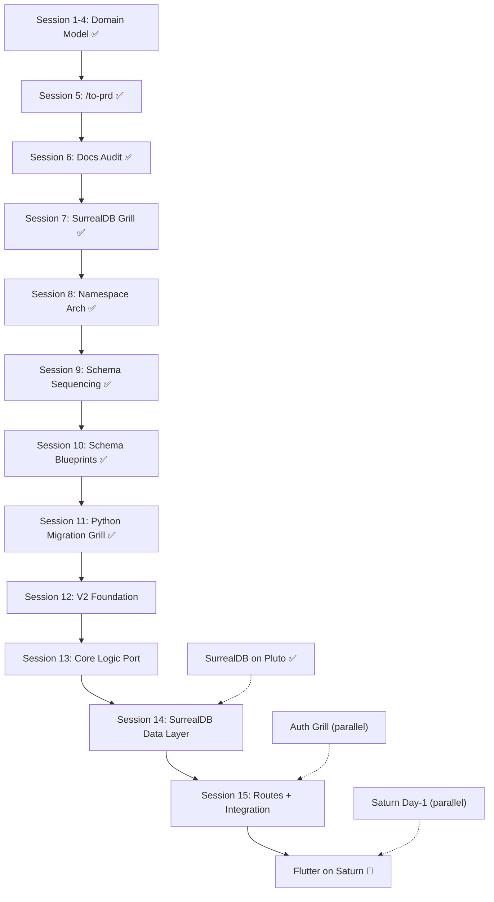

# DittoDatto Chapter 2 — PRD Waymap

The structured path from grilling to building. Each session feeds the next. No wasted work.

## ⚠️ Session 7 Pivot: Firestore → SurrealDB

> Session 7 resolved 9 architectural questions confirming the full platform pivot to SurrealDB 3.0.
> Sessions 8–9 locked the namespace architecture and schema sequencing.
> Session 10 wrote and tested all schema blueprints on Pluto SurrealDB.
> See [Session 7](./grill/session-7-surrealdb-pivot.md), [Session 8](./grill/session-8-surrealdb-namespace-architecture.md), [Session 9](./grill/session-9-surrealdb-schema-sequencing.md)

## ⚠️ Session 11 Pivot: TypeScript → Python

> Session 11 resolved 10 architectural questions confirming the full language migration.
> TypeScript is out of the platform stack. MercuryEngine = Python/FastAPI/Pydantic/SurrealDB.
> See [Session 11](./grill/session-11-python-migration-grill.md)

## The Pipeline (Updated)

```bash
GRILL PHASE               PIVOT PHASE                EXECUTION (Python/FastAPI)
─────────────             ──────────                 ──────────────────────────

Session 1-4 ✅ ──┐
(Domain Model)   │        ┌────────────────┐
                 │        │ Session 7 ✅    │        ┌──────────────┐
Session 5 ✅ ────┤        │ SurrealDB Grill│        │ Session 8-9 ✅│
(PRD Synthesis)  ├───────►│ (9 decisions)  ├───────►│ Schema Design │
                 │        └────────────────┘        └──────┬───────┘
Session 6 ✅ ────┘                                         │
(Docs Audit)                                               ▼
                                                    ┌──────────────┐
                                                    │ Session 10 ✅ │
                                                    │ Schema Files  │
                                                    │ (tested on    │
                                                    │  Pluto SDB)   │
                                                    └──────┬───────┘
                                                           │
                           ┌───────────────────────────────▼───────┐
                           │  Session 11 ✅  Python Migration Grill │
                           │  (10 decisions — TS out, Python in)   │
                           └───────────────────────────────┬───────┘
                                                           │
                           ┌───────────────────────────────▼───────┐
                           │   MercuryEngine Rebuild (Python)   │
                           │                                       │
                           │  Phase 0 ✅ Schema blueprints (.surql)│
                           │  Session 12: V2 Foundation            │ ← NEXT
                           │    (FastAPI scaffold, Pydantic models)│
                           │  Session 13: Core Logic Port          │
                           │    (Pure functions + pytest)          │
                           │  Session 14: SurrealDB Data Layer     │
                           │    (Repository implementation)        │
                           │  Session 15: Routes + Integration     │
                           │    (FastAPI endpoints, auth, E2E)     │
                           │  Future: Flutter apps on Saturn       │
                           └───────────────────────────────────────┘
```

## Sessions

| # | Focus | Output | Status |
|---|-------|--------|--------|
| 1 | Public Marketplace (Flutter v1 scope) | CONTEXT.md, ADR-0001, ADR-0002 | ✅ Complete |
| 2 | Type Schemas & Domain Model | `.docs/types/`, ADR-0003 thru ADR-0006 | ✅ Complete |
| 3 | MercuryEngine | Engine Bookshelf, staffId migration, 3 verticals | ✅ Complete |
| 4 | TheOracle & SurrealDB | ADR-0007, ADR-0008, Reverse Conductor | ✅ Complete |
| 5 | PRD Synthesis | Formal PRD at `.docs/prd-public-marketplace-v1.md` | ✅ Complete |
| 6 | Docs Audit | WAYMAP/CONTEXT fixes, Firebase pivot identified | ✅ Complete |
| 7 | SurrealDB Platform Pivot | 9 grill questions resolved, Firestore residue audit | ✅ Complete |
| 8 | SurrealDB Namespace Architecture | titan/enceladus namespaces, per-company DBs | ✅ Complete |
| 9 | SurrealDB Schema Sequencing | 7 open questions locked (graph/record heuristic, sync) | ✅ Complete |
| 10 | Schema Blueprint Writing | 4 `.surql` files written + tested on Pluto SurrealDB | ✅ Complete |
| **11** | **Python Migration Grill** | **10 GQs locked — TS out, Python/FastAPI/Pydantic in** | ✅ Complete |
| **12** | **MercuryEngine Foundation** | **Python scaffolding, FastAPI skeleton, Pydantic models, pytest** | `[ ]` **Next** |
| **13** | **Core Logic Port** | **Pure functions (calculators, availability, holds) + pytest tests** | `[ ]` Blocked by 12 |
| **14** | **SurrealDB Data Layer** | **Repository implementation against SurrealDB** | `[ ]` Blocked by 13 |
| **15** | **Routes + Integration** | **FastAPI endpoints, auth middleware, E2E tests** | `[ ]` Blocked by 14 |
| TBD | Auth Architecture Grill | BankID/Vipps OIDC + SurrealDB native auth eval | `[ ]` Can run in parallel |

## Session Dependency Graph



## The Documentation Bookshelf

### 📖 Domain Context

| File | Purpose |
|------|---------|
| [CONTEXT.md](./CONTEXT.md) | Domain glossary, principles, version roadmap, tech defaults |

### 📜 Architectural Decisions (ADRs)

| ADR | Title | Status |
|-----|-------|--------|
| [0001](./adr/0001-dittobar-search-on-mercury-engine.md) | DittoBar search on MercuryEngine | ~~Superseded by ADR-0007~~ |
| [0002](./adr/0002-hybrid-collapsible-map-home-screen.md) | Hybrid collapsible map home screen | Accepted |
| [0003](./adr/0003-unified-datetime-schema.md) | Unified DateTimeSchema | Accepted |
| [0004](./adr/0004-per-service-booking-modes.md) | Per-service booking modes | Accepted |
| [0005](./adr/0005-aaas-feature-access.md) | AaaS over SaaS feature access | Accepted |
| [0006](./adr/0006-staff-assignment-modes.md) | Staff assignment modes | Accepted |
| [0007](./adr/0007-dittobar-search-on-theoracle.md) | DittoBar discovery on MercuryEngine (revised) | Accepted (revised — TheOracle merged into MercuryEngine) |
| [0008](./adr/0008-surrealdb-platform-graph-database.md) | SurrealDB as unified platform database (revised) | Accepted (revised — sole DB, not complementary) |
| [0009](./adr/0009-surrealdb-namespace-architecture.md) | SurrealDB namespace architecture | Accepted |

### ⚙️ Engine Bookshelf

| File | Purpose |
|------|---------|
| [README](./engine/README.md) | MercuryEngine documentation hub |
| [Verdict](./engine/verdict.md) | Session 3 audit & Noona comparison |

### 📋 Type Reference Library

| File | Purpose |
|------|---------|
| [README](./types/README.md) | Type index (24 schemas + deferred tracker) |

### 🗄️ SurrealDB Schemas

| File | Purpose |
|------|---------|
| [README](../schemas/README.md) | Schema directory index, apply order, Zod→SurrealQL rules |
| [company-blueprint.surql](../schemas/company-blueprint.surql) | 19-table per-company template (282 statements) |
| [discovery.surql](../schemas/discovery.surql) | DittoBar search, categories, areas, demand signals |
| [users.surql](../schemas/users.surql) | GDPR-isolated user profiles (enceladus namespace) |
| [platform.surql](../schemas/platform.surql) | Company registry, system alerts, audit log |
| [init.surql](../schemas/init.surql) | Namespace + database bootstrap |

### 🔥 Grill Documentation

| File | Purpose |
|------|---------|
| [Session 7](./grill/session-7-surrealdb-pivot.md) | SurrealDB Platform Pivot — 9 decisions, Firestore residue audit |
| [Session 8](./grill/session-8-surrealdb-namespace-architecture.md) | Namespace architecture — titan/enceladus, per-company DBs |
| [Session 9](./grill/session-9-surrealdb-schema-sequencing.md) | Schema sequencing — 7 questions locked, table mapping |
| [Session 11](./grill/session-11-python-migration-grill.md) | Python Migration — 10 decisions, TS→Python/FastAPI/Pydantic |

### 📝 PostIts (Actionable Plans)

| PostIt | Topic | Status |
|--------|-------|--------|
| [bankid-vipps-auth](./postit/bankid-vipps-auth.md) | BankID/Vipps OIDC architecture | ⚠️ Needs update (SurrealDB auth path) |
| [saturn-local-stack](./postit/saturn-local-stack.md) | Saturn Day-1 Docker Compose blueprint | Ready |
| ~~[surrealdb-poc](./postit/surrealdb-poc.md)~~ | ~~SurrealDB PoC plan~~ | ✅ Done (Phase 0 complete, schemas tested on Pluto) |
| [prediction-department](./postit/prediction-department.md) | Scout agents for proactive area mapping | Concept (v1.5+) |
| [dittobar-ux](./postit/dittobar-ux.md) | DittoBar A2UI screen experience | Concept (needs grill) |
| [python-migration-decision](./postit/python-migration-decision.md) | MercuryEngine TS→Python/FastAPI/Pydantic migration | ✅ Grilled — [Session 11](./grill/session-11-python-migration-grill.md) |

## 🔴 Firestore Residue (Reference — V1 stays frozen, V2 is clean Python)

> With the Python migration decision (Session 11), these files are **not being migrated** — they're being **left behind**.
> MercuryEngine is a clean Python rewrite. The TS codebase stays frozen as Chapter 1 reference.

| Location | What | V2 Status |
|----------|------|----------|
| `packages/mercury-engine/` (entire TS codebase) | MercuryEngine V1 (Hono/TS/Firestore) | Frozen — reference + test spec for V2 port |
| `packages/shared-types/` | Zod schemas (24 schemas) | Frozen — Pydantic models replace in V2 |
| `apps/web/business-portal/` | `nuxt-vuefire` direct Firestore CRUD | Frozen — stays on Firebase staging |
| `apps/web/admin-panel/` | `nuxt-vuefire` direct Firestore reads | Frozen — stays on Firebase staging |
| `apps/web/public-marketplace/` | Nuxt public app | Frozen — stays on Firebase staging |
| `packages/mercury-engine/src/middleware/auth.ts` | Firebase Auth (`verifyIdToken`) | Firebase Auth kept as interim in V2 (via `firebase-admin` Python SDK) |

## Context Carry-Over

Every session starts with `/conductor`. The following files carry all context forward:

| File | What It Carries |
|------|-----------------|
| `.docs/CONTEXT.md` | Domain glossary, principles, version roadmap, tech defaults |
| `.docs/adr/*.md` | Hard-to-reverse architectural decisions |
| `.docs/grill/*.md` | Grill session documentation and decision registers |
| `conductor/pulse.md` | Session memory, active tracks, blockers |
| `schemas/*.surql` | SurrealDB schema definitions (source of truth for data model) |
| `.docs/WAYMAP.md` | This file — the pipeline overview |

No context lost between sessions. No tvíverknað.

---

*Created: 2026-05-02 — Chapter 2 Grill Session 1*  
*Updated: 2026-05-05 — Session 11: Python Migration Grill (10 GQs locked, WAYMAP restructured)*
