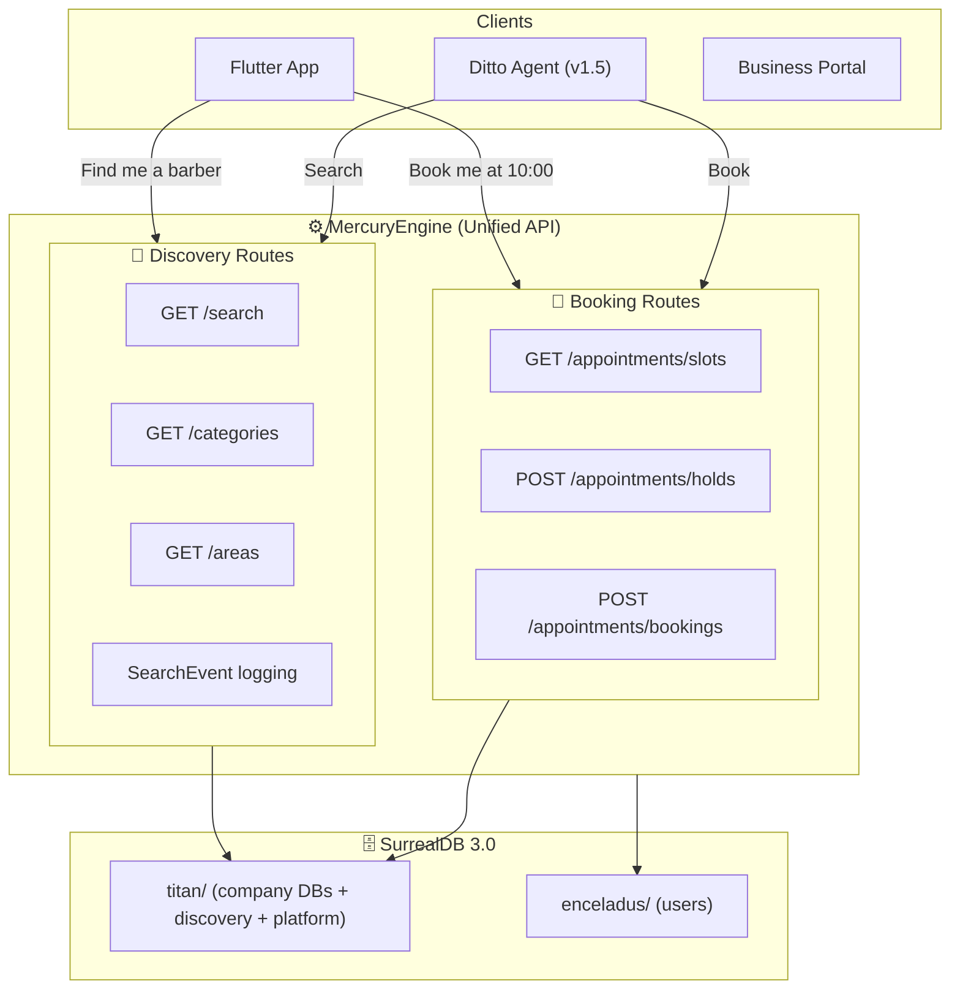

# DittoBar Discovery on MercuryEngine (formerly TheOracle)

## Context

The original ADR-0007 established **TheOracle** as a separate Hono microservice for discovery, backed by SurrealDB while MercuryEngine stayed on Firestore. Session 7 resolved the full platform pivot to SurrealDB — eliminating Firestore entirely.

With SurrealDB as the sole database for both booking and discovery, the bounded context separation between "booking service" and "discovery service" no longer requires separate deployments. The database handles graph traversal, full-text search, and geo queries natively — MercuryEngine can serve both concerns from the same process.

## Decision

**TheOracle's responsibilities are absorbed into MercuryEngine as discovery routes.** There is no separate `@dittodatto/the-oracle` package. MercuryEngine is the single API server.

The conceptual boundary remains: discovery routes (`/search`, `/categories`, `/areas`) and booking routes (`/appointments/*`) are organized as separate route modules within MercuryEngine, but they share the same SurrealDB connection pool and deployment.

## What Survives From TheOracle

| Concept | Status | Where It Lives Now |
|---------|--------|--------------------|
| DittoBar search | ✅ Kept | `MercuryEngine /search` route |
| Geo search ("near me") | ✅ Kept | `MercuryEngine /search` with geo params |
| Category browsing | ✅ Kept | `MercuryEngine /categories` route |
| Demand signal harvesting | ✅ Kept | `search_event` table in `titan/discovery` |
| Reverse Conductor onboarding | ✅ Kept | `company.ai_suggested_data` in `titan/platform` |
| A2UI visor concept (DittoBar) | ✅ Kept | Unchanged — Ditto's eyes into the graph |
| Separate Hono server | ❌ Removed | Absorbed into MercuryEngine |
| Firestore → SurrealDB sync pipe | ❌ Removed | No sync needed — single DB |

## Bounded Context Map (Updated)

## Why Merge

| Concern | Separate Services (old) | Single Service (new) |
|---------|------------------------|---------------------|
| Deployment | 2 containers, 2 health checks | 1 container |
| DB connection | 2 connection pools to same DB | 1 shared pool |
| Auth middleware | Duplicated | Shared |
| Saturn resources | More memory overhead | Efficient |
| Complexity | Inter-service calls for enrichment | In-process function calls |
| DX | 2 packages to maintain | 1 cohesive codebase |

The original rationale for separation was **different backing stores** (Firestore vs SurrealDB). With one database, the trade-off flips — separate services add complexity without benefit.

## Consequences

- `packages/the-oracle/` will NOT be created
- Discovery routes are organized under `src/routes/discovery/` in MercuryEngine
- The `titan/discovery` database schema remains separate from company databases
- MercuryEngine uses the repository adapter pattern for both booking and discovery data
- DittoBar in Flutter calls MercuryEngine endpoints, not a separate service
- The term "TheOracle" can still be used conversationally for the discovery concern, but it's not a deployable artifact

---

*Origin: Session 3–4 Grill (bounded context analysis), revised Session 7 (SurrealDB platform pivot eliminated the need for a separate service)*
