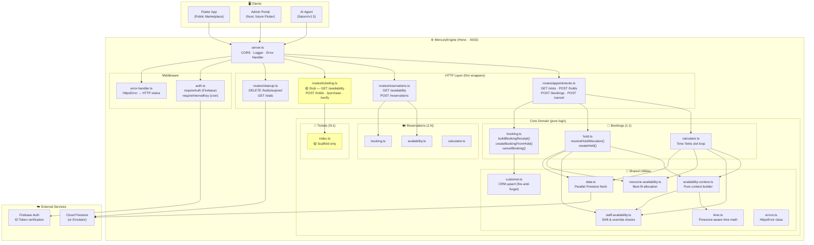

# MercuryEngine — Architecture

## System Overview



## Module Map

```
mercury-engine/
├── src/
│   ├── server.ts                      ← Hono entry point (:5002)
│   ├── config/
│   │   ├── env.ts                     ← Zod-validated env (fail-fast)
│   │   └── firebase.ts               ← Firebase Admin SDK init
│   ├── middleware/
│   │   ├── auth.ts                    ← requireAuth + requireInternalKey
│   │   └── error-handler.ts          ← HttpsError → HTTP status mapping
│   ├── routes/                        ← HTTP layer (validation only)
│   │   ├── appointments.ts            ← 1:1 booking endpoints
│   │   ├── reservations.ts            ← 1:N capacity endpoints
│   │   ├── ticketing.ts               ← N:1 event stubs
│   │   └── cleanup.ts                 ← System maintenance
│   └── core/                          ← Domain logic (pure functions)
│       ├── bookings/                  ← Standard appointment domain
│       │   ├── calculator.ts          ← Time Tetris slot generation
│       │   ├── hold.ts               ← Hold allocation + creation
│       │   ├── booking.ts            ← Receipt builder + cancellation
│       │   └── index.ts              ← Barrel re-exports
│       ├── reservations/              ← Table reservation domain
│       │   ├── availability.ts
│       │   ├── booking.ts
│       │   └── calculator.ts
│       ├── tickets/                   ← Event ticketing (scaffold)
│       │   └── index.ts
│       └── shared/                    ← Cross-domain utilities
│           ├── availability-context.ts ← Pure context builder
│           ├── data.ts               ← Parallel Firestore fetcher
│           ├── errors.ts             ← HttpsError class
│           ├── time.ts               ← Timezone-aware time math
│           ├── staff-availability.ts  ← Shift schedule checker
│           ├── resource-availability.ts ← Best-fit resource allocator
│           └── customer.ts           ← CRM upsert (fire-and-forget)
├── tests/
│   ├── contracts/                     ← API contract tests (HTTP shape)
│   │   └── api-contracts.test.ts
│   ├── core/                          ← Pure function unit tests
│   │   ├── availability-context.test.ts
│   │   ├── booking-receipt.test.ts
│   │   ├── calculator-slots.test.ts
│   │   ├── error-handler.test.ts
│   │   ├── hold-allocation.test.ts
│   │   ├── reservations-calculator.test.ts
│   │   ├── resource-availability.test.ts
│   │   ├── staff-availability.test.ts
│   │   └── time.test.ts
│   └── helpers/
│       └── test-app.ts               ← Test Hono app factory
└── package.json                       ← v0.2.0
```

## Booking Verticals

MercuryEngine supports three booking verticals, matching the Establishment types defined in CONTEXT.md:

| Vertical | Pattern | Route Prefix | Core Module | Status |
|----------|---------|-------------|-------------|--------|
| **Service** (salon, garage) | 1:1 — one customer, one slot | `/appointments/*` | `core/bookings/` | ✅ Production |
| **Restaurant** (table reservation) | 1:N — one resource, many guests | `/reservations/*` | `core/reservations/` | ✅ Production |
| **Venue** (event ticketing) | N:1 — many customers, one event | `/tickets/*` | `core/tickets/` | 🟡 Scaffold |

## Data Flow Pattern

Every booking domain follows the same pattern:

```
Client Request
     │
     ▼
┌─────────────────┐
│   Route Handler  │  ← Validates params, destructures body
│   (HTTP Layer)   │     Does NOT contain business logic
└────────┬────────┘
         │
         ▼
┌─────────────────┐
│  fetchData()     │  ← Parallel Firestore reads (Promise.all)
│  (data.ts)       │     Store + Bookings + Holds + Services + Staff + Resources
└────────┬────────┘
         │
         ▼
┌─────────────────────────┐
│  buildAvailabilityCtx() │  ← PURE — Zero IO
│  (availability-ctx.ts)  │     Normalizes staff, builds occupancy maps,
│                         │     derives policies, extracts resource groups
└────────┬────────────────┘
         │
         ▼
┌─────────────────────────┐
│  Domain Logic            │  ← PURE — Zero IO
│  calculator / hold /     │     Slot loop, allocation, receipt builder
│  booking                 │
└────────┬────────────────┘
         │
         ▼
┌─────────────────┐
│  Firestore Write │  ← Transaction (hold.ts / booking.ts)
│  (Atomic)        │     Idempotent composite keys
└─────────────────┘
```

## Architecture Principles

1. **Pure Core, Thin Shell** — All business logic lives in `core/` as pure functions. Routes are thin HTTP wrappers. Tests target pure functions exclusively.

2. **Parallel Data Fetching** — `fetchAvailabilityData()` uses `Promise.all` for 7 concurrent Firestore reads. Data latency = slowest single read, not sum.

3. **Granular Concurrency Locks** — Hold transactions lock at the most specific entity: staff doc → resource doc → store doc (fallback). Alice's bookings don't block Bob's.

4. **Snapshot Pattern** — Bookings copy service price/title at booking time. Price changes don't affect historical bookings (Norwegian fiscal compliance).

5. **Fire-and-Forget CRM** — Customer record upsert runs after the booking transaction. Failures go to a dead-letter queue, never block bookings.

6. **Fail-Fast Config** — `env.ts` validates all environment variables at startup with Zod. Misconfigured servers crash immediately, not at first request.

## Dependencies

| Package | Purpose | Lock-in Risk |
|---------|---------|-------------|
| `hono` | HTTP framework | Low — standard fetch API |
| `firebase-admin` | Firestore + Auth | High — core data layer |
| `@dittodatto/shared-types` | Zod schemas | Internal — workspace package |
| `zod` | Validation | Low — replaceable |
| `date-fns` | Date utilities | Low — mostly using Intl API |

---

*Created: 2026-05-02 — Session 3 Grill*
