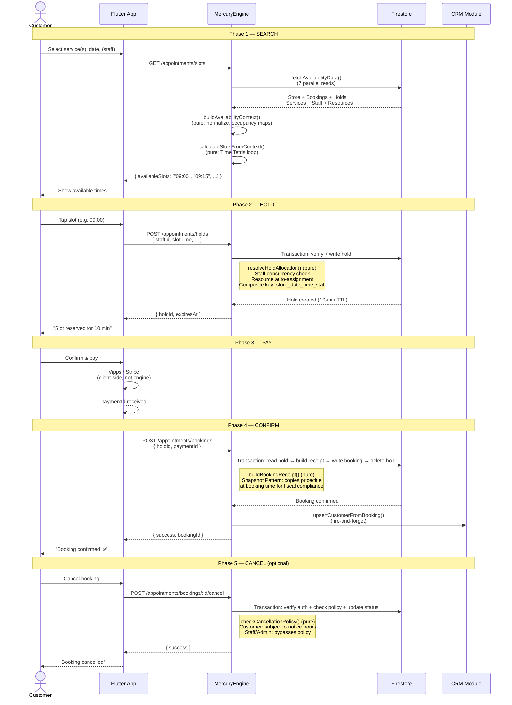
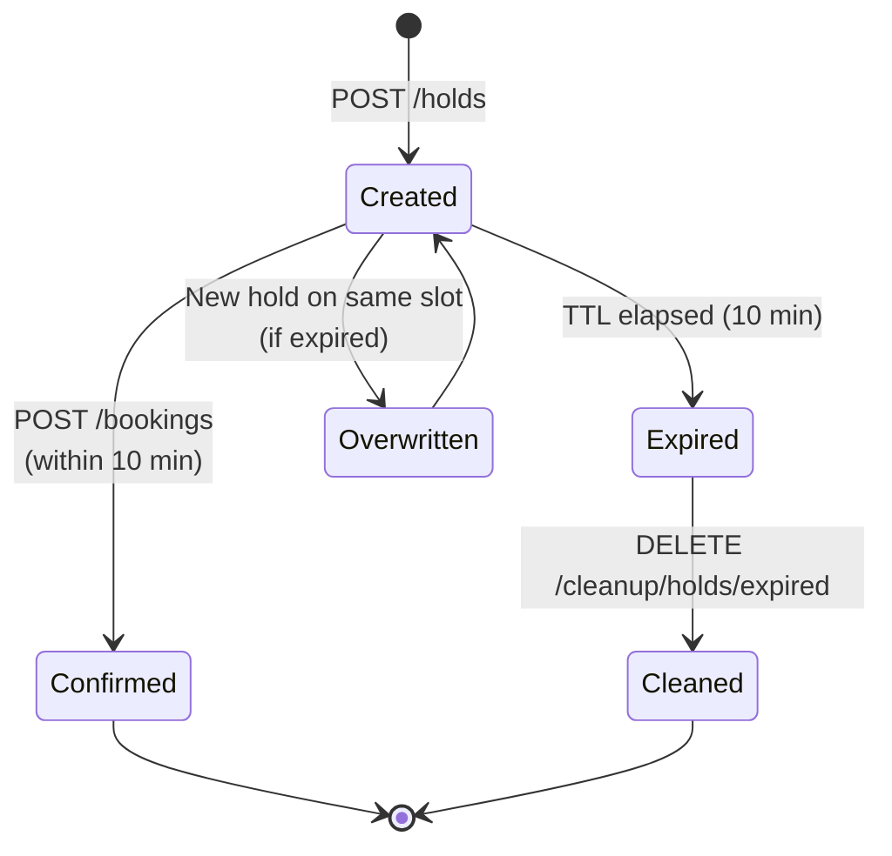
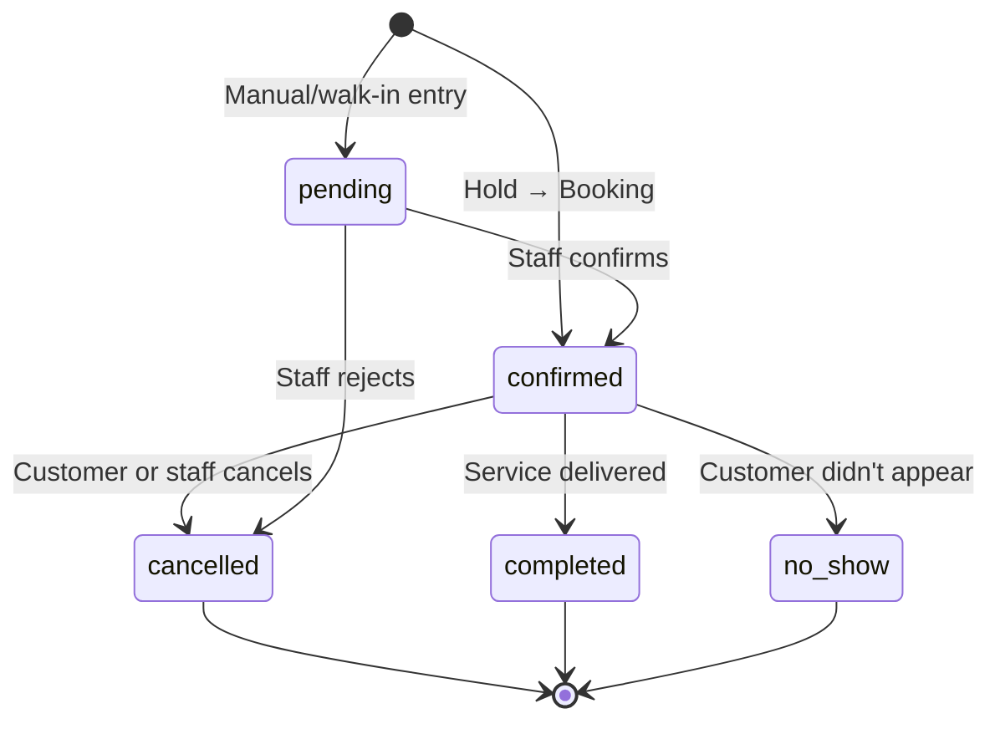

# MercuryEngine — Booking Flow

> The 5-phase lifecycle of a standard appointment (1:1 booking).

## Flow Diagram

## Phase Details

### Phase 1: Search (Slot Calculation)

**Endpoint:** `GET /appointments/slots`  
**Auth:** Public  
**Core function:** `calculateSlotsFromContext()` — pure, testable

The Time Tetris algorithm:
1. Fetch all data in parallel (store hours, existing bookings, active holds, services, staff schedules, resources)
2. Build a computed `AvailabilityContext` — normalize staff shifts, build occupancy maps, derive policies
3. Loop from store open → close in `slotInterval` increments:
   - **Notice check** — skip slots too close to "now" (timezone-aware)
   - **Staff check** — is ANY eligible staff member free for this slot?
   - **Resource check** — is a resource available from each required group?
   - If all checks pass → slot is available

### Phase 2: Hold (10-minute Lock)

**Endpoint:** `POST /appointments/holds`  
**Auth:** Firebase Auth  
**Core function:** `resolveHoldAllocation()` — pure, testable

Hold mechanics:
- **Composite key:** `{storeId}_{date}_{slotTime}_{staffId|resourceId|userId}` — provides idempotency AND concurrency differentiation
- **Staff auto-assignment:** If customer didn't pick a specific staff member, engine assigns the first available one
- **Resource auto-assignment:** Best-fit algorithm (priority → smallest capacity)
- **Granular locking:** Transaction writes a tracker to the staff/resource doc, not the store doc — multiplies throughput by number of bookable entities
- **Expired hold overwrite:** If a hold exists but has expired, it's overwritten atomically

### Phase 3: Payment (Client-Side)

Payment is handled entirely by the Flutter client (Vipps/Stripe SDK). The engine doesn't process payments — it only receives the `paymentId` as proof.

### Phase 4: Confirm (Hold → Booking)

**Endpoint:** `POST /appointments/bookings`  
**Auth:** Firebase Auth  
**Core function:** `buildBookingReceipt()` — pure, testable

Confirmation mechanics:
- **Snapshot Pattern:** Copies service `price`, `title`, `duration` at booking time. If the business raises prices later, existing bookings are unaffected (Norwegian fiscal requirement)
- **Atomic transaction:** Read hold → fetch services → build receipt → write booking → delete hold
- **CRM upsert:** After the transaction succeeds, `upsertCustomerFromBooking()` runs fire-and-forget. Failures go to a dead-letter queue (`failed_crm_jobs` collection), never block the booking

### Phase 5: Cancel

**Endpoint:** `POST /appointments/bookings/:bookingId/cancel`  
**Auth:** Firebase Auth (customer or company admin)  
**Core function:** `checkCancellationPolicy()` — pure, testable

Authorization layers:
1. Is the user the customer who made the booking? → Check cancellation policy
2. Is the user a company admin/member? → Always allowed (bypass policy)
3. Is the user a super_admin? → Always allowed

Cancellation policy checks:
- `clientCancelEnabled` — can customers cancel at all?
- `minCancelNoticeHours` — how far in advance must they cancel?

## Hold Lifecycle

## Booking Status Lifecycle

---

*Created: 2026-05-02 — Session 3 Grill*
