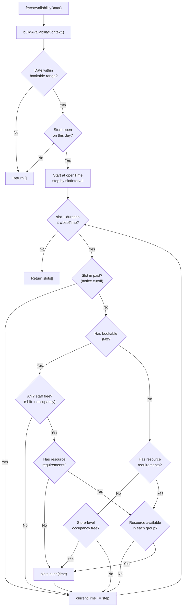

# MercuryEngine — Time Tetris Algorithm

> The slot calculation algorithm is the heart of MercuryEngine. This document explains exactly how it works.

## What It Does

Given a store, date, and selected services → return all bookable time slots.

## Algorithm



## Concurrency Model

MercuryEngine has three concurrency modes, selected automatically based on store configuration:

### 1. Staff-Aware (most common)

**When:** Store has bookable staff members.

```
Staff: [Alice, Bob]
Service: Haircut (60min)
Date: Monday

09:00  Alice: [Booked 09:00-10:00]  Bob: [FREE]       → Slot available (Bob)
10:00  Alice: [FREE]                  Bob: [FREE]       → Slot available (either)
```

- Slot is available if **ANY** eligible staff member is free
- Staff eligibility = intersection of `Service.assignedStaff[]` across all selected services
- Staff schedule checked via `weeklyShifts` → `dateOverrides` (sick/off/custom)
- If staff has no `weeklyShifts`, they inherit store opening hours (Mon-Fri)

### 2. Resource-Aware (additive)

**When:** Services have `requiredResourceGroupIds`.

Resources are checked **in addition to** staff (not instead of). Both must be available.

```
Resource Group: "Main Dining" → [Table 1 (cap 2), Table 2 (cap 4), Table 3 (cap 6)]
Sort: priority (high→low), then capacity (smallest first = best-fit)

Slot 18:00: Table 1 occupied → Try Table 2 → Free → Assigned ✅
```

### 3. Store-Level Fallback

**When:** No staff AND no resources configured.

Single global slot — only one booking at a time for the entire store. Like a solo practitioner with no staff records.

## Context Building

`buildAvailabilityContext()` is the most critical pure function. It transforms raw Firestore data into a computed context used by both the slot calculator and the hold allocator.

### What it computes

| Computation | Logic |
|-------------|-------|
| **Staff normalization** | Staff without `weeklyShifts` → inject store hours (Mon-Fri) |
| **Staff-service filtering** | Intersection of `assignedStaff[]` across all services. Empty array = universal. |
| **Policy derivation** | `noticeCutoffMinutes` = max across services. `slotInterval` = min across services. |
| **Occupancy maps** | Per-staff: bookings + active holds mapped to minute intervals. Store-level: all occupancy combined. Resource-level: occupancy keyed by resourceId. |
| **Resource extraction** | Deduplicated `requiredResourceGroupIds` from all services |

### Why it matters

This computation was previously duplicated in both `calculator.ts` and `hold.ts`. Extracting it into a pure function:

- Eliminated 30+ lines of duplication
- Made both modules independently testable with the same context
- Ensures calculator and hold validator always agree on what's "available"

## Timezone Handling

All time operations are timezone-aware:

1. **Store timezone** is stored as IANA string (e.g., `"Europe/Oslo"`)
2. **`getStoreNow()`** uses `Intl.DateTimeFormat` to get current time in the store's timezone
3. **`minutesFromMidnight()`** converts ISO timestamps to minutes-from-midnight in the store's timezone
4. **Slot times** are timezone-naive strings (`"10:00"`) — they represent local time at the store
5. **Notice cutoff** compares slot time against store-local "now" — not UTC

This means a store in `Europe/Oslo` (UTC+1/+2) correctly handles bookings from customers in any timezone. The customer sees slots in the store's local time.

## Test Coverage

| Test File | What It Tests | Tests |
|-----------|---------------|-------|
| `calculator-slots.test.ts` | Slot generation with various schedules | Basic generation, closed days, intervals, store-level blocking, staff-aware blocking |
| `hold-allocation.test.ts` | Hold allocation + concurrency | Composite keys, staff assignment, concurrency (busy/free), store-level, resource allocation, edge cases |
| `availability-context.test.ts` | Context building | Staff normalization, service filtering, policy derivation, resource groups, schedule parsing, occupancy maps |
| `staff-availability.test.ts` | Shift schedule checking | Weekly shifts, date overrides, block fitting |
| `resource-availability.test.ts` | Resource allocation | Best-fit sort, group satisfaction, overlap detection |

---

*Created: 2026-05-02 — Session 3 Grill*
