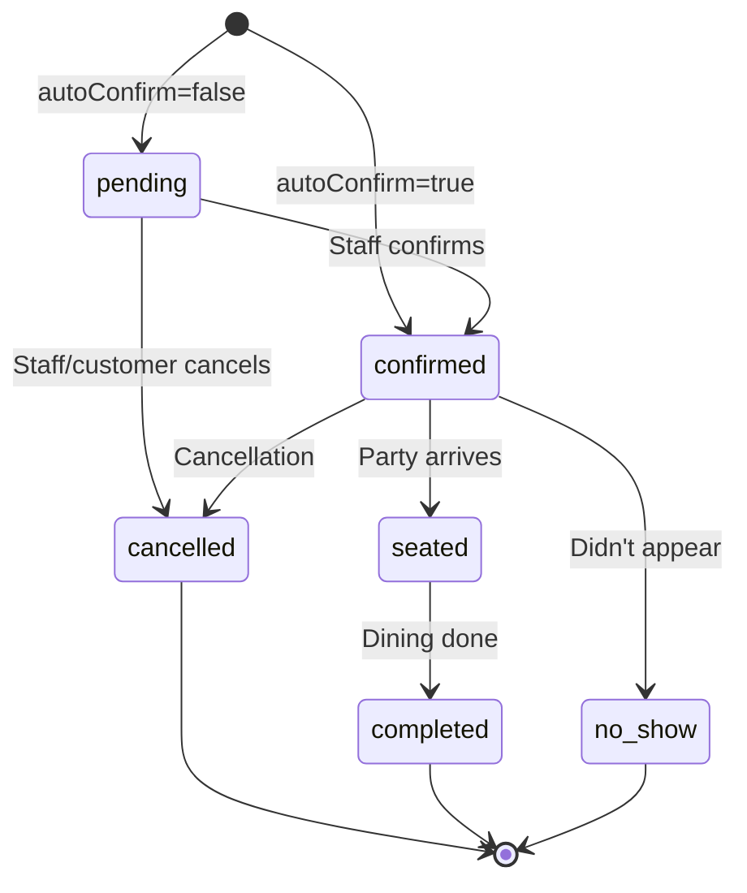

# MercuryEngine — Table Reservations (1:N)

> One resource (table), many guests per time slot.  
> Restaurants, cafés, coworking spaces — capacity-based booking.

## Pattern

```
Party of N ──[1:N]──► Table (Resource)
                         │
                    [during window]
                         │
                         ▼
                    Time Slot
              (from store hours or service)
```

## Route Prefix

`/reservations/*`

## Core Module

`core/reservations/` — [calculator.ts](file:///media/addinator/Mercury/Projects/DittoDatto/packages/mercury-engine/src/core/reservations/calculator.ts), [availability.ts](file:///media/addinator/Mercury/Projects/DittoDatto/packages/mercury-engine/src/core/reservations/availability.ts), [booking.ts](file:///media/addinator/Mercury/Projects/DittoDatto/packages/mercury-engine/src/core/reservations/booking.ts)

## Status: ✅ Production

Working, tested. Has a resolved P1 (table resource scoping by service).

## Lifecycle

```
Search availability → Create reservation (atomic transaction)
```

> **Note:** Reservations skip the hold phase. They go straight from "is this available?" to "booked." This is intentional — restaurant reservations are lower-commitment than paid appointments.

## Two Capacity Modes

Auto-detected based on whether the store has table resources:

### Pool Mode (no tables)

Simple guest count tracking against `totalCapacity`:

```
Store capacity: 60 seats
18:00 slot: 42 guests booked → 18 remaining
Party of 4 → ✅ Available (18 ≥ 4)
Party of 20 → ❌ Exceeded
```

### Table Mode (with resources)

Per-table assignment using best-fit algorithm:

```
Tables: [T1 (cap 2), T2 (cap 4), T3 (cap 6)]
Party of 3 → Try T2 (smallest that fits) → ✅ Assigned to T2
```

**Best-fit sort:** Priority DESC → Capacity ASC (smallest suitable table first). Prevents fragmentation.

### Service-Scoped Tables (P1 Fix)

When a `serviceId` is provided, only tables belonging to that service's `requiredResourceGroupIds` are considered:

```
Service "Terrace Dinner" → ResourceGroup "Terrace Tables"
Service "Indoor Dining"  → ResourceGroup "Main Hall Tables"

Request: serviceId=terrace-dinner → only terrace tables checked
```

This prevents an indoor table from being assigned to a terrace reservation.

## Data Model

| Entity | Schema | Collection Path |
|--------|--------|----------------|
| Reservation | `ReservationSchema` | `companies/{cid}/reservations/{rid}` |
| ReservationConfig | `ReservationConfigSchema` | Embedded in `Store.reservationConfig` |
| Resource (table) | `ResourceSchema` | `companies/{cid}/stores/{sid}/resources/{rid}` |

### Reservation Status Lifecycle



## ReservationConfig

| Field | Type | Default | Purpose |
|-------|------|---------|---------|
| `maxGuestsPerReservation` | number | 8 | Instant booking limit |
| `largePartyHandling` | enum | `email` | What happens above max: `email`, `call`, `datto`, `disabled` |
| `defaultDuration` | number | 90 min | How long a reservation blocks the table |
| `slotInterval` | number | 30 min | Time between bookable slots |
| `bufferBetweenSlots` | number | 0 min | Gap between reservations (turnover) |
| `capacityMode` | enum | `pool` | `pool`, `tables`, or `hybrid` |
| `totalCapacity` | number | — | Total seats for pool mode |
| `autoConfirm` | boolean | true | Skip pending state |

## ~~Experience~~ (Deprecated)

> [!WARNING]
> **`Experience` is a legacy concept from Noona.** It provided named operating windows (e.g., "Lunch 11-15", "Dinner 17-23") as a way to split the day. 
>
> In DittoDatto, this is handled by **Services with `bookingMode: 'tableReservation'`** (ADR-0004). A restaurant can have multiple reservation services ("Terrace Dinner", "Indoor Lunch") each scoped to different resource groups and time windows.
>
> The `ExperienceSchema` in shared-types and the `experiences` fetch in `availability.ts` should be removed in a future cleanup session. The code currently falls back to store hours when no experiences exist, which is the correct path.

## API Reference

See [API Contract](./api-contract.md#reservations--capacity-1n-booking) for full endpoint documentation.

| Method | Endpoint | Auth | Purpose |
|--------|----------|------|---------|
| `GET` | `/reservations/availability` | Public | Slot availability with capacity |
| `POST` | `/reservations` | Firebase | Create reservation |

## Concurrency Protection

Reservations use Firestore transactions with **granular locking**:
- **Table mode:** Transaction writes `_lastReservationTracker` to the assigned table's resource doc
- **Pool mode:** Transaction writes to the store doc

This means two reservations for different tables can be created concurrently without blocking each other.

## Test Coverage

| Test File | Focus |
|-----------|-------|
| `reservations-calculator.test.ts` | Slot generation, pool mode, table best-fit, overlap detection |

---

*Created: 2026-05-02 — Session 3 Grill*
