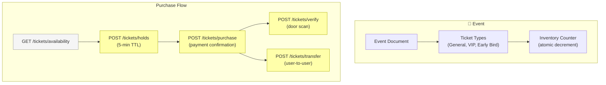

# MercuryEngine — Event Ticketing (N:1)

> Many customers, one event.  
> Concerts, workshops, classes, nightclubs — the Scandinavian Ticketmaster play.

## Pattern

```
Customer A ──┐
Customer B ──┤──[N:1]──► Event (finite tickets)
Customer C ──┘
```

## Route Prefix

`/tickets/*`

## Core Module

`core/tickets/` — [index.ts](file:///media/addinator/Mercury/Projects/DittoDatto/packages/mercury-engine/src/core/tickets/index.ts) (scaffold only)

## Status: 🟡 Scaffold

Routes exist with stub responses. No core logic implemented. Target: v1.4+.

## Why This Matters

From CONTEXT.md:
- `storeType: 'venue'` → ticketing is the **primary** booking mode
- **Any** establishment can create one-off events (salon hosting a workshop)
- Events with ticketing are gated by `Company.enabledFeatures.ticketSystem`
- This is the "Scandinavian Ticketmaster" play — decentralized event ticketing

## System Design

> [!NOTE]
> 🗣️ **Arnar:** There's a system design interview on YouTube that goes deep into how Ticketmaster is architected. The core design is surprisingly simple from above. That simplicity is why we introduced this vertical into MercuryEngine.

### High-Level Architecture



### Core Concepts

| Concept | Description |
|---------|-------------|
| **Event** | A time-bound occurrence at a venue. Has a start/end time, capacity, and ticket types |
| **Ticket Type** | A pricing tier within an event: General Admission, VIP, Early Bird, etc. Each has its own inventory count and price |
| **Ticket** | An individual admission unit. Belongs to a user, linked to an event + ticket type |
| **Inventory** | Atomic counter per ticket type. Decremented on purchase, incremented on refund. The hot-path concurrency concern |
| **Hold** | 5-minute reservation (shorter than booking holds — ticket demand is spikier). Decrements inventory speculatively |
| **Door Scan** | QR code verification at entry. Marks ticket as `used`. Must be idempotent (same ticket scanned twice = same result) |
| **Transfer** | Re-assign ticket ownership to another user. Original owner loses access, new owner gains it |

### What Makes Ticketing Different from Standard Bookings

| Concern | Standard (1:1) | Ticketing (N:1) |
|---------|---------------|-----------------|
| **Concurrency** | Staff-level locks (low contention) | Inventory counter (high contention — flash sales) |
| **Hold TTL** | 10 minutes | 5 minutes (spikier demand) |
| **Resource** | Staff member / room | Venue capacity (a number, not an entity) |
| **Post-purchase** | Service delivery | Door verification + potential transfer |
| **Pricing** | Fixed per service | Tiered (GA, VIP) + potentially dynamic |
| **Time model** | Slot-based (09:00, 09:15) | Event-based (one start time) |

### The Hot Path: Inventory Decrement

The critical concurrency challenge. When 1000 people try to buy the last 50 tickets:

```
Option A: Firestore Transaction (current pattern)
  → transaction.get(inventoryDoc) → check count → decrement → commit
  → Contention: HIGH for popular events
  → Firestore retries: up to 5x, then fails

Option B: Distributed Counter (Firestore sharded)
  → Split inventory across N shard documents
  → Each shard holds count/N tickets
  → Parallel writes across shards
  → Contention: LOW, but aggregation needed for reads

Option C: Redis/Memorystore Atomic Decrement (future)
  → DECR command is O(1) and atomic
  → Requires additional infra (Saturn could host this)
  → Best for flash-sale scenarios
```

**Recommendation for v1:** Start with Option A (Firestore transactions). DittoDatto's scale in Drammen won't hit contention limits. If a venue sells 500+ tickets for a single event, graduate to Option B.

### Proposed API

| Method | Endpoint | Purpose | Status |
|--------|----------|---------|--------|
| `GET` | `/tickets/availability?eventId=X` | Ticket types + remaining counts | 🟡 Stub |
| `POST` | `/tickets/holds` | Reserve tickets (5-min) | 🟡 Stub |
| `POST` | `/tickets/purchase` | Confirm purchase | 🟡 Stub |
| `POST` | `/tickets/verify` | Door scan validation | 🟡 Stub |
| `POST` | `/tickets/transfer` | Transfer to another user | 🟡 Stub |

### Proposed Data Model

```
events/{eventId}
  ├── ticketTypes/{typeId}    ← price, name, inventory count
  ├── tickets/{ticketId}      ← owner, status, QR code
  └── holds/{holdId}          ← 5-min speculative lock
```

| Entity | Key Fields |
|--------|-----------|
| **Event** | `storeId`, `companyId`, `title`, `startDateTime`, `endDateTime`, `venue`, `status` |
| **TicketType** | `eventId`, `name` ("GA", "VIP"), `price`, `totalInventory`, `remainingInventory`, `salesStart`, `salesEnd` |
| **Ticket** | `eventId`, `ticketTypeId`, `ownerId`, `status` (`active`, `used`, `transferred`, `refunded`), `qrCode` |
| **TicketHold** | `eventId`, `ticketTypeId`, `userId`, `quantity`, `expiresAt` |

## Implementation Roadmap

1. **v1.4 (Comms Layer)** — prerequisite: push notifications for ticket confirmation
2. **v1.5 (Agentic)** — Ditto can search and buy tickets via TheOracle + MercuryEngine
3. **Post-v1.5** — Dynamic pricing, waitlists, season passes

## References

- [CONTEXT.md — Establishment Verticals](file:///media/addinator/Mercury/Projects/DittoDatto/.docs/CONTEXT.md)
- [ADR-0004 — Per-service booking modes](file:///media/addinator/Mercury/Projects/DittoDatto/.docs/adr/0004-per-service-booking-mode.md)
- YouTube system design interview: Ticketmaster architecture (Arnar's reference)

---

*Created: 2026-05-02 — Session 3 Grill*
