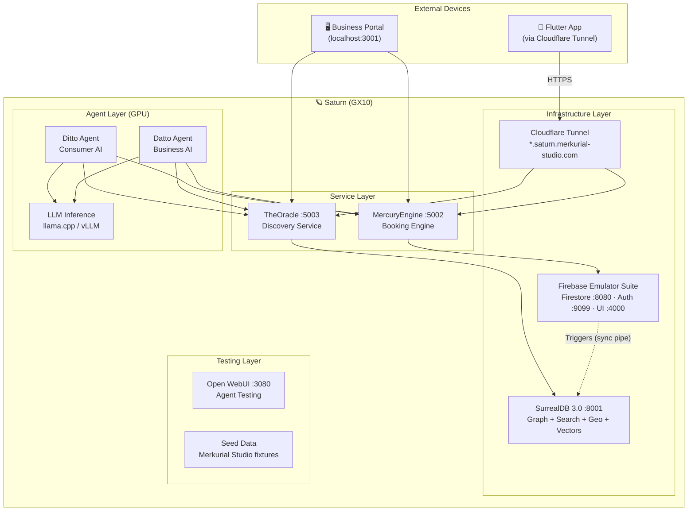

# 📌 PostIT: Saturn Local Stack — Full DittoDatto Platform on GX10

## The Vision

Run the **entire DittoDatto platform** on Saturn — MercuryEngine, TheOracle, Ditto, Datto, and the Flutter app — all local-first. Zero cloud dependency during development. Dogfood Merkurial Studio on the same box that builds the platform.

## Can We Do It?

**Yes. 100%.** MercuryEngine already supports `FIRESTORE_EMULATOR_HOST` — when set, Firebase Admin SDK talks to the local emulator instead of GCP. Same for Auth. The engine is Docker-ready (Cloud Run images). Everything composable.

## Proposed Stack



## Docker Compose Blueprint

```yaml
# docker-compose.saturn.yml
services:
  firebase-emulator:
    image: ghcr.io/nicholasgasior/docker-firebase-emulator:latest
    ports:
      - "8080:8080"   # Firestore
      - "9099:9099"   # Auth
      - "4000:4000"   # Emulator UI
    volumes:
      - ./firebase-data:/data
    environment:
      - GCLOUD_PROJECT=cs-poc-4zmxog23jmy4io0d4yx6rj0

  mercury-engine:
    build: ./packages/mercury-engine
    ports:
      - "5002:5002"
    environment:
      - PORT=5002
      - NODE_ENV=development
      - GCLOUD_PROJECT=cs-poc-4zmxog23jmy4io0d4yx6rj0
      - FIRESTORE_EMULATOR_HOST=firebase-emulator:8080
      - FIREBASE_AUTH_EMULATOR_HOST=firebase-emulator:9099
    depends_on:
      - firebase-emulator

  the-oracle:
    build: ./packages/the-oracle
    ports:
      - "5003:5003"
    environment:
      - PORT=5003
      - SURREALDB_URL=http://surrealdb:8000
      - SURREALDB_USER=root
      - SURREALDB_PASS=root
      - SURREALDB_NS=dittodatto
      - SURREALDB_DB=main
    depends_on:
      - surrealdb

  surrealdb:
    image: surrealdb/surrealdb:latest
    command: start --log info --user root --pass root file:/data/dittodatto.db
    ports:
      - "8001:8000"
    volumes:
      - ./surrealdb-data:/data

  # LLM inference — already running in Hermesopolis Domes
  # Agent harness — connects to llm + services
```

## What's Identical to Cloud Production

| Concern | Saturn (Local) | Cloud (Production) |
|---------|---------------|-------------------|
| MercuryEngine code | ✅ Same Docker image | ✅ Cloud Run |
| TheOracle code | ✅ Same Docker image | ✅ Cloud Run |
| Firestore API | ✅ Emulator (full API compat) | ✅ Real Firestore |
| Auth API | ✅ Emulator (token generation) | ✅ Firebase Auth |
| REST endpoints | ✅ Same Hono routes | ✅ Same routes |
| API contract | ✅ Same payloads | ✅ Same payloads |

## What's Different (and why it's fine)

| Concern | Saturn | Cloud | Impact |
|---------|--------|-------|--------|
| Firestore indexes | Emulator ignores them | Required for compound queries | Test indexes separately |
| BankID/Vipps auth | Mock tokens | Real BankID verification | Use Auth Emulator test users |
| Payment processing | Mock paymentIds | Real Vipps/Stripe | Payment is client-side anyway |
| Auto-scaling | Single instance | Cloud Run scales | Saturn has more power than needed |
| SSL/domains | Cloudflare Tunnel | Cloud Run HTTPS | Tunnel gives real HTTPS |
| Uptime SLA | Your power grid 😄 | Google's SLA | Dev environment, not prod |

## Seed Data — Merkurial Studio as Test Company

Pre-load the emulator with:
- **Company:** Merkurial Studio
- **Store:** The Drammen studio
- **Services:** Consulting, Development, etc.
- **Staff:** Arnar + test staff members
- **Resources:** Meeting rooms, workstations
- **Sample bookings:** Past + upcoming for testing

Export as JSON → `firebase-data/` → auto-imported on `docker compose up`.

## Mobile Testing via Cloudflare Tunnel

```bash
cloudflared tunnel run saturn-dev
# Exposes:
#   mercury.saturn.merkurial-studio.com → localhost:5002
#   oracle.saturn.merkurial-studio.com  → localhost:5003
```

Flutter app config:
```dart
// lib/config/environment.dart
const mercuryUrl = 'https://mercury.saturn.merkurial-studio.com';
const oracleUrl  = 'https://oracle.saturn.merkurial-studio.com';
```

## Regarding Nvidia Hosting (Parking Lot)

> Arnar mentioned considering Nvidia GPU Cloud as an alternative to GCP — not serious yet.

**Current lock-in assessment:**
- **Low lock-in:** Hono (standard fetch API), Zod (replaceable), Docker (universal)
- **Medium lock-in:** Firebase Admin SDK (Firestore + Auth) — MercuryEngine only
- **Zero lock-in:** SurrealDB (BSL 1.1, self-hosted, single binary)
- **Migration path:** Firebase Auth → Supabase Auth (if ever needed)

The architecture is portable by design. If Nvidia ever makes sense (dedicated GPU hosting for inference), the services can move with minimal changes. The Docker images are the same regardless of host.

**Recommendation:** Stay on GCP for production (scale-to-zero, managed infra). Use Saturn for dev/staging/agent training. Revisit hosting when agent inference becomes the dominant cost.

## Day-1 Saturn Checklist

- [ ] Install Docker + Docker Compose on Saturn
- [ ] Create `docker-compose.saturn.yml` in project root
- [ ] Set up SurrealDB Dome (port 8001, data on Saturn SSD)
- [ ] Run SurrealDB PoC graph schema + seed data (see `.docs/postit/surrealdb-poc.md`)
- [ ] Set up Firebase Emulator with seed data
- [ ] Test MercuryEngine against emulator
- [ ] Build TheOracle → SurrealDB connection
- [ ] Set up Firestore Triggers sync pipe (store changes → SurrealDB upsert)
- [ ] Set up Cloudflare Tunnel for mobile testing
- [ ] Decommission Qdrant Dome on Pluto (SurrealDB replaces it)
- [ ] Connect Ditto/Datto agent harness to local services
- [ ] Run first end-to-end: Flutter → TheOracle → SurrealDB → MercuryEngine → Booking confirmed 🎉

---

*Created: 2026-05-02 — Session 3 Grill*
*Updated: 2026-05-02 — Session 4: Qdrant → SurrealDB (ADR-0008)*
