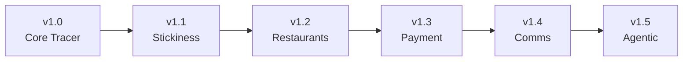

# DittoDatto Public Marketplace v1.0 — Product Requirements Document

---

## Problem Statement

Norwegian consumers currently have no unified, intelligent way to discover and book local services — salons, restaurants, garages, clinics — from a single native app. Existing solutions are fragmented (Noona for beauty, Resy for dining, phone calls for everything else), none of them capture demand signals, and none are designed for agentic commerce.

Businesses lack a platform that onboards them into a knowledge graph, makes them discoverable through geo-aware search, and prepares them for AI-mediated transactions — all without forcing rigid SaaS tier structures.

DittoDatto needs its first complete vertical slice through every layer of the system: a **tracer bullet** from authentication to booking confirmation that proves the architecture, establishes the user experience, and begins harvesting demand intelligence from day one.

---

## Solution

A **Flutter native app** (iOS + Android) that lets verified Norwegian consumers discover local establishments on a map, search via the DittoBar (backed by MercuryEngine's SurrealDB-powered discovery routes), browse services, book appointments through MercuryEngine, and manage their bookings — all secured by mandatory BankID verification through Vipps Login.

The app is designed as an **agentic-ready platform**: the DittoBar is an A2UI visor (Ditto's future eyes into the graph), the map is an agent canvas, and every search query is logged as a geo-enriched SearchEvent for demand intelligence. v1.0 delivers a clean manual experience; v1.5 activates the agentic layer without rebuilding.

---

## User Stories

### Consumer (Public Marketplace User)

1. As a consumer, I want to sign in with Vipps Login, so that my identity is BankID-verified and I can book services securely.
2. As a consumer, I want the app to remember my session, so that I don't have to re-authenticate every time I open it.
3. As a consumer, I want to see a map showing nearby establishments when I open the app, so that I can visually discover what's around me.
4. As a consumer, I want the map to collapse into a compact header, so that I can scroll through curated listings without losing spatial context.
5. As a consumer, I want to expand the map to full-screen by pulling up, so that I can explore a wider area when I want spatial discovery.
6. As a consumer, I want to tap a map pin to see the establishment name and category, so that I can identify businesses at a glance.
7. As a consumer, I want to type in the DittoBar and get results from establishments and services, so that I can find what I'm looking for.
8. As a consumer, I want to see autocomplete suggestions from cached categories as I type, so that I get instant feedback before the server responds.
9. As a consumer, I want search results to appear as both map pins and a scrollable list, so that I can choose between spatial and list-based browsing.
10. As a consumer, I want to filter search results by category (salon, restaurant, garage, etc.), so that I can narrow down my options.
11. As a consumer, I want to filter search results by distance radius, so that I only see establishments I'm willing to travel to.
12. As a consumer, I want to browse establishments by category from the home screen, so that I can discover without typing a query.
13. As a consumer, I want to tap an establishment to see its EstablishmentPage, so that I can learn about its services, staff, and details.
14. As a consumer, I want to see a list of services offered by an establishment, so that I can choose what I need.
15. As a consumer, I want to see staff portraits when the service uses `customer_choice` assignment, so that I can pick my preferred staff member.
16. As a consumer, I want to see available time slots for a service on a given day, so that I can pick a time that works for me.
17. As a consumer, I want to navigate between days when selecting a time slot, so that I can find availability on my preferred date.
18. As a consumer, I want to hold a time slot while I confirm my booking, so that another user doesn't take it from under me.
19. As a consumer, I want to confirm a held booking, so that my appointment is officially created.
20. As a consumer, I want to see a booking confirmation screen with all details (date, time, service, staff, location), so that I have a clear record.
21. As a consumer, I want to see my upcoming bookings in a dedicated Bookings tab, so that I can manage my schedule.
22. As a consumer, I want to see my past bookings, so that I can review my history.
23. As a consumer, I want to cancel a booking, so that I can free up the slot if my plans change.
24. As a consumer, I want to see the cancellation deadline and any policy restrictions before I cancel, so that I make an informed decision.
25. As a consumer, I want to view my profile with account details, so that I can manage my information.
26. As a consumer, I want the app to work in both Norwegian (bokmål) and English, so that I can use my preferred language.
27. As a consumer, I want to see establishment locations on the map with my current location, so that I can gauge travel distance.
28. As a consumer, I want smooth transitions between the collapsed map and expanded map states, so that the experience feels polished.
29. As a consumer, I want the app to handle no-result searches gracefully with a clear message, so that I know my query didn't fail silently.

### Business Owner (Indirect — via Business Portal, data consumed by Public Marketplace)

1. As a business owner, I want my establishment to appear on the map when a consumer is nearby, so that I gain visibility.
2. As a business owner, I want my services and staff to be displayed accurately on my EstablishmentPage, so that consumers can make informed booking decisions.
3. As a business owner, I want my cancellation policies to be enforced by the app, so that consumers respect my booking rules.
4. As a business owner, I want my availability to update in real-time when bookings are made, so that double-bookings don't occur.

### Platform Operator (Admin Panel / Analytics)

1. As a platform operator, I want every DittoBar query logged as a SearchEvent with geo data, so that I can analyze demand patterns.
2. As a platform operator, I want zero-result queries flagged as Zero-Result Signals, so that I can identify unmet market demand for B2B sales.
3. As a platform operator, I want a SearchEvent to include `userLocation`, `filters`, and `nearestResultDistance_m`, so that demand mapping is geographically precise.
4. As a platform operator, I want MercuryEngine's discovery data to stay consistent via dual-write to the `titan/discovery` database, so that the DittoBar graph stays current.
5. As a platform operator, I want to monitor discovery route performance, so that I can ensure DittoBar response times stay acceptable.

### System (Technical / Infrastructure)

1. As the system, I want to enforce BankID verification (via `requireBankId` middleware) on all write operations, so that only verified users can create bookings.
2. As the system, I want discovery routes (`/search`, `/categories`) logically isolated from booking routes (`/appointments/*`) within MercuryEngine, so that query patterns don't interfere with transactional operations.
3. As the system, I want fiscal immutability on booking snapshots, so that price, service title, and user info captured at creation never change (Norwegian commerce law).
4. As the system, I want all backend infrastructure deployed in EU regions (SurrealDB on Saturn, MercuryEngine on local/EU infra), so that latency is minimal for Norwegian users and data residency is respected.
5. As the system, I want the DittoBar designed as an A2UI visor from day one, so that Ditto agent integration (v1.5) requires no DittoBar rebuild.
6. As the system, I want the map designed as an agent canvas from day one, so that Ditto can inject personalized markers and overlays (v1.5) without a Home screen rebuild.
7. As the system, I want `Service.staffAssignmentMode` to control whether the customer picks staff, the engine auto-assigns, or a manager assigns post-booking, so that booking flows are explicit and mode-aware.
8. As the system, I want `Service.bookingMode` (per-service, not per-store) to determine the booking UX, so that one establishment can offer appointments, reservations, and tickets across different services.
9. As the system, I want empty `Service.assignedStaff` to mean "not bookable" (zero slots returned), so that incomplete service setup is never accidentally exposed to consumers.
10. As the system, I want the Reverse Conductor pattern: establishments push themselves into the SurrealDB knowledge graph via Datto-guided onboarding, so that the graph builds through business activity — not user queries.

---

## Implementation Decisions

### Module Architecture

Eight deep modules, each with a narrow public interface hiding significant internal complexity:

#### 1. Auth Module

- **Interface:** `AuthService.signIn()`, `AuthService.signOut()`, `AuthService.currentUser` (stream), `AuthService.isBankIdVerified`
- **Internals:** Vipps Login OIDC flow with PKCE, app-to-app deep linking (Universal Links / App Links), authorization code exchange via MercuryEngine auth endpoint, SurrealDB user record creation in `enceladus/users`, JWT session management
- **Backend:** MercuryEngine `/auth/vipps` — exchanges Vipps auth code for tokens, creates SurrealDB user session
- **Packages to evaluate:** `flutter_appauth`, `openid_client`
- **Ref:** [PostIT: BankID + Vipps Auth](file:///media/addinator/Mercury/Projects/DittoDatto/.docs/postit/bankid-vipps-auth.md)

#### 2. Discovery Module (DittoBar + MercuryEngine Discovery Client)

- **Interface:** `DiscoveryService.search(query, location, filters)` → `SearchResult[]`, `DiscoveryService.categories()` → `Category[]`, `DiscoveryService.establishment(id)` → `EstablishmentDetail`
- **Internals:** MercuryEngine discovery REST client, debounced query dispatch (300ms), client-side category autocomplete from cache, result mapping to map pins + list items, SearchEvent emission
- **Backend dependency:** MercuryEngine discovery routes (`/search`, `/categories`, `/establishments/:id`)
- **Ref:** [ADR-0007](file:///media/addinator/Mercury/Projects/DittoDatto/.docs/adr/0007-dittobar-search-on-theoracle.md) (revised)

#### 3. Map Module

- **Interface:** `MapController.setMarkers(pins)`, `MapController.focusOn(latLng)`, `MapController.expand()`, `MapController.collapse()`
- **Internals:** Google Maps Flutter widget, hybrid collapsible sheet pattern (DraggableScrollableSheet or similar), marker clustering, user location tracking, dark mode support
- **Design:** Compact header (~30% screen) default, full-screen on pull-up. Agent canvas foundation — designed to accept dynamic markers/overlays from external sources
- **Ref:** [ADR-0002](file:///media/addinator/Mercury/Projects/DittoDatto/.docs/adr/0002-hybrid-collapsible-map-home-screen.md)

#### 4. Establishment Module

- **Interface:** `EstablishmentPage(establishmentId)` — renders services, staff, info, booking entry
- **Internals:** Data fetching from MercuryEngine (establishment detail + availability check on demand), staff portrait display (conditional on `staffAssignmentMode`), service list with booking mode indicators, establishment info (address, hours, contact)
- **Domain mapping:** SurrealDB `establishment` → Flutter `Establishment`. Zod schemas use `StoreSchema`/`storeId` (repository layer maps).

#### 5. Booking Module (MercuryEngine Client)

- **Interface:** `BookingService.getSlots(establishmentId, serviceId, date, staffId?)` → `TimeSlot[]`, `BookingService.createHold(slot)` → `Hold`, `BookingService.confirmBooking(holdId)` → `Booking`, `BookingService.cancelBooking(bookingId)` → `CancelResult`
- **Internals:** MercuryEngine REST client, slot rendering (day navigation), hold timer with UI countdown, booking confirmation flow, cancellation with policy enforcement display, fiscal snapshot capture
- **Auth:** All write operations require `requireBankId` middleware validation

#### 6. Bookings Management Module

- **Interface:** `MyBookingsPage` — upcoming + past tabs, cancel action
- **Internals:** Booking list from MercuryEngine API (user's bookings via `enceladus/users` booking refs + company DB lookups), cancellation flow with `getCancelStatus()` for deadline/policy display, booking detail view

#### 7. Profile Module

- **Interface:** `ProfilePage` — account info, settings, sign out
- **Internals:** User profile display, language toggle (NO/EN), sign out flow, BankID verification status badge
- **v1.1 extension point:** Favorites list (designed but not wired)

#### 8. Navigation Shell

- **Interface:** `AppShell` — 3-tab bottom navigation (Home, Bookings, Profile)
- **Internals:** GoRouter configuration with nested navigation, deep link support, tab persistence, route guards (auth required)

> **Note:** Modules 9 (TheOracle) and 10 (Sync Pipe) from the original PRD are **removed**. TheOracle's discovery routes are absorbed into MercuryEngine (see [ADR-0007 revised](file:///media/addinator/Mercury/Projects/DittoDatto/.docs/adr/0007-dittobar-search-on-theoracle.md)). The Sync Pipe is eliminated — SurrealDB is the sole database, no Firestore sync needed (see [ADR-0008 revised](file:///media/addinator/Mercury/Projects/DittoDatto/.docs/adr/0008-surrealdb-platform-graph-database.md)).

### Architectural Decisions (Locked)

| # | Decision | ADR |
|---|----------|-----|
| 1 | DittoBar discovery on MercuryEngine (TheOracle absorbed) | [ADR-0007](file:///media/addinator/Mercury/Projects/DittoDatto/.docs/adr/0007-dittobar-search-on-theoracle.md) (revised) |
| 2 | Hybrid collapsible map as Home screen | [ADR-0002](file:///media/addinator/Mercury/Projects/DittoDatto/.docs/adr/0002-hybrid-collapsible-map-home-screen.md) |
| 3 | SurrealDB 3.0 as unified platform database | [ADR-0008](file:///media/addinator/Mercury/Projects/DittoDatto/.docs/adr/0008-surrealdb-platform-graph-database.md) (revised) |
| 4 | Booking mode is per-service, not per-store | [ADR-0004](file:///media/addinator/Mercury/Projects/DittoDatto/.docs/adr/0004-per-service-booking-modes.md) |
| 5 | AaaS over SaaS — `enabledFeatures` is transitional | [ADR-0005](file:///media/addinator/Mercury/Projects/DittoDatto/.docs/adr/0005-aaas-feature-access.md) |
| 6 | Staff assignment modes — `customer_choice` / `any_available` / `manual` | [ADR-0006](file:///media/addinator/Mercury/Projects/DittoDatto/.docs/adr/0006-staff-assignment-modes.md) |
| 7 | Unified DateTimeSchema across all Zod types | [ADR-0003](file:///media/addinator/Mercury/Projects/DittoDatto/.docs/adr/0003-unified-datetime-schema.md) |
| 8 | DittoBar search is server-side, not client-side | [ADR-0001](file:///media/addinator/Mercury/Projects/DittoDatto/.docs/adr/0001-dittobar-search-on-mercury-engine.md) (superseded by ADR-0007) |
| 9 | SurrealDB namespace architecture (titan/enceladus) | [ADR-0009](file:///media/addinator/Mercury/Projects/DittoDatto/.docs/adr/0009-surrealdb-namespace-architecture.md) |

### Tech Stack

| Layer | Choice | Rationale |
|-------|--------|-----------|
| Framework | Flutter (iOS + Android) | Native performance, single codebase, Google ecosystem |
| State management | Riverpod | Compile-safe, testable, Flutter-native |
| Routing | GoRouter | Declarative, deep-link support |
| Design system | Material 3 + DittoDatto brand tokens | moody-blue, pickled-bluewood, mountain-meadow |
| Maps | `google_maps_flutter` | Google ecosystem, native rendering, agent canvas |
| i18n | Norwegian (bokmål) + English | Norway-first, tourist/immigrant accessible |
| Auth | BankID (mandatory) via Vipps Login (OIDC) | SurrealDB native auth + BankID/Vipps OIDC |
| Backend | MercuryEngine (Hono, REST) + SurrealDB 3.0 | Unified API — booking + discovery. 156 engine tests. |
| Database | SurrealDB 3.0 (graph + search + geo + vectors) | Sole platform DB. Schema blueprints in `schemas/` |
| Deployment | Saturn (Docker), Pluto for dev | Self-hosted, `merkurial-networks` |
| Data residency | EU / Norway | **Non-negotiable** — all infra in-house or EU region |

### Schema Decisions

- **Domain mapping:** SurrealDB `establishment` table → Flutter `Establishment`. Zod schemas stay as-is (`StoreSchema`, `storeId`) for backward compatibility. Flutter domain models use `Establishment` / `establishmentId`. Repository layer maps.
- **Per-service booking modes:** `Service.bookingMode` ∈ `{standard, tableReservation, ticketSystem}`. v1.0 only implements `standard` flow. `Store.bookingFormType` removed (ADR-0004).
- **Staff assignment:** `Service.staffAssignmentMode` ∈ `{customer_choice, any_available, manual}`, default `any_available`. Empty `assignedStaff` = not bookable (ADR-0006).
- **Fiscal immutability:** Booking snapshots (price, service title, user info) captured at creation, never updated.
- **SearchEvent:** `{ query, resultCount, sessionId, selectedResult?, timestamp, userLocation, filters, nearestResultDistance_m }` — stored in SurrealDB as graph-connected nodes.

---

## Testing Decisions

### Testing Philosophy

Tests should verify **external behavior through module interfaces**, not internal implementation details. A good test exercises the public API of a module, asserts on observable outputs, and remains valid even when the module's internals are refactored.

### Modules Requiring Tests

| Module | Test Type | Rationale |
|--------|-----------|-----------|
| **Booking Module** | Integration tests (mocked MercuryEngine) | Core transaction path — slots → hold → confirm → cancel. Must verify fiscal snapshot, hold timer, cancellation policy enforcement. |
| **Auth Module** | Integration tests (mocked Vipps) | OIDC flow correctness, SurrealDB user creation, `requireBankId` enforcement. |
| **Discovery Routes** | Unit + integration tests | Graph traversal correctness, SearchEvent logging, geo queries, zero-result detection. Follows MercuryEngine's test patterns (Vitest, 156 tests). |
| **Discovery Module** | Widget tests | DittoBar debounce behavior, autocomplete rendering, result display (map + list). |
| **Map Module** | Widget tests | Collapse/expand transitions, marker rendering, user location display. |

### Prior Art

MercuryEngine's test suite (`packages/mercury-engine/tests/`, 156 tests, <1s) is the gold standard for this project:

- Pure core/thin shell architecture — business logic tested without HTTP layer
- Vitest runner with fast feedback loops
- Comprehensive coverage of time-slot calculations and edge cases
- Discovery routes should follow the same pattern: pure query logic tested independently of HTTP transport

### What NOT to Test

- Flutter widget pixel-level layout (fragile, slow)
- SurrealDB SDK internals
- Google Maps rendering specifics
- Vipps OIDC protocol implementation (tested by Vipps)

---

## Out of Scope

The following are **explicitly out of scope** for v1.0 and deferred to their designated versions:

| Item | Deferred To | Reason |
|------|-------------|--------|
| Favorites system | v1.1 | Stickiness feature — additive, not core |
| Table reservations (restaurant vertical) | v1.2 | Requires capacity-mode booking UI |
| Event ticketing (venue vertical) | v1.2+ | Scaffold exists in engine, UI not built |
| Vipps payment integration | v1.3 | Deposits, no-show fees, pre-payment |
| Messages and notifications (comms layer) | v1.4 | Ditto↔Datto neural foundation |
| Ditto agent interface (agentic path) | v1.5 | Requires Saturn infrastructure |
| Datto agent (business AI receptionist) | v1.5 | Depends on Ditto + usage policy |
| Second-hand marketplace | ~6 months post-launch | Same DittoBar, separate vertical |
| Rebook endpoint | MercuryEngine track | Engine primitive not yet built |
| Waitlist system | MercuryEngine track | Depends on rebook |
| CRM (customer list + history) | Business Portal track | Portal-side feature |
| Staff management RBAC + invite | Business Portal track | Portal-side feature |
| Home screen OS widgets | Post v1.5 | Android/iOS widgets for Ditto |
| Availability enrichment in search results | v1.2+ | Optional cross-DB availability check from discovery |
| `usagePolicy` replacing `enabledFeatures` | v1.5 | AaaS model (ADR-0005) |
| Intelligent staff scoring (Datto-enhanced `any_available`) | v1.5 | Agent runtime enhancement |
| Web Shell (dittodatto.no) | Parallel track | SEO/landing — not this PRD |
| Multi-service bookings | v1.1+ | Same-store only, deferred UI |

---

## Further Notes

### The Tracer Bullet Path

v1.0 is one thin, complete path through every layer:

```
Vipps Login → SurrealDB Auth (BankID verified, enceladus/users)
    → Home Screen (map + DittoBar + categories)
        → MercuryEngine Discovery (SurrealDB graph traversal, titan/discovery)
            → Search results (pins + list)
                → EstablishmentPage (services, staff, info)
                    → MercuryEngine (slot calculation)
                        → Hold → Confirm → Booking created
                            → My Bookings → Cancel (with policy)
```

Every layer touched. Every integration proven. Every module exercised.

### Expansion Model

v1.0 through v1.5 are **additive layers on the same booking spine** — each version widens the tracer bullet:



---

*Synthesized from Sessions 1–4 Grill (2026-05-02) by Commander Hermes.*
*Updated: 2026-05-03 — Sessions 7–10: SurrealDB platform pivot, TheOracle merger, Sync Pipe removal. 🖖*
