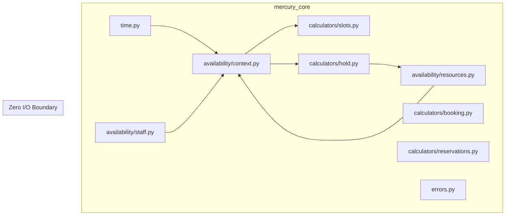

# Session 13: Core Logic Port

## Objective

Port all pure domain logic from MercuryEngine V1 (TypeScript) to V2 (Python), maintaining test parity and adapting to the Pydantic-native V2 model architecture.

## Results

| Metric | Value |
|---|---|
| **Tests** | 157 passed |
| **Time** | 0.28s |
| **Lint** | ruff clean (0 errors) |
| **Files created** | 12 source + 9 test |
| **V1 parity** | All 139 pure domain functions ported |

## Architecture

## Vertical Slices

### Slice 1: Time Utilities (20 tests)

Replaced `Intl.DateTimeFormat` with Python `datetime` + `zoneinfo`. `StoreTimeContext` as a frozen dataclass.

### Slice 2: Staff Availability (21 tests)

V2 adaptation: `DateOverride` as a **separate table** (passed as parameter) instead of V1's embedded field. Shift-matching and block-fitting logic preserved.

### Slice 3: Resource Availability (13 tests)

Best-fit allocation with priority sorting (high → normal → low) and capacity-based ordering. V2 field: `resource_group` instead of `resourceGroupId`.

### Slice 4: Availability Context (14 tests)

The heaviest builder — transforms raw data into computed context for both slot calculator and hold allocator. Handles staff normalization, service-assignment intersection filtering, policy derivation, schedule parsing, and occupancy map construction.

### Slice 5: Slot Calculator — "Time Tetris" (8 tests)

Pure slot generation loop. Checks store hours, staff shifts, occupancy, and booking notice windows. Staff-aware mode: slot available if ANY eligible staff member is free.

### Slice 6: Hold Allocation (12 tests)

Concurrency resolution: staff auto-assignment, resource allocation, composite holdId generation. Includes `"undefined"`/`"null"` string sanitization for network artifacts.

### Slice 7: Booking Receipt & Cancellation (16 tests)

Fiscal snapshot pattern (Norwegian law compliance). Cancellation policy enforcement with configurable notice windows.

### Slice 8: Reservation Calculator (24 tests)

Restaurant-specific logic: time slot generation, overlap detection, best-fit table assignment, and dual-mode availability (pool vs table).

> **Bug fix during port:** V1 `findBestTable` was missing `minCapacity` filtering — a party of 2 could be assigned a table with `minCapacity: 4`. Fixed in V2 by adding `party_size >= t.min_capacity` to the filter.

### Error Hierarchy (11 tests)

Fresh V2 tests (not ported from V1 `HttpsError`). Validates all 7 domain-specific error subclasses with correct HTTP status codes.

## V1 → V2 Field Mapping

| V1 (TypeScript) | V2 (Python) |
|---|---|
| `store` | `establishment` |
| `storeId` | `establishment` |
| `staffId` | `staff` |
| `resourceGroupId` | `resource_group` |
| `isBookable` | `is_bookable` |
| `allowOverlapping` | `allow_overlapping` |
| `weeklyShifts` | `weekly_shifts` |
| `dateOverrides` (embedded) | `DateOverride` (separate table) |
| `openingSchedule` | `opening_schedule` |
| `slotInterval` | `slot_interval` |
| `minBookingNoticeMinutes` | `min_booking_notice_minutes` |
| `requiredResourceGroupIds` | `required_resource_groups` |
| `priceAtTimeOfBooking` | `price_at_booking` |

## Design Decisions

- **DateOverride as separate table**: V2 scalability requirement — overrides grow over time and benefit from indexing
- **`model_copy()` for staff normalization**: Immutable pattern — normalized staff are new objects, originals untouched
- **Intersection filtering for multi-service**: Staff must be eligible for ALL services in a multi-service booking
- **`_dt_to_str` helper**: Extracted to avoid repeated `hasattr`/`isoformat` checks on datetime fields

## Next Steps — Session 14

Session 14 targets the **SurrealDB data layer adapter**:
1. Repository interfaces (abstract base classes)
2. SurrealDB repository implementations
3. FastAPI route integration connecting routes → repositories → pure core
4. Interactive Swagger UI (`/docs`) as the CRUD test harness
