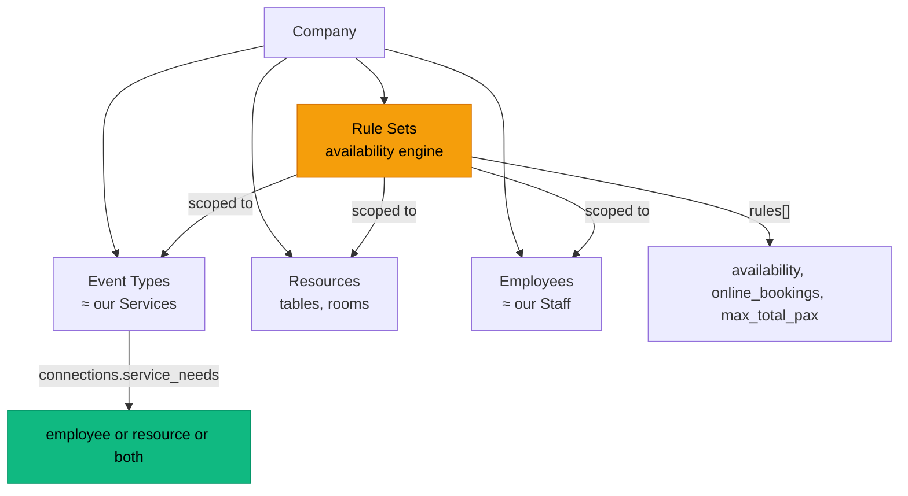

# Noona vs DittoDatto: Configuration Architecture Analysis

## How Noona Structures It

After studying the Noona HQ API, their architecture is fundamentally **different** from our current cascade:

### Noona's Model (3 separate concerns)



### Key Insights from Noona:

| Concept              | Noona                                             | DittoDatto (current)                               | Problem                    |
| -------------------- | ------------------------------------------------- | -------------------------------------------------- | -------------------------- |
| **Duration**         | On Event Type ONLY                                | Store → Group → Service                            | 3-layer cascade            |
| **Buffer**           | `buffer_after_service` on Event Type ONLY         | Store → Group → Service                            | 3-layer cascade            |
| **Capacity**         | `min/max_capacity` on RESOURCE only               | Store → Group → Service AND Resource               | Duplicated across 4 layers |
| **Guest limits**     | `min/max_guests_per_booking` on Event Type        | `capacity` on Service                              | Different concept!         |
| **Availability**     | Separate `Rule Sets` system                       | `availabilityStart/End` on Store + Group + Service | 3-layer cascade            |
| **Booking interval** | Company default, overridable on Resource/Employee | `slotInterval` on BookingPolicy                    | Simpler                    |
| **Groups**           | Event Type Categories — **display/org only**      | Service Groups carry config defaults               | Groups doing too much      |
| **Resource Groups**  | **Organizational only** — just `title` + `order`  | We added config fields                             | Correct in Noona           |

### The Critical Difference

**Noona separates WHAT from WHEN from WHERE:**

1. **WHAT** = Event Type (service definition: title, duration, price, buffer, guest limits)
2. **WHEN** = Rule Sets (availability windows — scoped to employees, resources, or event types)
3. **WHERE** = Resources (physical constraints: capacity, booking interval, overlapping)

**DittoDatto currently mixes all three** into every layer of the hierarchy.

### The problem and what we are aiming for:

Here's the short version:

The Issue: DittoDatto has 5 layers of configuration (Store → Service Group → Service → Resource Group → Resource) where duration, capacity, buffer time, and availability windows are duplicated and can override each other. This creates a confusing UX where the same setting appears in multiple places with inheritance hints, and it's nearly impossible to mentally model which value actually applies.

The Method: We studied the Noona HQ API — the established competitor in Norway/Iceland — to understand how they separate concerns. Their key architectural pattern: separate WHAT (Event Types/services) from WHEN (Rule Sets/hours) from WHERE (Resources/physical assets). Groups are always organizational only — never a config layer.

The Goal: Simplify to 2 effective config layers. Services own their timing (duration, buffer, price). Resources own their physical constraints (capacity, overlapping). Groups are just folders. Store owns availability (hours). No inheritance cascade, no "Inherited from: Set Menu Bronze" hints. Each setting exists in exactly one place.

---

## Proposed Simplification

### Layer 1: Store (the establishment)

- Opening hours (WHEN the store is open)
- `bookingPolicy` (slot interval, notice time, max future days)
- `maxCapacity` (venue total — we already have this)
- That's it. No "default duration" or "default buffer time"

### Layer 2: Service (what the customer books)

- `title`, `description`, `price`, `currency`
- `duration` (required — no inheritance, explicit per service)
- `bufferTime` (required — explicit per service)
- `bookingMode` ("standard" | "tableReservation" | "ticketSystem")
- `minGuests`, `maxGuests` (for table reservation mode — how many people can book as a group)
- `requiredResourceGroupIds[]` (which resource pools are needed)
- `assignedStaff[]` (which staff can perform it)
- `coverImage`, `gallery`

### Layer 3: Service Group (ORGANIZATIONAL ONLY)

- `name`, `description`, `sortOrder`
- `showOnBookingPanel` (visibility toggle)
- `allowMultiSelect` (can pick multiple from this group)
- **NO config defaults** — no duration, no buffer, no capacity, no booking mode, no availability window

### Layer 4: Resource (physical constraint)

- `name`, `type`, `minCapacity`, `maxCapacity`
- `isBookable`, `allowOverlapping`, `priority`
- `bookingInterval` (override store interval for this resource)
- `price` (for add-ons only)

### Layer 5: Resource Group (ORGANIZATIONAL ONLY)

- `name`, `sortOrder`
- **Nothing else** — just a folder for resources

---

## What Changes in the Engine

Currently: `slot is available = store open + no collision + staff free`

After: `slot is available = store open + no collision + staff free + resource free`

The engine already handles the first three. Adding resource checking is additive, not a rewrite.

---

## What Changes in the UI

### Service Form (simplified)

```
┌─────────────────────────────────────┐
│ Service Title *        [Dinner    ] │
│ Description            [Optional  ] │
│ Establishment *        [Fjell...  ] │
│ Service Group          [Set Menu  ] │  ← organizational only, no defaults
│ Booking Mode           [Standard ▾] │
│ Cover Image            [📷 Choose ] │
│───────────── Timing ────────────────│
│ Duration *    [1 hour ▾]            │  ← explicit, no inheritance hints
│ Buffer Time   [15 min  ]           │  ← explicit, no inheritance hints
│ Price (NOK) * [1500    ]            │
│───────── Resources Required ────────│
│ Required Groups  [Main Dining Hall] │  ← only if store has resources
│───────────── Staff ─────────────────│
│ Assigned Staff   [🧑 Select...   ] │
│─────────────────────────────────────│
│              Cancel    Create       │
└─────────────────────────────────────┘
```

**Removed:** Capacity (belongs on Resource), Availability Window (belongs on Store hours), inherited hints, group defaults.

### Service Group Form (simplified)

```
┌─────────────────────────────────────┐
│ Group Name *           [Set Menu  ] │
│ Description            [Optional  ] │
│ Show on Booking Panel  [🟢 ON    ] │
│ Allow Multi-Select     [⚪ OFF   ] │
│─────────────────────────────────────│
│              Cancel    Create       │
└─────────────────────────────────────┘
```

**Removed:** Default Duration, Default Booking Mode, Default Capacity, Default Buffer Time, Availability Window.

---

## Over-Capacity Booking: Noona's Approach

Noona has `overbookable` as an **enum** on Event Types:

- `"not_overbookable"` — hard limit
- `"partially_overbookable"` — can request, business approves
- `"fully_overbookable"` — always accepted

This maps to Arnar's feature request:

- **DittoDatto equivalent:** Add `overCapacityPolicy` to Service schema
  - `"reject"` → "Sorry, no availability" (current behavior)
  - `"request"` → Submit as `pending_approval`, notify business (Arnar's preferred)
  - `"allow"` → Always accept even if over capacity

---

## Migration Impact

| What                                          | Action                                                                     | Risk                                 |
| --------------------------------------------- | -------------------------------------------------------------------------- | ------------------------------------ |
| Remove group defaults from ServiceGroupSchema | Remove fields                                                              | Low — groups are few, mostly display |
| Make duration/bufferTime explicit on Service  | Ensure all services have values (use store defaults as migration fallback) | Medium — need migration script       |
| Remove availabilityStart/End from Service     | Services follow store hours                                                | Low                                  |
| Remove capacity from Service                  | Move to Resource only                                                      | Low — most services have capacity=1  |
| Add minGuests/maxGuests to Service            | New fields for table reservation mode                                      | None — additive                      |

---

## Summary

> **The fundamental insight from Noona: Separate WHAT (services) from WHEN (rules/hours) from WHERE (resources). Don't cascade config through organizational layers.**

DittoDatto should:

1. **Delete** config inheritance from Service Groups (make them organizational only)
2. **Require** duration + buffer on each Service explicitly
3. **Move** capacity to Resources only (not Services)
4. **Remove** availability windows from Services (use Store hours)
5. **Add** `overCapacityPolicy` for the "call us" → request flow

---

## Further Findings by Gemini 3.1 Pro. :)

After reiterating over the extensive Noona HQ API documentation, here are several advanced patterns and configuration insights that go beyond what was initially highlighted, which could be extremely valuable for DittoDatto's future state:

### 1. Granular Service Timing (Event Pauses)

Noona breaks down service duration into three parts for complex appointments (like hair coloring): `beforePause`, `pause`, and `afterPause`. This allows the staff member to be free (and bookable for other minor tasks) during the `pause` while the underlying resource (like a specific chair) might still remain occupied.

- **Takeaway for DittoDatto:** If we implement complex services in the future, separating staff availability from resource occupancy during "processing time" is a massive competitive advantage.

### 2. Deep Resource Customization

Resources in Noona are not just dumb nodes; they contain explicit rules that override global settings:

- `priority`: Resources have a priority level to control which one gets picked first when the engine randomly assigns them.
- `allow_overlapping_bookings`: A specific resource can allow multiple overlapping bookings (e.g., a large shared table).
- `event_type_preferences`: A resource can explicitly _skip_ certain event types, or apply a `custom_duration` if a specific service is performed at that resource.
- **Takeaway for DittoDatto:** Binding rules to resources directly gives the physical constraints "smart" behaviors (e.g., "The VIP room takes 15 minutes longer to clean").

### 3. Comprehensive Global Policy Controls (Store Profile)

Noona's company `profile` object contains incredibly fine-grained flow controls that are worth integrating when designing our `BookingPolicySchema`:

- `max_guests_per_interval` & `max_same_time_arrival`: Prevents the kitchen or front desk from being overwhelmed by staggering arrivals, even if total capacity allows more.
- `client_reschedule_disabled` and `client_cancel_disabled` alongside their respective notice periods (`min_cancel_notice_hours`, etc).
- **Takeaway for DittoDatto:** We should ensure our `BookingPolicySchema` encompasses throttling mechanics (`max_same_time_arrival`) to prevent operational bottlenecks, not just standard notice periods.

### 4. Advanced Availability Overlaps (Rule Sets)

Noona handles time overlaps using a sophisticated priority system:

1.  Fewer recurring instances win.
2.  Shorter time periods win.
3.  Recently updated wins.
4.  Explicit `priority` integers (lower is higher priority).

- **Takeaway for DittoDatto:** We must decide how intersecting rules (e.g. general store hours vs. holiday overrides vs. a staff member's time off) are resolved. Explicit prioritization integers or "narrowest scope wins" is highly recommended.

### 5. Custom Pre-Booking Friction

Noona event types have powerful friction options:

- `connections.booking_questions`: Service-specific required questions.
- `payments.pre_payment_ratio` / `flat_fee`: Service-specific upfront payments or deposits.
- **Takeaway for DittoDatto:** We should anticipate that services will eventually need an extensible `requirements` or `friction` array (questions, waivers, deposits) before the checkout flow can complete.
