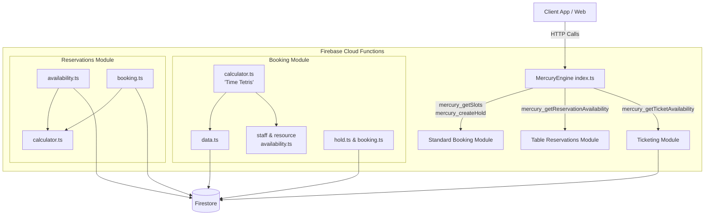
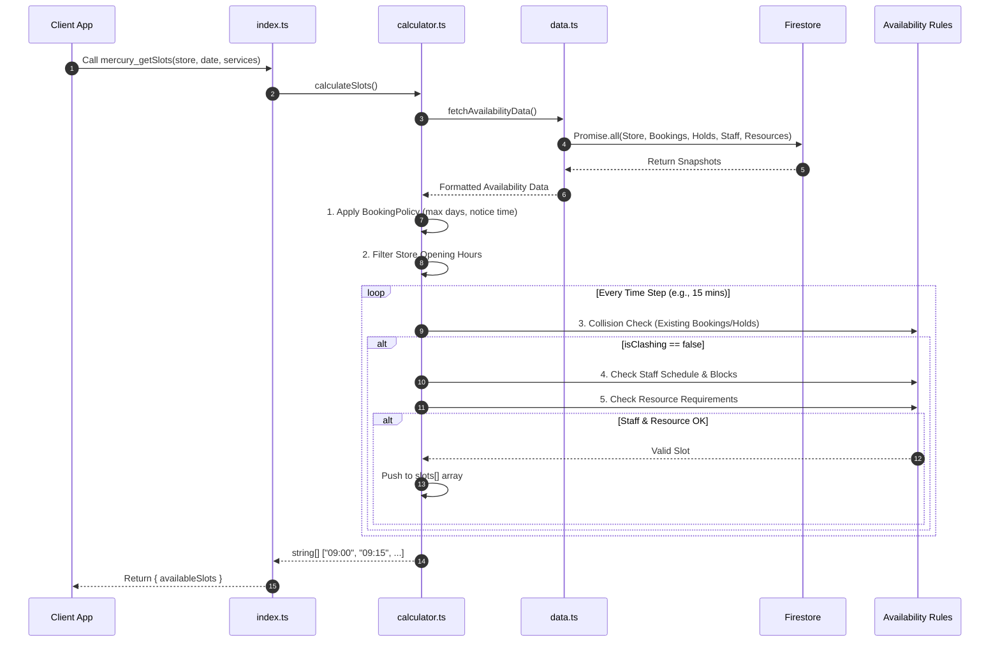
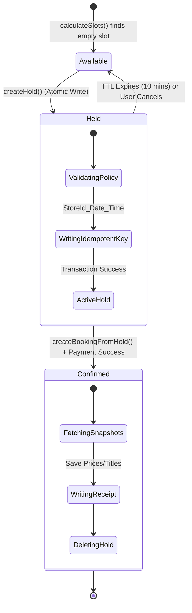
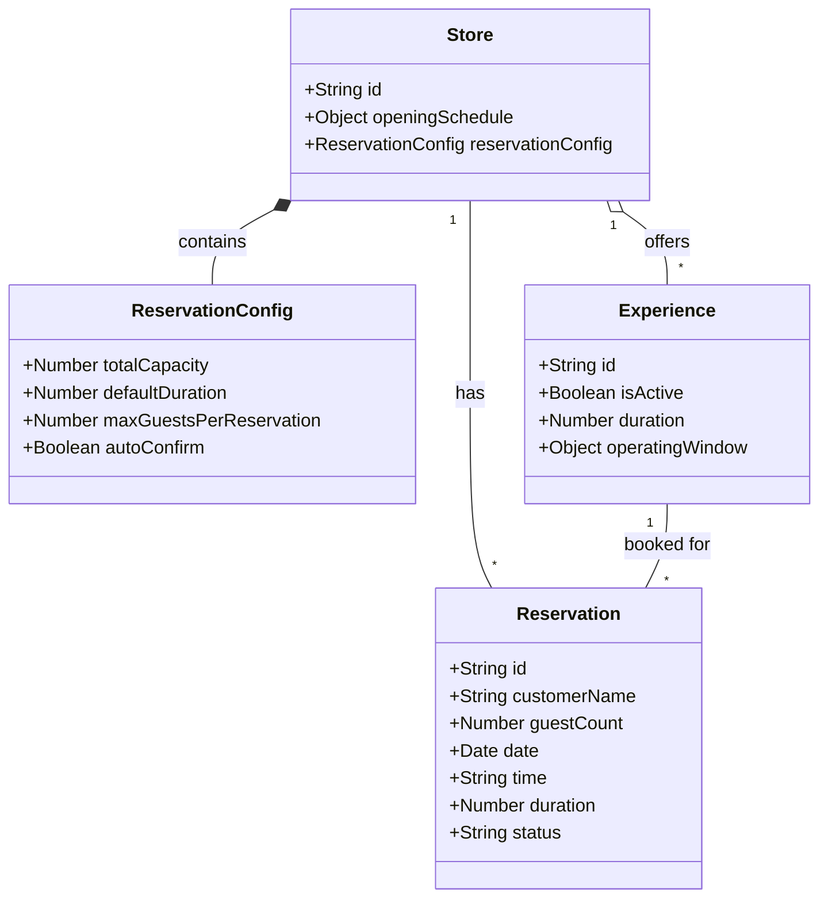
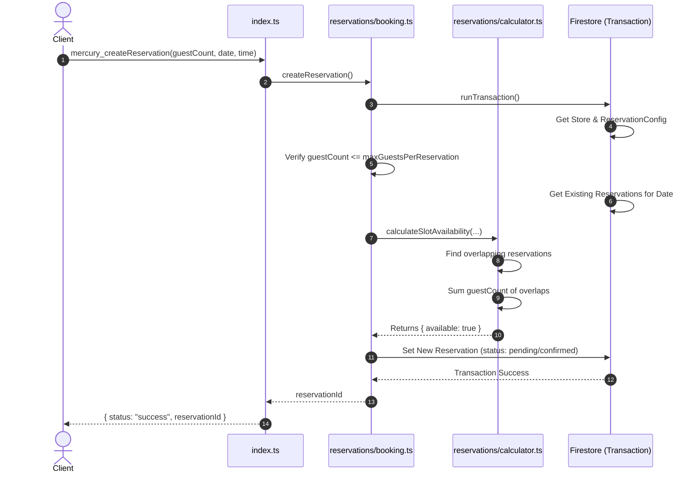
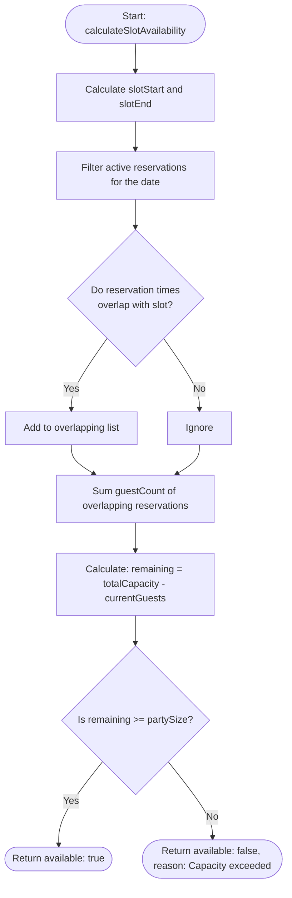

Mapping out the MercuryEngine with UML (Unified Modeling Language) is a fantastic way to visualize the architecture, especially as the system grows to handle standard bookings, table reservations, and event ticketing.

Because you are working in a modern TypeScript/serverless environment, the best way to draw this up is using **Mermaid.js**. It is a text-based diagramming tool that uses standard markdown (which means it will render right here in this chat, as well as in GitHub, Notion, or Obsidian).

Here are the three most useful UML diagrams to represent the MercuryEngine based on your code.

### 1. Component Diagram (System Architecture)

This diagram shows the high-level structure. It illustrates how your entry point (`index.ts`) exposes Cloud Functions and delegates work to your three core domain modules, which then interact with Firestore.



### 2. Sequence Diagram (The "Time Tetris" Algorithm)

Sequence diagrams are perfect for mapping out complex logic over time. This diagram visualizes the exact flow of `mercury_getSlots` as it moves through `calculator.ts`, fetches parallel data, and applies your 4-gate validation (Policy, Clashes, Staff, Resources).



### 3. State Machine Diagram (The Booking Lifecycle)

Because you are using a "Hold" pattern with a 10-minute TTL (Time-to-Live) to prevent double-booking, a State diagram is the best way to show how a time slot moves from available to permanently booked.



### How to use these for your documentation:

1. **Copy the code blocks** starting with ` ```mermaid ` and ending with ` ``` `.
    
2. **Paste them** into a markdown file in your codebase (like a `README.md` or an architecture document).
    
3. If you want to tweak the colors, layout, or add new flows (like mapping out the Ticketing module once you start working on it more), you can paste these directly into the **[Mermaid Live Editor](https://mermaid.live/)** to edit them visually in real-time, Arnar.
    

Would you like to map out the Table Reservations flow next, or do these cover the specific engine logic you were looking to visualize?


---


Being a visual learner makes complete sense, especially when dealing with complex transactional logic like a booking engine. Having these generated right here gives you a perfect reference point to look at while you build out the strict UML in Gaphor.

Here are the Mermaid.js equivalents for the Table Reservations module based on your codebase.

### 1. Class Diagram (Data Model)

This diagram maps out the relationships between the Store, its configuration, the bookable Experiences, and the final Reservation document.



### 2. Sequence Diagram (Transactional Booking Flow)

This visualizes the atomic transaction inside your `mercury_createReservation` function. It ensures that by the time a slot is verified as available, it is immediately locked in the same database operation to prevent double-booking.



### 3. Activity Diagram / Flowchart (Capacity Calculator)

This illustrates the internal logic of the `calculateSlotAvailability` function. It shows how the engine calculates physical table space based on the size of the party and overlapping reservation durations.



