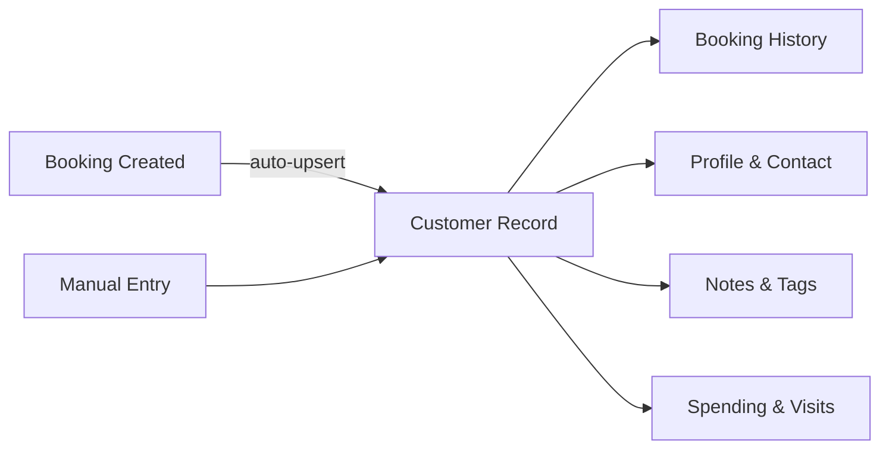

# Professional CRM — Implementation Plan

## How Booking CRMs Work in the Real World

Booking platforms (Fresha, Noona, Square Appointments, Mindbody) share a universal CRM pattern:



**Key principles:**
1. **Customers are auto-created** from bookings — you never have zero customers if bookings exist
2. **Customers are company-level, not store-level** — a company shares its client base across stores. `storeIds[]` tracks _which_ stores a customer has visited
3. **"All Establishments"** = unfiltered global view. Per-store = filtered by `storeIds` membership
4. **The customer detail page** is the CRM's core — contact info, full booking history, notes, lifetime spend
5. **Duplicate handling** is critical — match by `userId` first, then `email`, then `phone`

---

## Current State

| What | Status | Issue |
|------|--------|-------|
| Schema | ✅ Enhanced | `status`, `staffIds`, `lastBookingId`, `totalSpent`, `channel` |
| Engine upsert | ✅ Code ready | **Not loaded** — engine needs restart |
| Table columns | ✅ Rich | ID, Name+@handle, Email, Visits, Status badges |
| Toolbar | ⚠️ Inconsistent | Uses dropdown filter, other pages use tab-style store switcher |
| Customer detail | ⚠️ Stub | `CustomerDetailSlideover` exists but has no booking history |
| AddModal | ⚠️ Stub | No Firestore write |
| Data | ❌ Empty | Engine ran old code during test bookings |

---

## Proposed Changes

### Phase 1: Data Pipeline Fix (get customers showing up)

#### [MODIFY] MercuryEngine restart
The engine needs a restart to load [customer.ts](file:///media/addinator/Mercury/Projects/DittoDatto/packages/shared-types/src/customer.ts). After restart, new bookings will auto-create customers. For existing test bookings, we'll write a one-time backfill.

#### [NEW] [backfill-customers.ts](file:///media/addinator/Mercury/Projects/DittoDatto/packages/mercury-engine/src/scripts/backfill-customers.ts)
One-shot script to scan existing bookings and create/update customer records from them.

---

### Phase 2: UI Cohesion — Match Portal Layout

The Services page pattern is the gold standard — tab-style store switcher below the navbar:

```
┌──────────────────────────────────────────────────┐
│ 🏢 Customers                     [+ New customer]│ ← UDashboardNavbar
├──────────────────────────────────────────────────┤
│ 🏪 All │ Fjell og Flamme │ Hov Garasjen │ ...   │ ← Tab-style store switcher  
├──────────────────────────────────────────────────┤
│ 🔍 Search...          [Active ▾] [Display ⚙]    │ ← UDashboardToolbar (filters)
├──────────────────────────────────────────────────┤
│  □  ID  Name        Email    Visits  Status      │ ← Table
│  ...                                             │
└──────────────────────────────────────────────────┘
```

#### [MODIFY] [index.vue](file:///media/addinator/Mercury/Projects/DittoDatto/apps/web/business-portal/app/pages/customers/index.vue)
- Replace store **dropdown** with **tab-style buttons** matching Services page
- Add "All" tab that shows customers across all stores
- Keep `UDashboardToolbar` for search + status filter + display toggle
- Add customer count per store in tabs

---

### Phase 3: Customer Detail Page

Replace the stub `CustomerDetailSlideover` with a rich, full-width slideover:

#### [MODIFY] [CustomerDetailSlideover.vue](file:///media/addinator/Mercury/Projects/DittoDatto/apps/web/business-portal/app/components/customers/CustomerDetailSlideover.vue)

Content sections:
1. **Header**: Avatar + name + status badge + Edit button
2. **Contact card**: Email, phone, social ID
3. **Stats row**: Total visits, total spent, first visit, last visit, member since
4. **Booking history timeline**: Query `bookings` where `userId == customer.userId` OR `userEmail == customer.email`, sorted by `startTime` desc. Each entry shows: date, service, staff, price, status badge.
5. **Notes**: Editable textarea, saved to `customer.notes`
6. **Danger zone**: Archive / Delete customer

#### [NEW] [useCustomerBookings.ts](file:///media/addinator/Mercury/Projects/DittoDatto/apps/web/business-portal/app/composables/useCustomerBookings.ts)
Composable that queries the root `bookings` collection filtered by `userId` or `userEmail` for a given customer.

---

### Phase 4: AddModal → Firestore

#### [MODIFY] [AddModal.vue](file:///media/addinator/Mercury/Projects/DittoDatto/apps/web/business-portal/app/components/customers/AddModal.vue)
- Wire form submit to `addDoc(collection(db, 'companies', companyId, 'customers'), {...})`
- Set `channel: 'portal'` (manual entry from business portal)
- Set `status: 'new'`
- Include current store in `storeIds[]`

---

## Verification Plan

### Phase 1
1. Restart engine, make 2–3 test bookings
2. Confirm customers appear in `/customers` with correct data

### Phase 2
- Visual check: tab store switcher renders identically to Services page
- "All" tab shows all customers, per-store tab filters correctly

### Phase 3
- Click a customer row → slideover opens with booking history
- Edit notes → saves to Firestore
- Verify booking timeline shows correct entries

### Phase 4
- Click "+ New customer" → fill form → submit → customer appears in table
