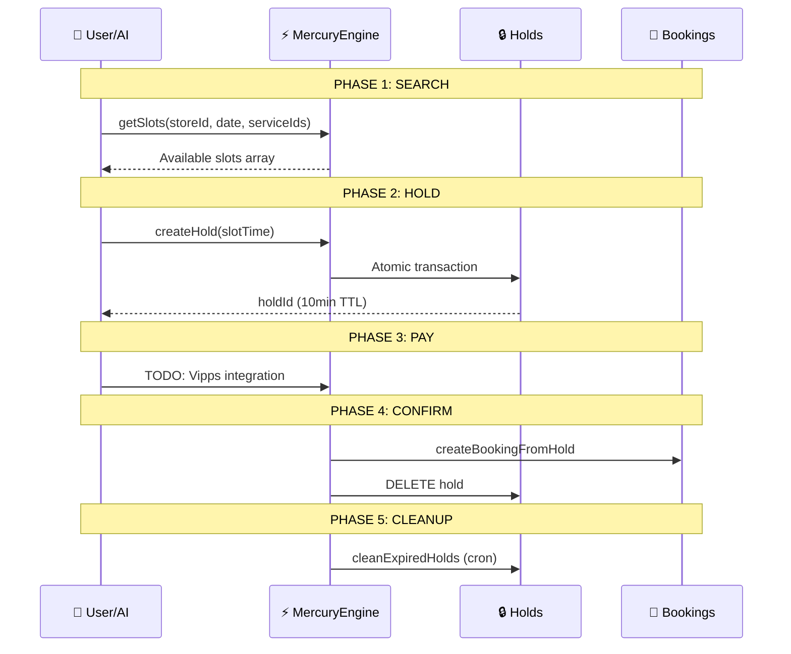

TODO: This Spec file might need official update and version numbered

**MercuryEngine** is the Core Domain Booking Engine for DittoDatto. It handles time-slot management, concurrency control, and payment integration (future).

> [!IMPORTANT]
> Supports three future pillars:
> 1. **Appointments** (Service-Based): 1-on-1 time (Barbers, Dentists)
> 2. **Reservations** (Capacity-Based): 1-on-Many space (Restaurants, Tables)
> 3. **Events** (Inventory-Based): Many-on-One experience (Concerts, Classes)

---

## Architecture: 5-Phase Booking Flow



---

## Core Components

### 1. Time Tetris (`calculator.ts`)
- Fetches store hours, bookings, holds, services in parallel
- Converts times to "minutes from midnight" for integer math
- Returns available 15-min slots

### 2. Hold Mechanism (`hold.ts`)
- **Composite Key:** `${storeId}_${date}_${slotTime}`
- **10-Minute TTL** for checkout
- **Atomic Transaction** via `db.runTransaction()`

### 3. Booking Creation (`booking.ts`)
- **Snapshot Pattern:** Copies price/title at booking time
- **Idempotency:** Uses `paymentId` as document ID
- **Atomic:** Delete hold + Create booking in single transaction

---

## File Structure

```ts
packages/functions/src/
├── MercuryEngine/              # Core Domain: Booking Context
│   ├── calculator.ts           # Time Tetris algorithm
│   ├── hold.ts                 # Hold creation with atomic lock
│   ├── booking.ts              # Booking from hold
│   ├── data.ts                 # Parallel data fetching
│   └── index.ts                # Export all MercuryEngine functions
└── index.ts                    # Main export (includes MercuryEngine)
```

---

## API Endpoints

| Endpoint | Access | Description |
|----------|--------|-------------|
| `mercury_getSlots` | Public | Time Tetris - Returns available slots |
| `mercury_createHold` | Auth | Locks the slot (10min TTL) |
| `mercury_createBooking` | Auth | Converts hold to booking |
| `mercury_cleanExpiredHolds` | System | Garbage collection (cron) |

---

## Migration Source

**From:** `.docs/project-context/BookingScripts/src/services/booking/`

| Source File | Target |
|-------------|--------|
| `business.ts` | `MercuryEngine/calculator.ts` |
| `hold.ts` | `MercuryEngine/hold.ts` |
| `create.ts` | `MercuryEngine/booking.ts` |
| `data.ts` | `MercuryEngine/data.ts` |
| `api.ts` | `MercuryEngine/index.ts` |
