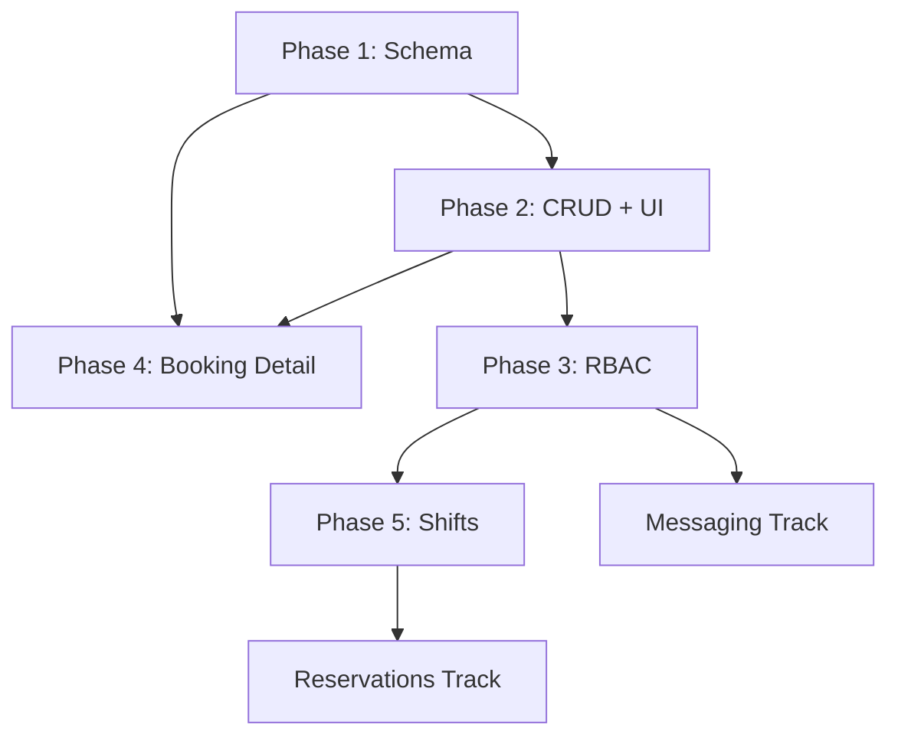

# Staff Management — Master Track

**Track ID:** `staff_management_20260211`  
**Domain:** `business-portal` (cross-cuts `shared/types`, `shared/functions`)  
**Created:** 2026-02-11  
**Status:** ✅ Complete (Phases 1–5B shipped, 5C+5D branched)  
**Estimated Sessions:** 5-7 → **Actual: 3 sessions**

---

## Overview

Implement full staff management for the Business Portal — from schema definition through CRUD operations, RBAC with context-aware capabilities, and eventually shift scheduling with portal access. This is the foundational layer that unlocks booking assignments, per-store staff views, and organisational structure.

**User Preference (confirmed):** Social login (Google/existing accounts) for staff — zero friction onboarding. Security rules handle data isolation.

---

## Current Codebase State

| Component               | State                             | Notes                                                           |
| ----------------------- | --------------------------------- | --------------------------------------------------------------- |
| `staff/index.vue`       | 🔴 Stub                           | 38 lines, "Under Development" placeholder                       |
| `settings/members.vue`  | 🟡 Template                       | Fetches `/api/members` (mock data), "Invite people" button      |
| `Person` schema         | 🟢 Exists                         | `person.ts` — basic fields: name, role, storeId, schedule       |
| `Company.managerIds`    | 🟢 Exists                         | Array of user IDs in company doc                                |
| `Company.memberIds`     | 🟢 Exists                         | Array of user IDs in company doc                                |
| `ServiceGroup.staffIds` | 🟢 Exists                         | Optional array, "future use" comment                            |
| `Booking.personId`      | 🟢 Exists                         | Optional staff assignment                                       |
| RBAC                    | 🟡 Basic                          | Role hierarchy only (customer → business → admin → super_admin) |
| Firestore Rules         | 🟡 Role-based                     | `isCompanyMember()` checks claims, no per-store granularity     |
| Firebase Auth Claims    | `companyId`, `companyIds`, `role` | No staff-level capabilities                                     |

---

## Architectural Decisions

### 1. Data Model Strategy

**Decision:** Evolve the existing `Person` schema into a full `StaffMember` type, stored as a subcollection `companies/{companyId}/staff/{staffId}`.

**Rationale:**

- `Person` already links to `storeId`, `userId`, `schedule`, `isBookable`
- Subcollection under company (not store) because staff can work at multiple stores
- `storeIds: string[]` replaces single `storeId` for multi-store assignment
- Keeps booking compatibility via `personId`

### 2. RBAC Architecture

**Decision:** Context-aware capabilities over rigid roles.

```
StaffCapability enum:
  can_manage_bookings    — View, confirm, cancel bookings
  can_manage_schedule    — Edit own availability / shifts
  can_manage_services    — Edit services, pricing
  can_manage_staff       — Invite/remove other staff
  can_view_financials    — See revenue, reports
  can_manage_media       — Upload/delete media
  can_manage_events      — Create/edit events
  can_manage_settings    — Edit store settings
```

**Per-store override:** `storeCapabilities: { [storeId]: Capability[] }` allows fine-grained control. Falls back to `defaultCapabilities` if no store-specific override exists.

### 3. Staff Onboarding Flow

**Decision:** Invite by email → staff member created with `status: 'invited'` → when user signs in with that email, auto-link via `userId`.

```
Status lifecycle:
  invited → active → suspended → removed
```

### 4. Firestore Collection Path

```
companies/{companyId}/staff/{staffId}
  - userId: string (linked Firebase Auth UID)
  - email: string (invite target)
  - displayName: string
  - avatarUrl: string
  - storeIds: string[]  (assigned stores)
  - position: string (custom label: "Barista", "Manager", etc.)
  - defaultCapabilities: Capability[]
  - storeCapabilities: { [storeId]: Capability[] }
  - isBookable: boolean
  - schedule: OpeningSchedule (override)
  - status: 'invited' | 'active' | 'suspended' | 'removed'
  - invitedAt, joinedAt, createdAt, updatedAt
```

---

## Phase Breakdown

### Phase 1: Schema & Types 🏗️

**Effort:** 🟢 Low (1 session)  
**Domain:** `shared/types` (🟡 Careful)  
**Prerequisite for:** Everything else

- [x] Create `packages/shared-types/src/staff.ts`
  - [x] `StaffCapabilitySchema` — Zod enum of all capabilities
  - [x] `StaffStatusSchema` — `invited | active | suspended | removed`
  - [x] `StaffMemberSchema` — Full schema with capabilities, multi-store, schedule
  - [x] `CreateStaffMemberSchema` — Validation for creation (invite)
  - [x] `UpdateStaffMemberSchema` — Partial update validation
- [x] Export from `shared-types` index
- [x] Evolve `Person` schema: add deprecation notice pointing to `StaffMember`
- [x] Update `ServiceGroup` schema: `staffIds` annotation → references `staff/{id}`
- [x] Update `Booking` schema: annotate `personId` → `staffId` migration path

**Output:** Types are importable as `import { StaffMember, StaffCapability } from '@dittodatto/shared-types'`

---

### Phase 2: Staff CRUD + List UI 📋

**Effort:** 🟡 Medium (1-2 sessions)  
**Domain:** `business-portal`  
**Depends on:** Phase 1

- [x] Create `composables/useStaff.ts`
  - [x] Firestore query: `companies/{companyId}/staff` with reactive binding
  - [x] `addStaff(email, name, storeIds, capabilities)` — creates invited member
  - [x] `updateStaff(staffId, updates)` — partial update
  - [x] `removeStaff(staffId)` — sets status to `removed` (soft delete)
  - [x] `getStaffForStore(storeId)` — filtered list
- [x] Implement `staff/index.vue` — Staff list page
  - [x] Staff cards/list with avatar, name, position, status badge, stores
  - [x] Filter by store (reuse pattern from Media Gallery)
  - [x] Search by name/email
  - [x] Status filter tabs: Active / Invited / All
- [x] Create `StaffFormSlideover.vue`
  - [x] Invite form (email, name, position, store assignment)
  - [x] Edit form (reuses same component)
  - [x] Store multi-select (checkboxes for each store)
  - [x] Capability toggles
- [x] Integrate with Media Gallery
  - [x] Staff avatar selection via `DDMediaPickerButton` (type: `staff_portrait`)
- [x] Firestore rules for `companies/{companyId}/staff/{staffId}`
  - [x] Read: company members + super_admin
  - [x] Write: members with `can_manage_staff` capability OR company owner
  - [ ] Self-update: staff can edit own schedule/availability _(deferred to 5D)_

**Output:** Business owner can invite staff, assign to stores, set capabilities.

---

### Phase 3: RBAC Enforcement 🔒

**Effort:** 🔴 High (1-2 sessions)  
**Domain:** `business-portal` + `shared/functions` (🔴 Tread Carefully)  
**Depends on:** Phase 2

- [x] Create capability-checking composable: `useStaffPermissions.ts`
  - [x] `hasCapability(capability, storeId?)` — checks current user's staff doc
  - [x] `requireCapability(capability)` — throws/redirects if missing
  - [x] Caches staff doc in session for performance
- [x] Wire capability checks into existing pages
  - [x] Bookings page: only show if `can_manage_bookings`
  - [x] Services page: edit controls gated by `can_manage_services`
  - [x] Media page: upload/delete gated by `can_manage_media`
  - [x] Settings: gated by `can_manage_settings`
  - [x] Staff page: "Add Staff" gated by `can_manage_staff`
- [ ] Firebase Function: auto-link staff on sign-in _(deferred to Cloud Functions session)_
  - [ ] `onUserCreate` / `onUserSignIn` trigger
  - [ ] Query all company staff docs where `email == user.email && status == 'invited'`
  - [ ] Set `userId`, update status to `active`, set custom claims
- [ ] Update Firestore rules _(deferred to Cloud Functions session)_
  - [ ] Staff capability checks for write operations
  - [ ] Per-store scoping for granular access
- [x] Update sidebar navigation
  - [x] Show/hide menu items based on capabilities
  - [x] Staff-specific dashboard view (limited scope)

**Output:** Portal enforces per-user, per-store permissions. Staff see only what they're allowed.

> ⚠️ **Note:** This phase touches Firebase Functions — requires careful review and lead notification per agent-profile.md.

---

### Phase 4: Bookings Detail View 📅

**Effort:** 🟡 Medium (1 session)  
**Domain:** `business-portal`  
**Depends on:** Phase 2 (staff names for display)

- [x] Create `BookingDetailSlideover.vue`
  - [x] Full booking info: service, time, duration, price, status
  - [x] Customer info section (name, email, phone)
  - [x] Staff assignment display (from staff collection)
  - [x] Comments/notes field
  - [ ] Booking history timeline (created, confirmed, etc.) _(future polish)_
- [x] Wire click handler in `bookings/index.vue`
  - [x] Open slideover on card click
  - [x] Pass booking data to slideover
- [x] Add booking actions
  - [x] Confirm / Cancel / Reschedule buttons
  - [x] Staff re-assignment dropdown
  - [x] Status update with optimistic UI
- [x] Add filtering to bookings list
  - [x] Filter by store
  - [x] Filter by staff member
  - [x] Filter by status
  - [ ] Date range picker _(future polish)_

**Output:** Business owner clicks a booking → sees all details, can manage it.

---

### Phase 5: Staff Scheduling & Shifts 📆

**Effort:** 🔴 High (2+ sessions)  
**Domain:** `business-portal` + `mercury-engine`  
**Depends on:** Phase 3

- [x] Extend `StaffMember` with shift data
  - [x] `weeklyShifts: WeeklyShiftSchema` — recurring weekly schedule with multi-block support
  - [x] `dateOverrides: DateOverrideSchema[]` — vacation, sick days, custom hours
- [x] Create schedule management UI
  - [x] Weekly shift editor for staff member
  - [x] Multi-block time pickers (break time support)
  - [x] Override editor (date picker + type + reason)
  - [ ] Bulk schedule for multiple staff _(deferred)_
- [ ] Self-service for staff _(branched to 5D track)_
  - [ ] Staff can view their schedule
  - [ ] Request time off (if `can_manage_schedule`)
  - [ ] Swap shift requests (future)
- [ ] Wire to MercuryEngine _(branched to 5C track)_
  - [ ] Slot availability considers staff schedule
  - [ ] Handle overlapping bookings vs staff capacity
  - [ ] Break time enforcement

**Output:** Staff schedules are managed visually. Engine integration deferred to branched track (5C+5D).

---

## Cross-Track Dependencies



---

## Related Files

| File                                                      | Purpose                             | Phase |
| --------------------------------------------------------- | ----------------------------------- | ----- |
| `packages/shared-types/src/person.ts`                     | Current staff-like schema (evolves) | 1     |
| `packages/shared-types/src/rbac.ts`                       | Current role hierarchy              | 3     |
| `packages/shared-types/src/booking.ts`                    | Has `personId` field                | 4     |
| `packages/shared-types/src/service-group.ts`              | Has `staffIds` field                | 1     |
| `apps/web/business-portal/app/pages/staff/index.vue`      | Stub page                           | 2     |
| `apps/web/business-portal/app/pages/settings/members.vue` | Mock members list                   | 2     |
| `apps/web/business-portal/app/pages/bookings/index.vue`   | Needs click handler                 | 4     |
| `firestore.rules`                                         | Needs staff subcollection rules     | 2-3   |
| `packages/functions/`                                     | Auto-link trigger                   | 3     |

---

## Open Questions

1. **Multi-company staff?** Can a person be staff at Company A and Company B simultaneously? Current assumption: **yes**, separate staff docs per company.
2. **Staff notifications?** When a booking is assigned to a staff member, should they get a notification? → Depends on Messaging track.
3. **Shift swap workflow?** Is this for Phase 5 or a future track? Current assumption: **future** — Phase 5 covers basic scheduling only.
4. **Owner vs first-staff?** Should the company owner auto-appear as a staff member, or remain separate? Current assumption: **separate** — owner has implicit full access.

---

## Session Checklist

When starting a coding session for this track, verify:

- [ ] `shared-types` package builds
- [ ] Firebase emulators running (for rules testing)
- [ ] Business portal dev server on :3001
- [ ] Logged in as company member (arnarvalur@avj.info / 123456)

---

> _"The needs of the many outweigh the needs of the few. But first, we define who 'the many' are."_ 🖖
