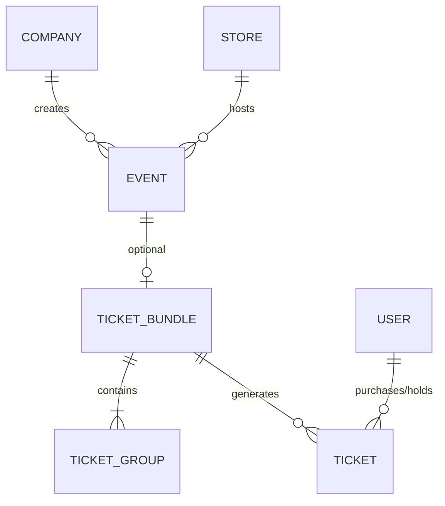

# Specification: Event & Ticketing System

## 1. Goal

Implement the **Event System** (company/store events) and **Ticketing System** (MercuryEngine's 3rd pillar) enabling businesses to create events and sell tickets with QR-based entry verification.

## 2. Architecture



| System | Responsibility | Location |
|--------|----------------|----------|
| **Event System** | WHAT is happening | Firestore `events` collection |
| **Ticketing System** | HOW to attend | MercuryEngine `ticketing/` module |

## 3. Core Entities

### Event
- `id`, `companyId`, `storeId` (nullable for company-level)
- `title`, `description`, `dateTime`, `endTime`
- `location: { address, coordinates? }`
- `images[]`, `socialLinks`
- `ticketBundleId` (optional)
- `status`: draft | published | cancelled | completed
- `visibility`: public | private

### Ticket Bundle
- `id`, `eventId` (REQUIRED)
- `totalCapacity`, `bufferCapacity` (overflow protection)
- `totalSold`, `maxPerPurchase`, `ageRequirement`
- `salesStart`, `salesEnd`, `status`
- `groups: TicketGroup[]`

### Ticket Group (embedded)
- `id`, `name`, `capacity`, `soldCount`
- `price` (øre), `currency`, `description`
- `isBuffer`: true for overflow pool

### Ticket
- `id`, `bundleId`, `eventId`, `groupId`
- `purchaserId`, `holderId`, `holderName`
- `qrCode`, `status`, `holdExpiresAt`
- `purchasedAt`, `usedAt`

## 4. Key Decisions

| Decision | Choice |
|----------|--------|
| Standalone bundles? | ❌ Always require Event |
| Multi-bundle events? | ❌ One Bundle with multiple Groups |
| Buffer logic | Overflow protection |
| Transfer | Post-purchase only |

## 5. MercuryEngine Integration

```
MercuryEngine/
├── appointments/     # Standard booking
├── reservations/     # TableReservation
└── ticketing/        # 🆕 Event tickets
    ├── createHold()
    ├── confirmPurchase()
    ├── verifyTicket()
    └── transferTicket()
```

## 6. Acceptance Criteria

1. ✅ Event CRUD at company/store level
2. ✅ Ticket Bundle with embedded Groups
3. ✅ Hold/Purchase flow with capacity checks
4. ✅ QR code generation and verification
5. ✅ Post-purchase ticket transfer
