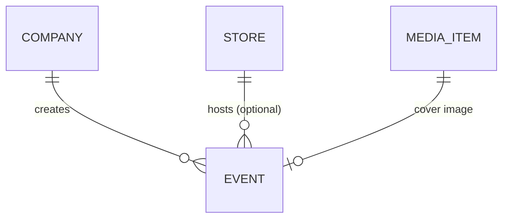

# Specification: Simple Event System

## 1. Goal

Implement a **Simple Event System** enabling businesses to create and manage events linked to their company or store. This is a foundational event management layer — ticketing is a separate future integration.

## 2. Overview

Events are informational entities that describe **what**, **when**, and **where** something is happening. Each event belongs to a company and optionally to a specific store.

### Key Features
- Title & Description
- Cover image (via Media Gallery)
- Date & time (start/end)
- Location with address and optional map coordinates
- Visibility control (draft, published)
- Link to store or company-level

## 3. Entity: Event

```typescript
// packages/shared-types/src/event.ts
EventSchema = z.object({
  id: IdSchema,
  companyId: IdSchema,
  storeId: IdSchema.optional(),        // null = company-level event
  
  // Core info
  title: z.string().min(1).max(255),
  description: z.string().optional(),
  
  // Date/Time
  startDateTime: IsoDateSchema,
  endDateTime: IsoDateSchema.optional(),
  timezone: z.string().default("Europe/Oslo"),
  
  // Location
  location: z.object({
    name: z.string().optional(),       // "Saga Kino", "Main Hall"
    address: z.string().min(1),
    city: z.string().min(1),
    country: z.string().default("NO"),
    coordinates: z.object({
      lat: z.number().min(-90).max(90),
      lng: z.number().min(-180).max(180),
    }).optional(),
  }),
  
  // Media
  coverImageUrl: z.url().optional(),
  
  // Status
  status: z.enum(["draft", "published", "cancelled", "completed"]),
  visibility: z.enum(["public", "private"]).default("public"),
  
  // Metadata
  createdAt: IsoDateSchema,
  updatedAt: IsoDateSchema,
  createdBy: IdSchema,
  
  // ╔══════════════════════════════════════════════════════════════╗
  // ║  🎫 TODO-PostIt: TICKETING INTEGRATION                       ║
  // ║──────────────────────────────────────────────────────────────║
  // ║  When Ticketing System is implemented, add:                  ║
  // ║  - ticketBundleId: IdSchema.optional()                       ║
  // ║  - hasTickets: z.boolean().default(false)                    ║
  // ║  See: conductor/tracks/event_ticketing_20251229/spec.md      ║
  // ╚══════════════════════════════════════════════════════════════╝
});
```

## 4. Relationships



### Ownership Rules
- Event **must** have a `companyId` (owner)
- Event **may** have a `storeId` (specific venue)
- If no `storeId`, it's a company-level event
- Cover image references existing Media Gallery item

## 5. Feature Flag

> [!NOTE]
> Add `eventSystem: z.boolean().default(false)` to `Company.enabledFeatures`

This allows admin-controlled rollout per company.

## 6. Firestore Collection

| Collection | Path | Index |
|------------|------|-------|
| `events` | `/events/{eventId}` | `companyId`, `storeId`, `startDateTime` |

### Security Rules (simplified)
- Company members can read/write their company's events
- Public can read `published` + `public` visibility events

## 7. Acceptance Criteria

1. ✅ `EventSchema` in `packages/shared-types/src/event.ts`
2. ✅ Export from `packages/shared-types/index.ts`
3. ✅ Feature flag in Company schema
4. ✅ Events CRUD in Business Portal
5. ✅ Event listing on store/company preview pages

---

> [!IMPORTANT]
> **Ticketing Integration Deferred**
> 
> This spec focuses on the **Event entity only**. Ticket sales, capacity management, QR verification, and purchases are handled by the separate **Ticketing System** track.
> 
> See: [event_ticketing_20251229/spec.md](../event_ticketing_20251229/spec.md)
