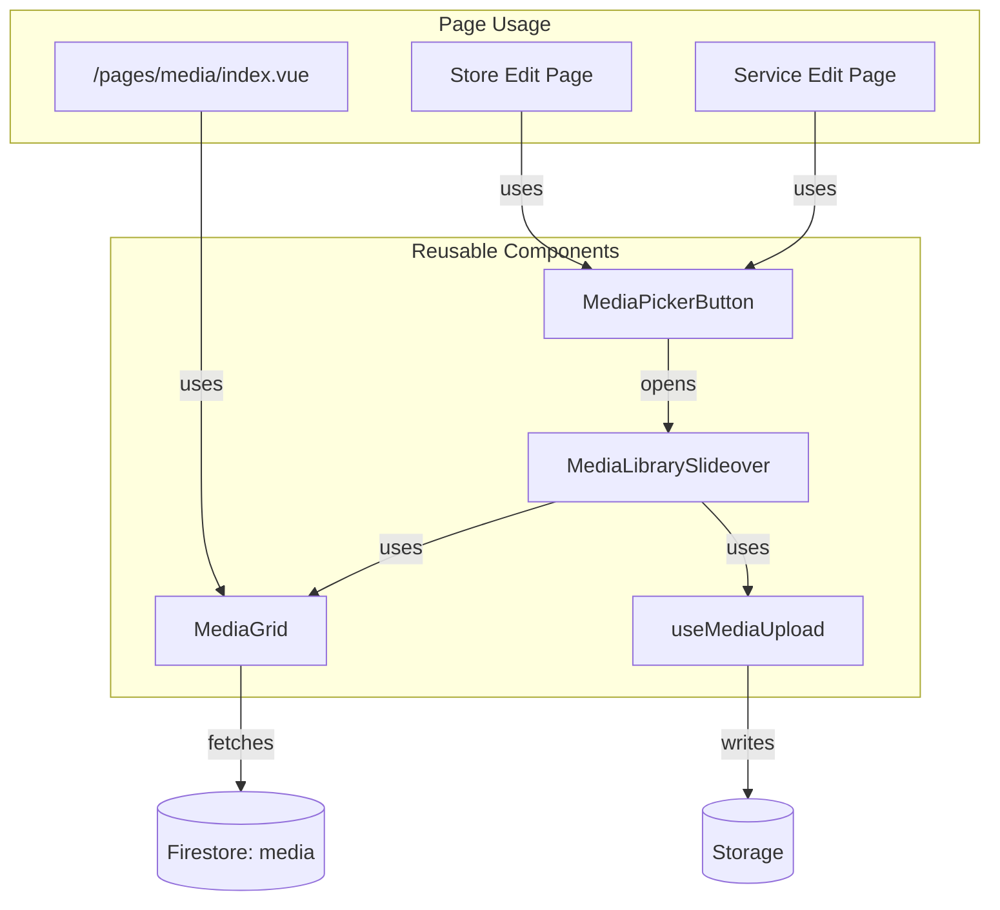
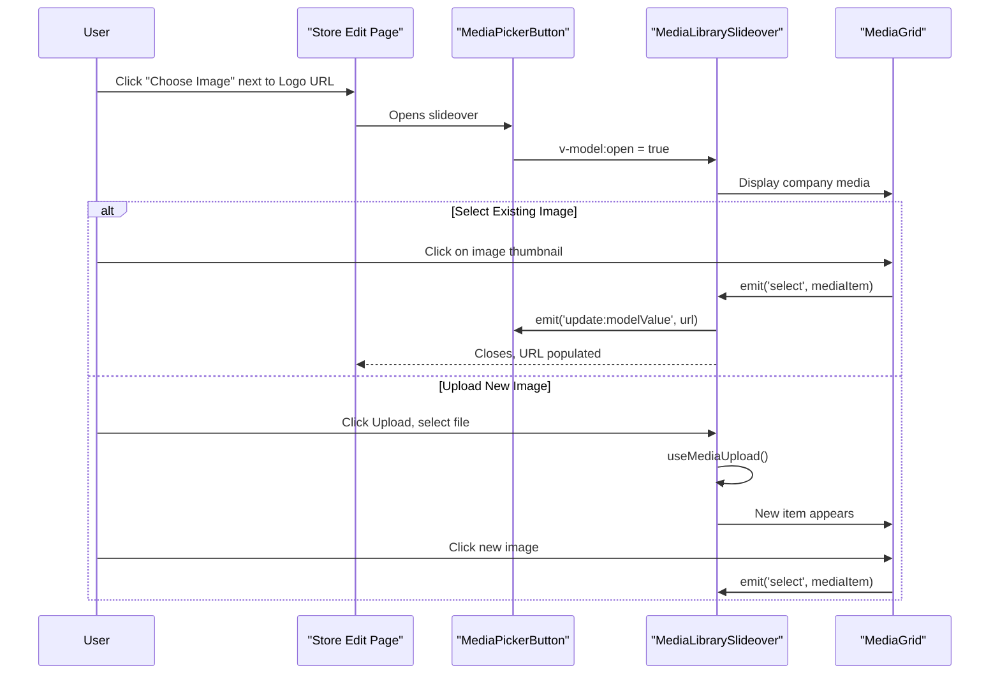

# Specification: Media Library Component (Phase 2)

> **Track:** media_gallery_20251229  
> **Status:** Draft - Awaiting User Review

## Overview

Extend the existing Media Gallery MVP with a **reusable Media Library component** that can be embedded in forms throughout the Business Portal. The component allows users to:

1. **Pick images from their existing library** (uploaded via the Media page)
2. **Upload new images** directly from the picker
3. **Return the selected image URL** to the parent form field

## Design References

````carousel

<!-- slide -->

````

---

## Component Architecture



### Component Breakdown

| Component | Location | Description |
|-----------|----------|-------------|
| `MediaPickerButton` | `packages/ui/components/media/` | Trigger button with optional thumbnail preview. Emits selected URL. |
| `MediaLibrarySlideover` | `packages/ui/components/media/` | Overlay panel containing the media grid + upload UI. |
| `MediaGrid` | `packages/ui/components/media/` | Reusable grid display of `MediaItem[]`. Used in both the slideover and the full page. |
| `useMediaUpload` | `packages/ui/composables/` | Already exists - handles upload logic. |

---

## User Flow



---

## Component Props & Events

### MediaPickerButton

```typescript
interface Props {
  modelValue?: string           // Current image URL (v-model)
  label?: string                // Button label, default: "Choose Image"
  placeholder?: string          // Placeholder when no image selected
  mediaType?: MediaType         // Filter by type: 'logo' | 'cover' | 'store_gallery' | 'general'
  showPreview?: boolean         // Show thumbnail next to button, default: true
  previewSize?: 'sm' | 'md'     // Thumbnail size, default: 'md'
}

interface Emits {
  (e: 'update:modelValue', url: string): void
  (e: 'select', item: MediaItem): void   // Full item for additional metadata
}
```

**Usage Example:**
```vue
<MediaPickerButton
  v-model="state.logoUrl"
  label="Store Logo"
  media-type="logo"
  :show-preview="true"
/>
```

### MediaLibrarySlideover

```typescript
interface Props {
  open: boolean                 // v-model:open
  companyId: string             // Required: scope to company's media
  mediaType?: MediaType         // Optional filter
  allowUpload?: boolean         // Enable upload UI, default: true
}

interface Emits {
  (e: 'update:open', value: boolean): void
  (e: 'select', item: MediaItem): void
}
```

### MediaGrid

```typescript
interface Props {
  items: MediaItem[]            // Media items to display
  loading?: boolean             // Show skeleton loading state
  selectable?: boolean          // Enable click-to-select, default: false
  selectedId?: string           // Currently selected item ID
  columns?: number              // Grid columns (responsive default)
}

interface Emits {
  (e: 'select', item: MediaItem): void
  (e: 'delete', item: MediaItem): void
}
```

---

## Integration Points

### Store Edit Page ([id]/index.vue)

**Before:**
```vue
<UFormField label="Logo URL">
  <UInput v-model="state.logoUrl" placeholder="https://..." />
</UFormField>
```

**After:**
```vue
<UFormField label="Store Logo">
  <MediaPickerButton
    v-model="state.logoUrl"
    media-type="logo"
  />
</UFormField>
```

### Future: Cover Image & Gallery

The store schema could be extended with:
- `coverImageUrl: string` - Hero image for the store page
- `galleryUrls: string[]` - Carousel images

These would use the same `MediaPickerButton` component (single select for cover, future multi-select for gallery).

---

## Visual Design

The components should follow the aesthetic from the dark theme mockup:
- **Card-based grid** with hover effects (scale on hover)
- **Glassmorphic overlay** when in slideover mode
- **Footer metadata** showing filename, type, and timestamp
- **Selection state** with ring/border highlight
- Support both **light and dark modes**

---

## Scope

### In Scope ✅
- [ ] `MediaGrid` component (extracted from existing page)
- [ ] `MediaLibrarySlideover` component
- [ ] `MediaPickerButton` component
- [ ] Integration into Store edit page (logoUrl field)
- [ ] Refactor `/pages/media/index.vue` to use `MediaGrid`

### Out of Scope ❌ (Future)
- Multi-select for gallery arrays
- Drag-and-drop reordering
- Image cropping/editing
- Cover image & gallery fields in store schema

---

## Questions for Review

> [!IMPORTANT]
> Please confirm or provide feedback on these design decisions:

1. **Component Location:** Should these go in `packages/ui/components/media/` (shared across apps) or `business-portal/components/` (portal-specific for now)?

2. **Slideover vs Modal:** The mockup shows a floating panel. Should we use `USlideover` (slides from right) or `UModal` (centered overlay)? I'm leaning toward **Slideover** for consistency with the dashboard.

3. **Store Schema Extension:** Should we add `coverImageUrl` and `galleryUrls` to the store schema now, or defer to a future phase?

4. **Folder Organization in Media:** The mockup shows a "Blog" folder. Do you want folder/category support, or is the flat list with `mediaType` filtering sufficient for now?

---

## Verification Plan

### Manual Testing
1. Navigate to Store edit page → Contact tab
2. Click "Choose Image" button next to Logo field
3. Verify slideover opens with existing media grid
4. Click an image → verify field is populated and slideover closes
5. Open again → verify selection highlight on current image
6. Upload new image from within slideover → verify it appears and can be selected

### Visual Verification
- Test in both light and dark mode
- Verify hover effects and selection states match the mockup aesthetic
