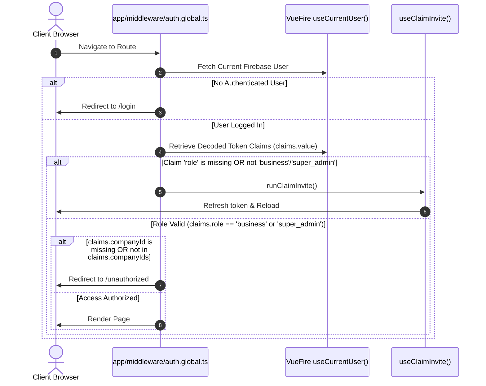
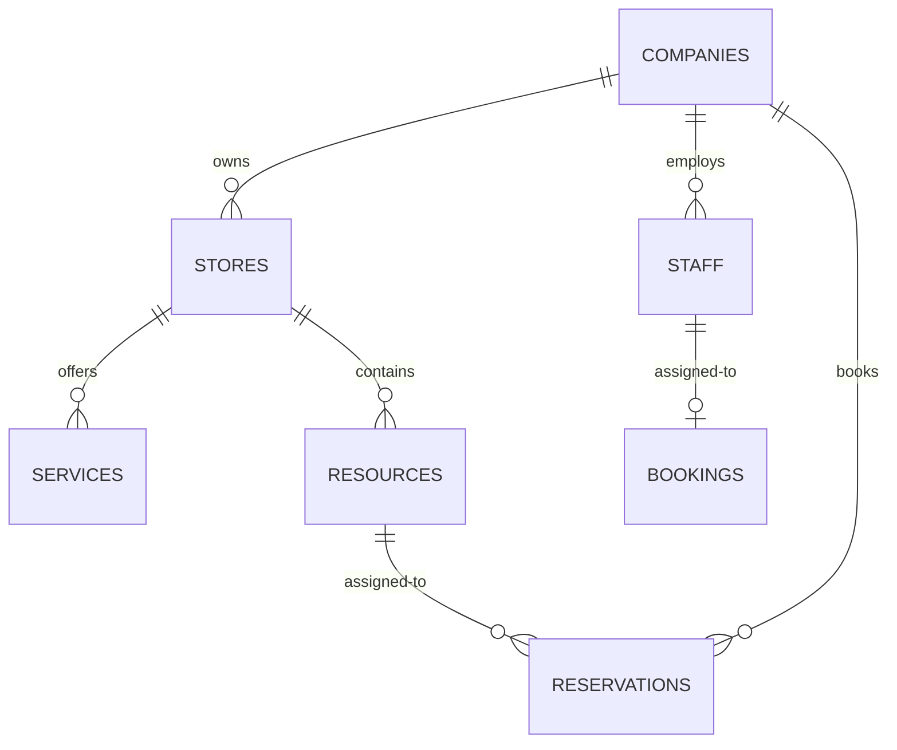

# DittoDatto Business Portal Code Audit & System Architecture Report

## 1. Executive Summary
The **DittoDatto Business Portal** is a web-based administration dashboard built on Nuxt 3 (configured with Nuxt 4 directory structure features). It serves as the business-facing portal in the DittoDatto ecosystem, enabling merchants to manage their companies, establishments (stores, restaurants, and venues), staff, service groups, bookings, physical resources (tables, rooms), and customer reservations.

The application leverages a hybrid architectural pattern:
* **Real-time Client-Side Binding**: Subscriptions to Firestore collections via the VueFire SDK.
* **Server-Side API Routes**: Under `server/api/` for diagnostic, utility, and mock endpoints.
* **External REST Layer**: Calling a Mercury API for business operations like booking cancellations.
* **Layer Inheritance**: Extending `@dittodatto/ui` for shared components, layouts, and style definitions, and using `@dittodatto/shared-types` for data schemas.

This audit details the structure, dependencies, auth flows, state management, domain models, and key architectural critiques of the business portal codebase.

---

## 2. Project Structure & Configurations
The codebase is structured using the Nuxt 4 standard directory convention, dividing source files into discrete logical directories:

```
business-portal/
├── app/                      # Nuxt client application files
│   ├── app.vue               # Entry point using Nuxt UI components
│   ├── composables/          # Client-side state and DB fetch hooks
│   ├── middleware/           # Client-side global auth gating
│   ├── pages/                # Route components (Bookings, Staff, etc.)
│   └── plugins/              # Client-side plugins (e.g. auth-error-handler)
├── i18n/                     # Multilingual setup
│   └── locales/              # JSON translations (en, nb, nn, pl)
├── public/                   # Static assets
├── server/                   # Nitro Server Engine
│   ├── api/                  # API routes (mock endpoints, diagnostics)
│   ├── plugins/              # Firebase Admin context bootloader
│   └── utils/                # Server-side auth verifiers
├── nuxt.config.ts            # App, Nitro, VueFire & UI configuration
└── package.json              # Main project manifests and workspace hooks
```

### 2.1 Dependency Analysis (`package.json`)
The application defines a modern frontend dependency matrix:
* **Framework**: `nuxt` ^3.11.1
* **UI Library**: `@nuxt/ui` ^4.4.0 (incorporates tailwind support, icons, dashboard layout components)
* **Firebase Ecosystem**:
  * `firebase` ^12.7.0 (Client SDK)
  * `firebase-admin` ^13.6.0 (Server SDK)
  * `nuxt-vuefire` ^1.1.0 & `vuefire` ^3.2.2 (Vue binding layer)
* **Internationalization**: `@nuxtjs/i18n` ^10.2.1
* **Internal Workspace References**:
  * `@dittodatto/shared-types` for schema enforcement.
  * `@dittodatto/ui` for baseline style inheritance.

### 2.2 Nuxt Configuration (`nuxt.config.ts`)
* **Layer Inheritance**: Configured with `extends: ['@dittodatto/ui']`, implying that core layouts (`dashboard`, `visual-preview`) and common UI components are imported implicitly from the design system layer.
* **Nuxt 4 Transition Flags**: Explicitly declares `future: { compatibilityVersion: 4 }` to support placing front-end files under `app/`.
* **Firebase Client Bootstrapping**: Uses `vuefire` configuration to enable client-side Firestore subscriptions, pointing auth endpoints to the Firebase project parameters.

---

## 3. Authentication & Security Architecture

### 3.1 Client-Side Middleware (`app/middleware/auth.global.ts`)
Client-side routes are universally guarded by the global middleware [auth.global.ts](file:///home/solmundur/Projects/DittoDatto/DittoDatto-old/apps/web/business-portal/app/middleware/auth.global.ts). It functions as follows:



The middleware validates:
1. **Authenticated User**: Via VueFire `useCurrentUser()`.
2. **Role Verification**: Requires a `role` claim equal to `'business'` or `'super_admin'`.
3. **Company Context Gating**: Checks if the user's custom claim `companyId` is defined and exists within the `companyIds` list claim. If they fail this check, they are redirected to `/unauthorized`.

### 3.2 Server-Side Firebase Admin Context (`server/plugins/firebase.ts`)
On the server side, Firebase Admin is initialized once using the Nitro plugin [firebase.ts](file:///home/solmundur/Projects/DittoDatto/DittoDatto-old/apps/web/business-portal/server/plugins/firebase.ts). It inspects `process.env.GOOGLE_APPLICATION_CREDENTIALS` (or falls back to service account JSON string definitions). Once initialized, the Admin app instance is bound directly to the H3 event context:
```typescript
event.context.firebaseAdmin = firebaseAdminApp
```
This enables secure token parsing and permission checks on Nitro API routes.

### 3.3 Server-Side Auth Utilities (`server/utils/auth.ts`)
API endpoints utilize helpers in [auth.ts](file:///home/solmundur/Projects/DittoDatto/DittoDatto-old/apps/web/business-portal/server/utils/auth.ts) to verify authorization tokens:
* `getAuthUser(event)`: Parses either the `__session` cookie (used during SSR) or the standard `Authorization: Bearer <Token>` header, verifying it against `firebaseAdmin.auth().verifyIdToken()`.
* `requireRole(event, roles)`: Restricts requests based on the custom claims decodes.
* `requireCompanyAccess(event, companyId)`: Gated at the request level, ensuring the authenticated user possesses claims matching the target resource's `companyId`.

### 3.4 Invite Claiming Flow (`app/composables/useClaimInvite.ts`)
When a staff member first signs up, they lack custom claims (`role`, `companyId`, `companyIds`).
1. `auth.global.ts` detects the missing claims and invokes `runClaimInvite()`.
2. `useClaimInvite` fires an HTTPS Callable function `staff_claimInvite` (deployed in region `europe-west1`).
3. The function maps the user's registered email to pending company invitations, writes claims, and returns a success response.
4. The client composable triggers a token force-refresh (`user.value.getIdToken(true)`) to obtain a new token containing the updated claims, followed by a window reload.

### 3.5 Cross-Domain Bypass Mechanism
During authentication, the login page triggers cross-domain maintenance bypass cookies. As defined in `@dittodatto/ui`'s `packages/ui/utils/bypass-cookie.ts`, a cookie named `dd_bypass` is set on the root domain `.dittodatto.no` with a signed security signature. This bypasses the global Cloudflare or Nginx maintenance screens for authenticated merchants.

---

## 4. State Management & Composables

State management is decentralised, utilizing specialized composable functions. These composables are categorized into **Shared State Singletons** and **Instance-Scoped Queries**.

### 4.1 Composable Analysis

| Composable | Scope | Backend Target | Purpose / Features |
| :--- | :--- | :--- | :--- |
| `useCompany.ts` | **Instance** | Firestore Doc `companies/{id}` | Fetches active company configuration, stores, and limits. Caches the active `companyId` in `localStorage`. |
| `useStaffPermissions.ts` | **Instance** | Firestore collection `companies/{cid}/staff` | Computes active user capabilities based on roles (Owner, Manager, Staff). Checks permissions against custom-defined capability mappings. |
| `useBookings.ts` | **Instance** | Firestore collection `bookings` | Fetches services bookings filtered by `companyId`, offering status filters and CRUD actions. |
| `useReservations.ts` | **Instance** | Firestore collection `companies/{cid}/reservations` | Fetches table-scoped restaurant reservations (separate from services bookings). |
| `useStaff.ts` | **Instance** | Firestore collection `companies/{cid}/staff` | Handles staff listing, invitations (soft-deletes via `removed` status archives), and shop associations. |
| `useServices.ts` | **Instance** | Subcollections under `companies/{cid}/stores/{sid}/services` | Fetches store-specific service lists. Iterates through stores to gather items sequentially. |
| `useNotifications.ts` | **Shared** | Firestore collection `users/{uid}/notifications` | Real-time listener for user-specific notification alerts. Managed as module-level global variables (`notifications`, `archivedNotifications`). |

### 4.2 Key Architectural Issues in State Composables

#### ⚠️ Issue 1: Instance-Scoped State Duplication
In several composables (e.g., `useCompany`, `useReservations`, `useBookings`), states are initialized **locally** inside the composable factory function:
```typescript
// useReservations.ts
export function useReservations() {
  const allReservations = ref<Reservation[]>([]); // Instantiated fresh per invocation
  ...
}
```
* **Impact**: If multiple components on a single page invoke `useReservations()`, each component creates a separate `allReservations` ref and starts a duplicate Firestore fetch query. This causes data desynchronization and results in redundant read operations.
* **Remedy**: Move the reactive refs outside the export function to create a module-scoped singleton (identical to the pattern utilized in `useNotifications.ts`).

#### ⚠️ Issue 2: Sequential Loop Queries
In `useServices.ts`, fetching services relies on executing individual queries in a loop for each store owned by the company:
```typescript
for (const store of storesValue) {
  const servicesRef = collection(db, 'companies', companyIdValue, 'stores', store.id, 'services')
  const snapshot = await getDocs(servicesRef)
  ...
}
```
* **Impact**: Creates a query waterfall. If a merchant owns 10 store locations, loading the page triggers 10 synchronous Firestore network requests sequentially.
* **Remedy**: Use `Promise.all()` to parallelize these queries, or store services in a top-level collection partitioned by `storeId` to query them in a single batch.

---

## 5. Domain Data Model & Entity Relations
DittoDatto maps complex hierarchical relations representing multi-location businesses, staff assignments, and booking modes:



### 5.1 Entities and Schema Definitions
1. **Company**: Represents the merchant's business entity. Holds the `storePolicy` settings determining maximum location limits (`maxStores`) and registration permissions (`canCreateOwnStores`).
2. **Store / Establishment**: Represents a physical location. Classified into `storeType` categories (`store`, `restaurant`, `venue`).
3. **Resource / Table**: Physical objects (tables, rooms, equipment, stations) located within a Store. Contains capacity boundaries (`minCapacity`, `maxCapacity`). Used in restaurant/venue booking contexts.
4. **Service**: Represents an offer booked by consumers (e.g. hair cut, massage). Services are stored under store subcollections.
5. **Staff**: Employs capabilities to perform services. Bound to stores (`storeIds`) and possesses unique permission overrides.
6. **Booking (Services)**: Represents a reservation for a service. Tied to a specific staff member.
7. **Reservation (Restaurants/Venues)**: Separate reservation entity representing resource-bound slots (e.g., Table 4 booked for 4 people).

---

## 6. Page & Feature Audit

### 6.1 Bookings Management (`app/pages/bookings/index.vue`)
This page handles appointment bookings for service-oriented businesses.
* **Dual Rendering Layout**:
  * **Schedule View**: Displays a daily calendar timeline showing columns for active staff members, using `<BookingsBookingOverview>`.
  * **List View**: Groups bookings chronologically (Today, Tomorrow, This Week, Earlier) using cards.
* **Exclusion Logic**: Checks stores for table resources and routes users to the Reservations tab when dealing with restaurant stores.

### 6.2 Reservations Management (`app/pages/reservations/index.vue`)
This page provides reservation scheduling for restaurants and venues.
* **Physical Resource Timeline**: Displays table occupancy over a timeline using the `<ReservationsReservationOverview>` calendar grid component.
* **Table Filtering**: Allows merchants to toggle table visibilities, persisting preferences in `localStorage` (`dd_reservations_hiddenResources`).
* **Conflict Mapping**: Maps reservations containing missing `tableId` parameters to a default `Ikke tildelt` (Unassigned) fallback column to prevent scheduler overlaps.

### 6.3 Establishments Management (`app/pages/establishments/[slug]/index.vue`)
This page configures settings for locations (stores, venues, or restaurants).
* **Map Pin Integration**: Uses `@googlemaps/js-api-loader` to load the Maps JavaScript API. The Geocoder translates street addresses into coordinates, which are previewed using the `<DDMapStoreMap>` component.
* **Capacity Bounds**: Configures limits for restaurant and event layout capacities (`totalCapacity`).
* **Bento Media Layouts**: Manages cover layouts in bento grids (`bento`, `showcase`, `spotlight`) and updates images directly in Firestore.

### 6.4 Staff & Services Configuration
* **Staff Portal**: Manages invitations, roles, and store associations. Allows filtering members by status (Active, Invited, Archived) and provides granular capability mapping.
* **Services Portal**: Organizes services into service groups (tabs). Includes price formatting (`nb-NO` locale) and configuration settings (price, duration, buffer times, active/inactive toggles).

### 6.5 Sandbox Activity Hub (`app/pages/sandbox/activity-hub.vue`)
This page serves as a diagnostic tool for testing real-time features.
* **Feed Listeners**: Sets up listeners on the `activities` and `messages` Firestore collections to monitor alerts and updates.
* **Support Ticket Simulation**: Simulates the support flow by writing new support threads and messages directly to Firestore, simulating communication with administrative accounts.
* **Mock Card Generator**: Allows developers to send 8 mock alert types (such as booking reminders or rescheduling requests) to specified admin account UIDs for testing.

---

## 7. Architectural Insights & Recommendations

### 7.1 Separation of Booking and Reservation Entities
The application runs two parallel reservation models:
1. **Service Bookings**: Handled through standard Firestore collections. Changes to booking statuses are updated in Firestore or sent to a Mercury REST endpoint (`/appointments/bookings/{id}/cancel`).
2. **Resource Reservations**: Saved directly in `companies/{id}/reservations` and mapped to physical tables.
* **Recommendation**: Standardize the cancellation flow. While service bookings call the Mercury API to trigger server-side cancellation logic, table reservations update statuses directly in Firestore. Moving both flows to API routes ensures consistent side-effect handling (such as sending customer emails or updating logs).

### 7.2 Security Gating Dependencies
Security is enforced on the client side via Nuxt middleware and on the server side via Nitro API route helpers. However, the client-side app also performs direct writes to Firestore collections (e.g. updating store metadata, inviting staff, adding services).
* **Recommendation**: Ensure Firestore Security Rules mirror the complex capability checks (like checking `can_manage_staff` or `can_manage_services`) defined in `useStaffPermissions.ts`. If the security rules do not validate these permissions, users could bypass frontend restrictions and modify database documents directly.

### 7.3 Unused Mock Endpoints
Several backend routes under `server/api/` (such as `customers.ts`, `mails.ts`, and `members.ts`) return hardcoded mockup arrays.
* **Recommendation**: Clean up these mock endpoints before deploying to production. This prevents exposing internal developer details (such as the Nuxt core team avatar URLs in `members.ts`) in the production build.
