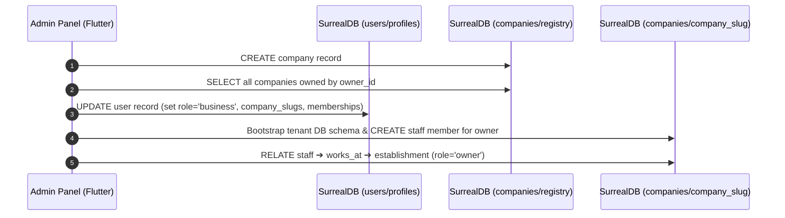
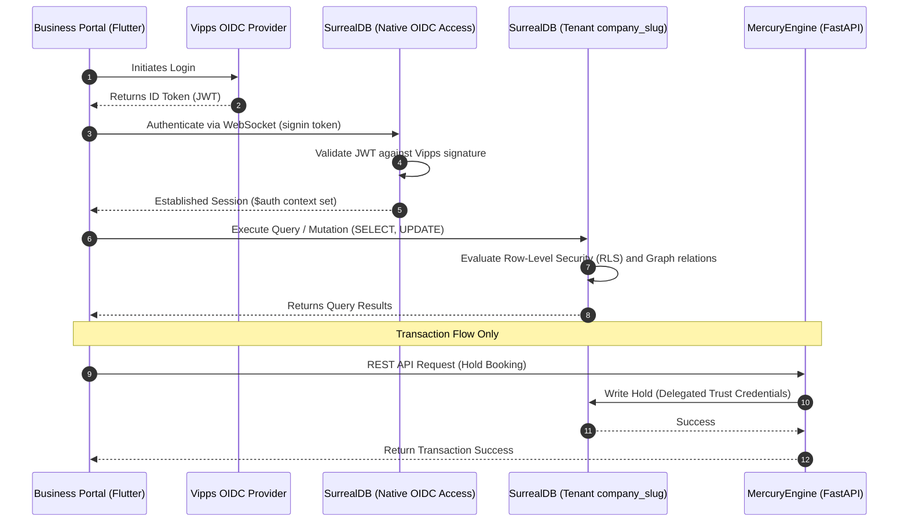

# DittoDatto Authentication, Authorization, and Database Flow Design

This report documents the multi-tenant database structure, authentication workflows, and authorization checks between the **Business Portal**, the **Admin Panel**, and **SurrealDB**, aligning with the Direct-to-SurrealDB architecture (ADR-0006).

---

## 1. Database Architecture & Tenancy Model

DittoDatto uses a hybrid multi-tenant architecture in SurrealDB 3.1. Security, compliance, and PII management are enforced using strict namespace and database isolation.

```
SurrealDB Instance
├── Namespace: users
│   └── Database: profiles
│       └── Table: user (GDPR-isolated consumer/business accounts)
└── Namespace: companies
    ├── Database: registry (System-wide list of all registered Dattos)
    │   └── Table: company (Company metadata + database routing tags)
    ├── Database: discovery (Public read-heavy aggregator)
    │   └── Table: establishment_listing (Projected store data)
    └── Databases: company_{slug} (Isolated per-company databases)
        ├── Table: establishment (Stores/Locations)
        ├── Table: staff (Company employees)
        ├── Table: works_at (Edge: staff ➔ establishment)
        └── Table: booking (Transactional appointments)
```

### Namespace Segregation (GDPR Boundaries)
*   **Namespace `users` / Database `profiles`**: Contains the `user` table. All customer and business owner PII remains isolated here. As per [users.surql](file:///home/solmundur/Projects/DittoDatto/schemas/users.surql#L8-L10), this is a hard boundary; company databases never store direct user records or sensitive credentials.
*   **Namespace `companies`**:
    *   **Database `registry`**: Holds the `company` registry. It contains owner mappings and feature flags.
    *   **Database `discovery`**: Houses read-heavy, denormalized projections (`establishment_listing`) for public search.
    *   **Database `company_{slug}`**: Tenant-isolated databases. If a company named "Sawasdee" is created, its database is `company_sawasdee`. It has its own `establishment`, `service`, `staff`, and `booking` tables.

### Cross-Namespace Mappings
Since SurrealDB record links cannot traverse namespace boundaries, references across the `users` and `companies` namespaces are stored as **String references**:
*   `company.owner_id` (in `companies/registry`) points to a user ID string (e.g., `"user:abc123"`).
*   `staff.user_id` (in `companies/company_{slug}`) points to a user ID string.
*   `user.company_membership_ids` (in `users/profiles`) is an array of company ID strings.

---

## 2. Onboarding Flow: User & Company Association

When a new business owner registers and associates with a company, the **Admin Panel** performs an atomic, multi-database sync directly against SurrealDB (using native namespace-level credentials with `ROLES OWNER` access).



### Detailed Steps

1.  **Company Creation**:
    The Admin Panel connects to the `companies` namespace and inserts the company metadata into `companies/registry`:
    ```surql
    USE NS companies DB registry;
    CREATE company CONTENT {
        name: "Sawasdee Spa",
        slug: "sawasdee",
        db_slug: "sawasdee",
        owner_id: "user:xyz789",
        owner_email: "owner@sawasdee.no",
        tier: "premium",
        onboarding_status: "verified"
    };
    ```
2.  **Aggregation of Owner Companies**:
    The Admin Panel queries all companies owned by this user:
    ```surql
    SELECT * FROM company WHERE owner_id = "user:xyz789";
    ```
3.  **Atomic User Profile Update**:
    The Admin Panel switches to the `users` namespace and updates the user profile record. This promotes the user to the `business` role and stores membership links for fast authentication checks:
    ```surql
    USE NS users DB profiles;
    UPDATE user:xyz789 SET 
        role = "business",
        company_slug = "sawasdee",
        company_membership_ids = ["company:sawasdee_id"],
        company_memberships = [
            {
                company_id: "company:sawasdee_id",
                role: "owner",
                assigned_at: time::now()
            }
        ];
    ```
4.  **Tenant Database Setup**:
    The tenant database (`companies/company_sawasdee`) is created and bootstrapped with the [company-blueprint.surql](file:///home/solmundur/Projects/DittoDatto/schemas/company-blueprint.surql).
5.  **Staff & Graph Assignment (Inside Tenant DB)**:
    An entry is created in the `staff` table of the tenant database, mapping the user ID to a staff entity:
    ```surql
    USE NS companies DB company_sawasdee;
    
    -- Create staff entry matching the owner's user ID string
    LET $staff = (CREATE staff CONTENT {
        user_id: "user:xyz789",
        email: "owner@sawasdee.no",
        display_name: "Owner Name",
        is_bookable: false,
        status: "active"
    });
    
    -- Relate staff to the initial establishment with owner privileges
    RELATE $staff->works_at->establishment:sawasdee_est_id SET
        role = "owner",
        since = time::now();
    ```

---

## 3. Direct-to-SurrealDB Auth & RLS Authorization Flow

In accordance with ADR-0006, the Business Portal and Public Marketplace connect and authenticate **directly** to SurrealDB. **MercuryEngine** is only invoked during transactions (booking holds, availability checking) and does not act as an auth gateway.



### Detailed Trace

#### Step 1: Client Authentication (OIDC)
The client application authenticates directly with SurrealDB using native OIDC integration (`DEFINE ACCESS ... TYPE OIDC`) configured with Vipps. The returned session token establishes the `$auth` context inside the SurrealDB connection.

#### Step 2: Native Database Routing
The client switches namespace and database to the active tenant database (`companies/company_{slug}`). Native OIDC credentials grant the client session a scoped user role matching the authenticated user profile.

#### Step 3: Row-Level Security (RLS) & Graph Authorization
Authorization is enforced natively in the database via table-level `PERMISSIONS` clauses, rather than inside application code. SurrealDB evaluates access rules for each record using graph traversal or user session attributes.

For example, restricting update permissions on the `establishment` table:
```surql
-- Schema defined in tenant DB company_{slug}
DEFINE TABLE establishment SCHEMAFULL
    PERMISSIONS 
        FOR select FULL
        FOR update, delete, create WHERE 
            (SELECT VALUE role FROM works_at WHERE in.user_id = $auth.id AND out = id AND role IN ['owner', 'admin'])[0] != NONE;
```

When a business user tries to execute an update:
```surql
-- Executed directly by the client app
UPDATE establishment:drammen_spa SET name = "Drammen Wellness Spa";
```
SurrealDB automatically:
1. Resolves `$auth.id` from the active WebSocket session.
2. Locates the `staff` record whose `user_id` matches the `$auth.id`.
3. Traverses the `works_at` edge from that staff member to the target establishment.
4. Checks if the edge's `role` attribute is `'owner'` or `'admin'`. If yes, the update executes; otherwise, it is blocked.

---

## 4. The Role of MercuryEngine

**MercuryEngine** is a specialized booking engine service, not an authentication or gateway service. It behaves as follows:

*   **Transactional Engine**: It only handles booking creation, hold locks, and availability calculations (using its pure Python Time Tetris solver).
*   **Delegated Trust**: It connects to SurrealDB using namespace-level service account credentials (`mercury` service account with `ROLES OWNER`).
*   **No Auth Mediation**: It does not intercept frontend CRUD operations (such as updating establishment names, configuring staff schedules, or creating services), which are queried directly against SurrealDB by the client.

---

## 5. Summary Table: Authentication & Roles

| Service / App | Authentication Source | SurrealDB Connection Namespace / DB | Security Boundary |
| :--- | :--- | :--- | :--- |
| **Admin Panel** | Namespace credentials (e.g. `arnarvalur`) | `companies/registry`, `companies/discovery`, `users/profiles` | Namespace owner (access to all system data) |
| **Business Portal (FE)** | Native OIDC JWT (Vipps Integration) | `companies/company_{slug}`, `users/profiles` | Direct WebSocket session; queries validated via RLS |
| **MercuryEngine (BE)** | Service Account Credentials | `companies/company_{slug}`, `users/profiles` | Booking transaction engine; accesses DB with Delegated Trust |
| **Public App (Marketplace)** | Scoped user session / Anonymous | `companies/discovery`, `companies/company_{slug}` | Read-only discovery listings; write-only hold creation |
