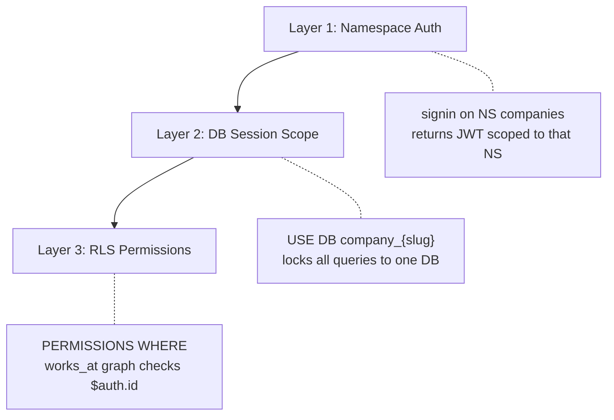

# Research: Business Portal Tenant-Scoped Login

> **Date:** 2026-06-14
> **Author:** Hermes
> **Domain:** business-portal / auth
> **Related:** [ADR-0013](file:///home/solmundur/Projects/DittoDatto/conductor/adr/business-portal/0013-business-portal-multi-tenant-authentication.md), [database_flow_design](file:///home/solmundur/Projects/DittoDatto/conductor/tracks/business-portal/database_flow_design.md), [business-portal-prd](file:///home/solmundur/Projects/DittoDatto/conductor/business-portal-prd.md)

---

## TL;DR

The settled design (ADR-0013) prescribes a 3-step login: **authenticate → verify role → route to tenant DB**. The current code only implements step 1 (credential authentication). Steps 2 and 3 are explicitly deferred. The `company_slug` lives on the `user` record in `users/profiles`, set by the Admin Panel during company onboarding. Tenant isolation is enforced by the database session (`USE DB company_{slug}`) — not by application-level checks.

---

## 1. How Does the Login Flow Discover `company_slug`?

### The Data Path

```
Admin Panel onboarding
  → UPDATE user SET company_slug = "sawasdee", role = "business"
    (in users/profiles)

Business Portal login
  → signin on NS users → SELECT company_slug FROM user WHERE email = $email
    → USE NS companies DB company_sawasdee
```

The `company_slug` field is stored on the [user table](file:///home/solmundur/Projects/DittoDatto/schemas/users.surql#L35) in the `users/profiles` database:

```surql
DEFINE FIELD company_slug ON user TYPE option<string>;
```

It is **set by the Admin Panel** during company onboarding ([surreal_admin_repository.dart](file:///home/solmundur/Projects/DittoDatto/apps/admin/lib/core/surreal_admin_repository.dart#L190)):

```dart
r'UPDATE type::record("user", $owner_id) SET role = ... "business" ..., company_slug = $slugs, ...'
```

The [User model](file:///home/solmundur/Projects/DittoDatto/packages/mercury_client/lib/src/models/user.dart#L34-L35) already maps this field:

```dart
@JsonKey(name: 'company_slug')
final String? companySlug;
```

### The Prescribed Flow (ADR-0013, Step 3)

After credential authentication succeeds, the Business Portal should:

1. Query `users/profiles` for the authenticated user's record
2. Read `company_slug` from that record
3. Execute `USE NS companies DB company_{company_slug};` on the `companies` WebSocket connection

This locks all subsequent queries on that connection to the tenant's isolated database.

---

## 2. Current Implementation State

### ✅ Implemented

| Component | Status | File |
|-----------|--------|------|
| Dual-namespace WebSocket signin (`companies` + `users`) | Done | [surreal_connection.dart](file:///home/solmundur/Projects/DittoDatto/apps/business-portal/lib/core/surreal_connection.dart) |
| JWT token persistence (secure storage + web storage) | Done | [surreal_auth_service.dart](file:///home/solmundur/Projects/DittoDatto/apps/business-portal/lib/core/surreal_auth_service.dart) |
| Session restore from persisted tokens | Done | [surreal_auth_service.dart](file:///home/solmundur/Projects/DittoDatto/apps/business-portal/lib/core/surreal_auth_service.dart#L86-L127) |
| Riverpod auth state management | Done | [auth_provider.dart](file:///home/solmundur/Projects/DittoDatto/apps/business-portal/lib/features/auth/auth_provider.dart) |

### ❌ Not Yet Implemented (Deferred)

| Capability | Where It Should Go | Notes |
|------------|-------------------|-------|
| **Role verification** (reject non-business users) | `SurrealAuthService.login()` after `SurrealConnection.connect()` | Query `users/profiles` for user record, check `role ∈ {business, admin, super_admin}` |
| **Slug discovery** (`SELECT company_slug FROM user`) | Same location | Query the `users` connection for the user's `company_slug` |
| **Tenant routing** (`USE DB company_{slug}`) | `SurrealConnection` or `SurrealAuthService` | Execute `USE NS companies DB company_{slug};` on `companies` connection |
| **Slug persistence** (for session restore) | Add a `_slugKey` to `SurrealAuthService` storage | Needed so `tryRestore()` can re-route without re-querying |

The code itself confirms this is deferred — see [surreal_auth_service.dart L17-18](file:///home/solmundur/Projects/DittoDatto/apps/business-portal/lib/core/surreal_auth_service.dart#L17-L18):

```dart
/// Role verification and tenant routing (`USE DB company_{slug}`) are
/// deferred to a future track — this scaffold just validates credentials.
```

---

## 3. What Prevents Cross-Tenant Access?

### Three Layers of Protection



#### Layer 1 — Namespace-Level Authentication

Users are defined as namespace-level users on both `companies` and `users` namespaces ([bootstrap.surql](file:///home/solmundur/Projects/DittoDatto/apps/admin/deploy/bootstrap.surql#L20-L26)). The JWT returned by `signin` is scoped to that namespace. A user **cannot access a namespace they aren't defined on**.

> [!WARNING]
> Currently only `arnarvalur` and `gurkudrengur` are defined as NS users with `ROLES OWNER`. For the Business Portal to support arbitrary business users, either:
> - Each business user needs a `DEFINE USER ON NAMESPACE` entry (provisioned during onboarding), or
> - OIDC access (`DEFINE ACCESS ... TYPE OIDC`) replaces namespace-level credentials (as the PRD and flow design prescribe for Vipps integration)

#### Layer 2 — Database Session Scope

Once `USE NS companies DB company_{slug}` executes on a WebSocket connection, **all subsequent queries on that connection only see that database**. The client cannot query `company_other` without issuing another `USE DB` statement.

Since the slug is determined server-side from the user's profile (not from client input), the client cannot choose a different tenant's database.

#### Layer 3 — Row-Level Security (RLS)

Even within the correct tenant database, SurrealDB enforces per-record permissions via `$auth.id` and graph traversal ([database_flow_design.md](file:///home/solmundur/Projects/DittoDatto/conductor/tracks/business-portal/database_flow_design.md#L160-L183)):

```surql
DEFINE TABLE establishment SCHEMAFULL
    PERMISSIONS
        FOR update, delete, create WHERE
            (SELECT VALUE role FROM works_at
             WHERE in.user_id = $auth.id
             AND out = id
             AND role IN ['owner', 'admin'])[0] != NONE;
```

---

## 4. Implementation Sketch for the Missing Steps

When this work is picked up, the login flow in `SurrealAuthService.login()` should expand to roughly:

```dart
// After successful SurrealConnection.connect():

// Step 2: Role verification
final profile = await connection.users.query(
  r'SELECT role, company_slug FROM user WHERE email = $email LIMIT 1',
  bindings: {'email': email},
);
final role = profile.first['role'];
if (!{'business', 'admin', 'super_admin'}.contains(role)) {
  connection.close();
  return const Unauthenticated();
}

// Step 3: Tenant routing
final slug = profile.first['company_slug'];
if (slug == null) {
  connection.close();
  return const Unauthenticated();
}
await connection.companies.query('USE NS companies DB company_$slug');

// Persist slug for session restore
await _storage.write(key: _slugKey, value: slug);
```

And `tryRestore()` should read the persisted slug and re-execute `USE DB company_{slug}` on the restored connection.

---

## 5. Open Questions / Risks

| # | Question | Impact |
|---|----------|--------|
| 1 | **Multi-company users**: `company_slug` is a single `option<string>`, but the schema also has `company_memberships[]` and `company_membership_ids[]`. If a user owns multiple companies, which slug is used? | Need a company picker or default-company logic |
| 2 | **NS user provisioning**: Current bootstrap only defines 2 hardcoded NS users. How are business users provisioned for NS-level signin? | Blocks all non-admin logins. OIDC (Vipps) bypasses this entirely — likely the real solution |
| 3 | **Client-side `USE DB` trust**: The client issues `USE DB company_{slug}` — but the slug comes from a query the client runs. Could a compromised client skip the query and `USE DB` a different slug? | With `ROLES OWNER` NS users, yes. With OIDC scoped access, SurrealDB's access method can restrict which DBs the session can target |
| 4 | **Session restore re-routing**: `tryRestore()` currently doesn't know the slug, so a restored session lands on no database. | Persist slug alongside tokens (straightforward) |

---

## 6. Source Files Referenced

| File | Purpose |
|------|---------|
| [surreal_auth_service.dart](file:///home/solmundur/Projects/DittoDatto/apps/business-portal/lib/core/surreal_auth_service.dart) | Auth service — credentials + token persistence |
| [surreal_connection.dart](file:///home/solmundur/Projects/DittoDatto/apps/business-portal/lib/core/surreal_connection.dart) | Dual-namespace WebSocket connection manager |
| [auth_provider.dart](file:///home/solmundur/Projects/DittoDatto/apps/business-portal/lib/features/auth/auth_provider.dart) | Riverpod state management for auth |
| [login_screen.dart](file:///home/solmundur/Projects/DittoDatto/apps/business-portal/lib/features/auth/login_screen.dart) | Login UI (email + password) |
| [user.dart](file:///home/solmundur/Projects/DittoDatto/packages/mercury_client/lib/src/models/user.dart) | User model with `companySlug` field |
| [users.surql](file:///home/solmundur/Projects/DittoDatto/schemas/users.surql) | Users database schema |
| [bootstrap.surql](file:///home/solmundur/Projects/DittoDatto/apps/admin/deploy/bootstrap.surql) | DB bootstrap with NS user definitions |
| [surreal_admin_repository.dart](file:///home/solmundur/Projects/DittoDatto/apps/admin/lib/core/surreal_admin_repository.dart) | Admin Panel — sets `company_slug` during onboarding |
| [database_flow_design.md](file:///home/solmundur/Projects/DittoDatto/conductor/tracks/business-portal/database_flow_design.md) | Full auth + data flow design document |
| [ADR-0013](file:///home/solmundur/Projects/DittoDatto/conductor/adr/business-portal/0013-business-portal-multi-tenant-authentication.md) | Settled decision on multi-tenant auth |
| [business-portal-prd.md](file:///home/solmundur/Projects/DittoDatto/conductor/business-portal-prd.md) | PRD v1.0 |
