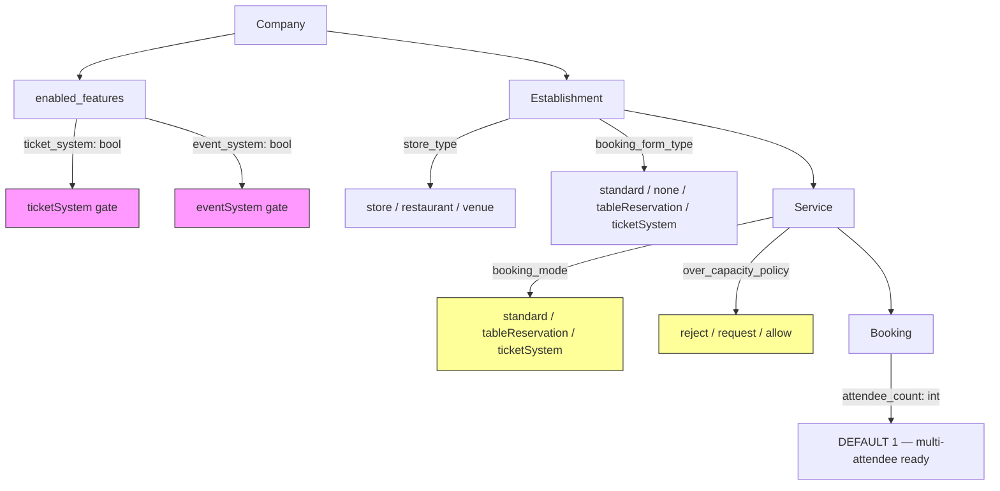

# 🎫 Ticketing Deep-Dive — Full Dossier

> **Date:** 2026-06-28
> **Scope:** Everything DittoDatto has ever designed, scaffolded, researched, or discussed about `ticketSystem`, events, venues, and capacity-based bookings.

---

## TL;DR

**Ticketing is a well-designed domain concept with solid schema scaffolding — but zero functional implementation.** The infrastructure is ready (enums, feature flags, `attendee_count`, `venue` store type), but no ticket table, no event table, no API route, no UI flow, no PRD screen, no ADR, and no track has ever touched it.

| Layer | Status |
|---|---|
| **Domain design** | ✅ Thoroughly designed — glossary, context, project-context all define it |
| **SurrealDB schema** | 🟡 Enum values + feature flags exist, but NO ticket/event table |
| **MercuryEngine** | 🟡 `BookingMode.TICKET_SYSTEM` enum declared, never used in code or tests |
| **Dart models** | 🟡 `EnabledFeatures.ticketSystem` + `.eventSystem` exist, never read by any UI |
| **UI (Flutter)** | 🔴 Placeholder "Arrangementer" section (always hidden). No booking flow |
| **UI (Legacy Nuxt)** | 🔴 `TicketBookingFlow.vue` + `DDEventGrid.vue` referenced in audit — files deleted |
| **API routes** | 🔴 None |
| **PRD / ADR / Track** | 🔴 None |
| **Competitive research** | ✅ Noona's Scheduled Events model well-documented |

---

## 1. Domain Design — What We've Decided

### From [context.md](file:///home/solmundur/Projects/DittoDatto/conductor/context.md) (Domain Glossary)

| Term | Definition |
|---|---|
| **Service** (L17) | Booking mode lives here: `standard` / `tableReservation` / `ticketSystem` |
| **Ticket** (L26) | A booking via `ticketSystem` mode (venues, events, recurring ticketed activities). AKA: event ticket, admission |
| **Event** (L27) | A one-off occurrence at an Establishment (e.g., a salon workshop). Can be ticketed if gated by `Company.enabledFeatures.ticketSystem` |

### From [project-context.md](file:///home/solmundur/Projects/DittoDatto/conductor/project-context.md)

- **L27:** Multi-vertical booking modes — "`standard` (appointments), `tableReservation` (restaurants), `ticketSystem` (venues/events) on one engine — **booking mode lives on the Service, not the Establishment**."
- **L193:** "One establishment can host multiple booking modes (appointments + ticketed workshops + table reservations)."

> [!IMPORTANT]
> The core architectural decision: booking mode is a **Service-level** attribute, not Establishment-level. A salon can have `standard` appointment services AND a `ticketSystem` workshop service.

---

## 2. SurrealDB Schema — What's Wired

### [company-blueprint.surql](file:///home/solmundur/Projects/DittoDatto/schemas/company-blueprint.surql)

| Field | Values | Status |
|---|---|---|
| `establishment.store_type` (L80–81) | `'store'`, `'restaurant'`, `'venue'` | ✅ Fully wired (DB, Dart, tests) |
| `establishment.booking_form_type` (L86–87) | `'standard'`, `'none'`, `'tableReservation'`, `'ticketSystem'` | 🟡 Schema exists, no UI reads/writes |
| `service.booking_mode` (L175–176) | `'standard'`, `'tableReservation'`, `'ticketSystem'` | 🟡 Schema + engine enum exist, tests only use `STANDARD` |
| `service.over_capacity_policy` (L199–200) | `'reject'`, `'request'`, `'allow'` | 🟡 Schema exists — relevant for ticket capacity mgmt |
| `booking.attendee_count` (L374) | `TYPE int DEFAULT 1` | 🟡 Ready for multi-attendee tickets |

### [platform.surql](file:///home/solmundur/Projects/DittoDatto/schemas/platform.surql) — Feature Flags

| Flag | Default | Status |
|---|---|---|
| `company.enabled_features.ticket_system` (L61) | `false` | 🟡 Defined, never toggled |
| `company.enabled_features.event_system` (L62) | `false` | 🟡 Defined, never toggled |

> [!NOTE]
> **No `ticket` or `event` table exists.** The `booking` table is the universal container. A `ticketSystem` booking is simply a `booking` row associated with a `ticketSystem`-mode service.

---

## 3. MercuryEngine — Python Enums (Stubs Only)

### [common.py](file:///home/solmundur/Projects/DittoDatto/services/mercury-engine/src/mercury_engine/domain/models/common.py) (L93–106)

```python
class BookingFormType(StrEnum):
    STANDARD = "standard"
    NONE = "none"
    TABLE_RESERVATION = "tableReservation"
    TICKET_SYSTEM = "ticketSystem"         # ← declared, never used

class BookingMode(StrEnum):
    STANDARD = "standard"
    TABLE_RESERVATION = "tableReservation"
    TICKET_SYSTEM = "ticketSystem"         # ← declared, never used
```

- `ServiceProjection.booking_mode` defaults to `BookingMode.STANDARD`
- **Zero tests** cover `TICKET_SYSTEM` — all 377 tests use `STANDARD`
- **Zero ticket-specific endpoints** exist
- **Zero ticket-specific slot logic** in Time Tetris

> [!WARNING]
> The referenced `BOOKING_ENGINE.md` safety manual (`conductor/docs/legacy/conductor-snapshot/BOOKING_ENGINE.md`) **does not exist** in the current project tree. It's in `DittoDatto-old/conductor/BOOKING_ENGINE.md` — a separate repo. This is a dead link in `project-context.md` L130 and L176.

---

## 4. Dart / Flutter — Feature Flags + UI Stubs

### [company.dart](file:///home/solmundur/Projects/DittoDatto/packages/mercury_client/lib/src/models/company.dart) — EnabledFeatures

```dart
class EnabledFeatures {
  final bool tableReservation;  // L56-57
  final bool aiAssistance;      // L59-60
  final bool ticketSystem;      // L62-63, maps to 'ticket_system'
  final bool eventSystem;       // L65-66, maps to 'event_system'
}
```

Fully wired with `@JsonKey` and defaults (`false`). No UI reads these flags to gate behavior.

### Shared `establishment_ui` Package

| File | What | Status |
|---|---|---|
| `establishment_data.dart` L11 | `EstablishmentType.venue` — "Spillested" + stadium icon | ✅ Full |
| `establishment_data.dart` L74, L133 | `showEvents` bool field (default `false`) | 🟡 Always false |
| `establishment_page.dart` L168–173 | `if (data.showEvents) EstablishmentEventsSection()` | 🟡 Wired but invisible |
| `establishment_events_section.dart` | "Arrangementer kommer snart" placeholder | 🔴 Pure stub |

### Business Portal + Marketplace

- `BusinessType.venue` enum value exists and works ✅
- Integration tests create venue establishments ✅
- **No ticket management screens, no event creation forms, no ticketSystem service creation flow**

---

## 5. Legacy Nuxt — Deleted Components

From [business-portal-ui_package_audit.md](file:///home/solmundur/Projects/DittoDatto/conductor/docs/Business-Portal/business-portal-ui_package_audit.md):

| Component | Used in | Status |
|---|---|---|
| `<DDBookingFlowsTicketBookingFlow>` (L62–63) | Establishment preview | ❌ Files deleted (were in legacy `packages/ui/`) |
| `<DDEventGrid>` (L74–75) | Establishment preview | ❌ Files deleted |

These prove ticket UI was at least started in Chapter 1 Nuxt code, but the components were part of a deleted shared UI package.

---

## 6. Competitive Research — Noona's Model

### From [noona-crm-research.md](file:///home/solmundur/Projects/DittoDatto/conductor/docs/Business-Portal/noona-crm-research.md) (L192–257)

Noona (Icelandic competitor) implements **Scheduled Events** with:

- **Tiers** — capacity, pricing, variations, booking questions per tier
- **Capacity tracking** — `total_capacity`, `remaining_capacity`, `is_full`
- **Ticket ID** — e.g., "A3B7C2K9" for ticketed events
- **Cancellation policy** — `allow_cancellation`, `min_cancel_notice_minutes`
- **Event ↔ Scheduled Event link** — separate entity from regular appointments

> [!TIP]
> This is the richest design reference for what our ticketSystem could look like. The key insight from Noona: **Events are a separate entity with capacity tiers**, not just regular bookings with a different mode flag.

---

## 7. Related References

### From [business-portal-business_portal_audit.md](file:///home/solmundur/Projects/DittoDatto/conductor/docs/Business-Portal/business-portal-business_portal_audit.md)

- **Resources** contain capacity bounds (`minCapacity`, `maxCapacity`) — used in "restaurant/venue booking contexts"
- **Reservations page** "provides reservation scheduling for restaurants and venues"
- **Capacity Bounds** "configures limits for restaurant and event layout capacities (`totalCapacity`)"

### From [grill_strategy.md](file:///home/solmundur/Projects/DittoDatto/conductor/docs/grill_strategy.md) (L121)

"Booking vs. Reservation vs. Ticket (MercuryEngine's three modes)" listed as a domain glossary item **needing refinement**.

### From [recon_report.md](file:///home/solmundur/Projects/DittoDatto/conductor/docs/recon_report.md) (L110)

Documents `bookingMode` tri-value and `overCapacityPolicy` as existing schema infrastructure.

### From [pulse.md](file:///home/solmundur/Projects/DittoDatto/conductor/pulse.md) (L50)

Next session suggestion: "Services section design — name, **type-dependent rendering (restaurant vs venue vs store)**. Needs grill."

---

## 8. Entity Relationship Map



---

## 9. Gaps & Open Questions for Future `/grill`

| # | Gap | Notes |
|---|---|---|
| 1 | **No `event` table** | Noona separates Events from regular bookings. Do we need a dedicated `event` table or is the `booking` table with `ticketSystem` mode sufficient? |
| 2 | **No capacity tiers** | Noona has multi-tier events (VIP, General, etc.). Schema has no tier concept. |
| 3 | **No PRD coverage** | Neither Admin PRD nor BP PRD define ticket/event screens or flows. |
| 4 | **No ADR** | The decision "booking mode lives on Service, not Establishment" is in `project-context.md` but never formalized as an ADR. |
| 5 | **`BOOKING_ENGINE.md` is missing** | Dead link in `project-context.md`. Lives in `DittoDatto-old/`. Should be ported or the reference updated. |
| 6 | **Feature flag semantics** | `ticket_system` vs `event_system` — what's the difference? Both are booleans defaulting to false. Are they independent gates? |
| 7 | **`over_capacity_policy`** | Schema-only. No UI, no API logic implements it. Presumably for ticketed events (waitlist? allow overbooking?). |
| 8 | **`attendee_count`** | Schema-only. No booking UI collects party size for ticket purchases. |
| 9 | **Recurring ticketed activities** | Context.md mentions "recurring ticketed activities" — no schema or engine support for recurring event patterns. |
| 10 | **Services section design** | Pulse suggests this is next — type-dependent rendering for venue vs restaurant vs store. Natural gateway to ticketing UI. |
