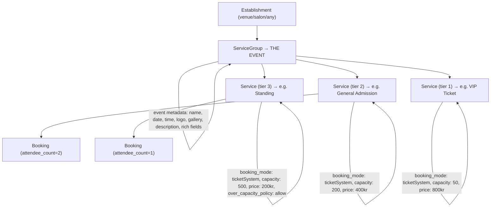

# 🎫 Ticketing & Events — Grill Brief

> **Session:** 2026-06-28
> **Participants:** Arnar (Captain) + Hermes (Cmdr)
> **Status:** Decisions crystallized — ready for ADR + context.md commit

---

## Two Systems, One Platform

DittoDatto's third booking domain splits into **two related but independent systems**:

### 1. Event System (`event_system` feature flag)

A general-purpose event system for companies/establishments.

| Aspect | Detail |
|---|---|
| **Purpose** | Create and display events on an establishment's page |
| **Public events** | Grand openings, community events, announcements — visibility only, no tickets required |
| **Private events** | Staff events, internal meetings — not visible to consumers |
| **Gate** | `company.enabled_features.event_system` |
| **Ticketing required?** | ❌ No. An event can exist without any ticket/booking attached |

### 2. Ticket System (`ticket_system` feature flag)

A booking mode (`ticketSystem`) for selling admission to events.

| Aspect | Detail |
|---|---|
| **Purpose** | Capacity-managed ticket sales for events |
| **Regular use** | Venues with recurring events — monthly concerts, weekly shows |
| **On-demand use** | Any company can spin up a one-off ticketed event (salon workshop, restaurant tasting) |
| **Gate** | `company.enabled_features.ticket_system` |
| **Requires event_system?** | ✅ Yes — you need events to sell tickets for them |

> [!IMPORTANT]
> **Independence rule:** `event_system` can be ON without `ticket_system` (display-only events). But `ticket_system` requires `event_system` (can't sell tickets without events to attach them to).

---

## The Model: ServiceGroup = Event, Services = Tickets

### Why ServiceGroup = Event?

| Benefit | Explanation |
|---|---|
| **Reuses existing infrastructure** | ServiceGroup already exists as a domain entity with CRUD |
| **Tier model is natural** | VIP / General / Standing = child Services under one group |
| **Per-tier flexibility** | Each tier (Service) gets its own price, capacity, `over_capacity_policy`, description |
| **Total capacity = sum** | Event capacity = Σ child Service capacities |
| **Simple events work too** | One-off salon workshop = 1 ServiceGroup (event) + 1 Service (the ticket). One event, one tier, done |
| **Mirrors Noona's model** | Noona's `tiers[]` on Scheduled Events = our Services under a ServiceGroup |

### Event Metadata on ServiceGroup

New fields needed on ServiceGroup (or an `event_metadata` embedded object):

| Field | Type | Notes |
|---|---|---|
| `event_date` | `datetime` | When the event occurs |
| `event_end_date` | `option<datetime>` | Optional end time |
| `event_type` | `string` | `'public'` / `'private'` |
| `event_logo` | `option<string>` | Event-specific branding |
| `event_gallery` | `array<string>` | Event photos |
| `event_description` | `option<string>` | Rich description |
| `rrule` | `option<string>` | RFC 5545 recurrence rule (for recurring events) |
| `parent_event` | `option<record>` | Link to parent recurring event ServiceGroup |

> [!NOTE]
> Whether these live directly on ServiceGroup or in a separate `event` table that references ServiceGroup is an implementation detail for the track spec. The **conceptual model** is settled: ServiceGroup IS the event container.

---

## Recurring Events

**Pattern:** Venues define a recurrence rule (RFC 5545 `rrule`) on their event ServiceGroup.

| Phase | How it works |
|---|---|
| **v1 (platform)** | Platform auto-creates next event instance from `rrule`, notifies company user to confirm/adjust details (date, lineup, pricing) |
| **v2 (Datto)** | Business AI agent handles recurrence automatically — creates, populates, adjusts based on historical patterns |

Example: "Jazzklubb Drammen" has `rrule: FREQ=MONTHLY;BYDAY=3SA` (third Saturday monthly). Platform auto-creates next month's instance → company user gets notification → reviews/adjusts → publishes.

Individual occurrences are full ServiceGroup instances linked to parent via `parent_event`.

---

## Infrastructure Insights from Research

### From Ticketmaster (Evan King / Hello Interview)

| Concept | DittoDatto mapping |
|---|---|
| Atomic seat holds via `UPDATE...WHERE` | Already have Hold entity in MercuryEngine. Same pattern |
| Virtual Waiting Room (queue buffer) | Future scaling concern — not v1 |
| Live Queries for real-time seat maps | SurrealDB `LIVE SELECT` — no Kafka/Redis needed |
| Seat status: AVAILABLE → HELD → SOLD | Maps to our Hold → Booking lifecycle |

### From Noona (Competitive Research)

| Concept | DittoDatto mapping |
|---|---|
| Scheduled Events with `tiers[]` | ServiceGroup with child Services |
| `total_capacity`, `remaining_capacity` | Computed from Service capacities + booking count |
| `ticket_id` (e.g. "A3B7C2K9") | Generate on Booking creation for `ticketSystem` bookings |
| `allow_cancellation`, `min_cancel_notice_minutes` | Already have BookingPolicy on Establishment |
| RRULE-based recurrence | Adopt RFC 5545 on ServiceGroup |

---

## Decisions to Formalize

### ADR Candidates

| # | Decision | Rationale |
|---|---|---|
| **ADR-0022** | **ServiceGroup = Event container, Services = Ticket tiers** | Hard to reverse (schema + API + UI), surprising without context (why not a separate Event table?), real trade-off (reuse vs. dedicated entity). Core architectural choice for the third booking domain. |
| **ADR-0023** | **Events and Ticketing are independent feature flags** | `event_system` gates event creation (public/private), `ticket_system` gates ticket sales. `ticket_system` implies `event_system`. Clarifies the two-flag design in `platform.surql`. |

### context.md Updates

| Term | Update |
|---|---|
| **Event** | Expand: "A one-off or recurring occurrence... Modeled as a ServiceGroup with event metadata. Can be public (consumer-visible) or private (staff-only). Can exist without ticketing (visibility-only)." |
| **Ticket** | Expand: "A booking via `ticketSystem` mode. Modeled as a Service within an Event ServiceGroup. Each Service = one ticket tier (VIP, General, Standing). Capacity tracked per tier." |
| **ServiceGroup** | Add: "Also serves as the Event container when `event_system` is enabled. Event metadata (date, type, logo, gallery, rrule) lives here." |
| **Recurring Event** | New term: "An Event ServiceGroup with an RFC 5545 `rrule`. Platform auto-creates next instance; company user confirms. Future: Datto automates." |

### pulse.md Session Memory

This session's findings and decisions should be appended.

---

## What's NOT Decided Yet (Future Grill / Track Spec)

| Question | Notes |
|---|---|
| Separate `event` table vs. fields on ServiceGroup? | Implementation detail — needs schema design in track spec |
| Seat maps / assigned seating? | Ticketmaster pattern ready, but is it v1? Most Norwegian venues are GA |
| Payment integration for tickets? | Vipps for tickets? Stripe? Not v1 |
| Ticket QR codes / check-in? | Noona has check-in flow. Future feature |
| Event discovery in Marketplace? | How do ticketed events appear in DittoBar search? |
| BP event creation UX? | Wireframes needed — ServiceGroup form extended with event fields |
| `attendee_count` UX? | How does consumer select "2 tickets" in Marketplace? |
