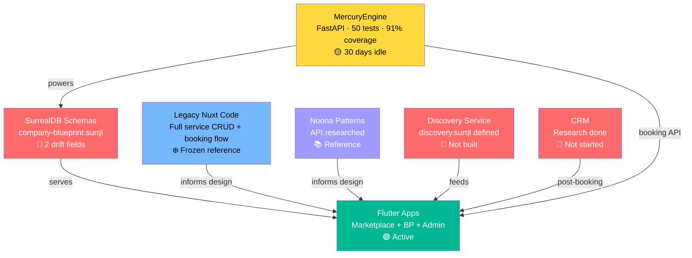
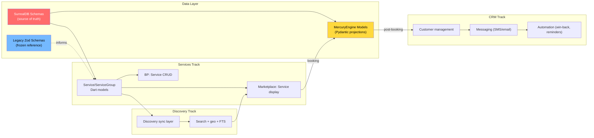

# 🔭 Recon Report — The Convergence Audit

**Date:** 2026-06-28 · **Agents dispatched:** 3 · **Status:** All complete

Three research agents investigated the interconnected domains that are "knotting together": MercuryEngine state, legacy Nuxt service patterns, and Noona's API for competitive reference.

---

## TL;DR — The Big Picture



> [!CAUTION]
> **Critical schema drift found.** MercuryEngine's `Booking` model has `rescheduled_from` / `rescheduled_to` fields for Norwegian Forbrukstilsynet compliance — but these fields **don't exist in the SurrealDB blueprint**. On a `SCHEMAFULL` table, writes are silently dropped. This must be fixed before any booking goes live.

---

## 1. MercuryEngine Audit

### Location & State

| Dimension | Status |
|---|---|
| **Path** | [services/mercury-engine/](file:///home/solmundur/Projects/DittoDatto/services/mercury-engine/) (own `.git`, branch `main`) |
| **Last code change** | 2026-05-29 (~30 days ago) |
| **Last commit** | `41ef5a3` — chore: grapher workflow rename (~25 days ago) |
| **Conductor** | Has its own. Pulse last updated 2026-05-29. 1 track, fully complete. |
| **Tests** | 50/50 passing, 91% coverage (95% on calculators) |
| **Blockers** | None internal. 3 unsynced ADR candidates + 4 glossary updates queued for parent conductor |

### Conductor State

- **Track:** "MercuryEngine 1.0 Booking Engine Greenfield" — **5/5 phases complete** ✅
- **Relay queue:** 3 ADR candidates + 4 glossary updates never synced to parent conductor
- **Next suggestions (from its own pulse):** Sync parent relay, resume Admin Panel build

### API Endpoints (8 total)

| Method | Path | Auth | Purpose |
|---|---|---|---|
| `GET` | `/health` | — | Health check |
| `GET` | `/ready` | — | DB readiness |
| `GET` | `/availability` | — | Slot query (company, services, date, staff) |
| `POST` | `/availability/probe` | — | Read-only availability check |
| `POST` | `/holds` | ✅ | Create 10min slot lock |
| `POST` | `/bookings/confirm` | ✅ | Confirm booking from hold |
| `POST` | `/bookings/{id}/cancel` | ✅ | Cancel booking |
| `POST` | `/bookings/{id}/reschedule` | ✅ | Reschedule (Norwegian compliance) |

### Model Inventory

**Core:** Hold, Booking, BookingItem, Customer, User, AvailabilityProbe
**Projections (read-only mirrors):** Establishment, Service, StaffMember, Resource, ResourceGroup, Schedule
**Enums:** 17 total (BookingMode, BookingStatus, BookingChannel, PaymentStatus, StoreType, CoverLayoutMode, etc.)

### 🔴 Schema Drift — Critical

| Python Field | SurrealDB Blueprint | Risk |
|---|---|---|
| `Booking.rescheduled_from` | ❌ **Missing** | 🔴 Silently dropped — compliance data loss |
| `Booking.rescheduled_to` | ❌ **Missing** | 🔴 Silently dropped — compliance data loss |
| `Booking.establishment` | `str` vs `record<establishment>` | 🟡 Type mismatch (may coerce at runtime) |
| `Hold.services` | `list[str]` vs `array<record<service>>` | 🟡 Type mismatch |
| `Customer.store_ids` | `list[str]` vs `array<record<establishment>>` | 🟡 Type mismatch |
| `Customer.last_booking` | `str` vs `record<booking>` | 🟡 Type mismatch |

> [!WARNING]
> The `rescheduled_from` / `rescheduled_to` drift is a **hard bug**. The reschedule endpoint actively writes these fields for Norwegian Forbrukstilsynet compliance (bidirectional old↔new booking links). On a `SCHEMAFULL` table, SurrealDB silently ignores unknown fields. **Fix: add both fields to `company-blueprint.surql`.**

---

## 2. Legacy Nuxt Services Inventory

> [!NOTE]
> Legacy code lives at `DittoDatto-old/`, not in the active project tree. All paths below reference the correct location.

### Service Model (Zod — frozen reference)

**[ServiceSchema](file:///home/solmundur/Projects/DittoDatto/DittoDatto-old/packages/shared-types/src/service.ts)** — 25+ fields:

| Category | Fields |
|---|---|
| **Identity** | `id`, `storeId`, `groupId?`, `assignedStaff[]` |
| **Content** | `title`, `description`, `serviceType[]`, `subcategory`, `keywords[]`, `aiDescription`, `_embedding[]` |
| **Booking** | `bookingMode` (standard/tableReservation/ticketSystem), `overCapacityPolicy` (reject/request/allow) |
| **Time** | `duration` (minutes), `bufferTime`, `minBookingNoticeMinutes`, `slotInterval` (5–120) |
| **Pricing** | `price` (≥ 0), `currency` (NOK/SEK/DKK/EUR/ISK) |
| **Resources** | `requiredResourceGroupIds[]` |
| **Media** | `coverImage`, `gallery[]` |
| **Status** | `isActive` |

**[ServiceGroupSchema](file:///home/solmundur/Projects/DittoDatto/DittoDatto-old/packages/shared-types/src/service-group.ts)** — organizational container:
- `name`, `description`, `staffIds[]`, `sortOrder`, `showOnBookingPanel`, `multiSelect`
- **No config inheritance** (explicit design decision 2026-03-03)

### Service UI Components

| Component | Lines | Purpose | Key Pattern |
|---|---|---|---|
| **ServiceFormSlideover.vue** | 596 | Full CRUD form | Duration presets (15/30/45/60/90/120/180), staff multi-select partitioned by store, booking mode conditional on `enabledFeatures` |
| **ServiceGroupFormSlideover.vue** | 378 | Group CRUD | Blocks delete if services linked, group defaults (duration, capacity, bookingMode) |
| **ServiceGrid.vue** | 224 | Public display grid | Multi-select groups → composite 2×2 collage card with price range |
| **ServiceSelector.vue** | 130 | Booking flow picker | Selected state ring, 64px thumbnail, 2-line clamp description |
| **services/index.vue** | 373 | BP management page | Store selector (persisted), group card strip, per-service card with cover/badge/price |
| **InheritedFieldHint.vue** | 56 | Config cascade indicator | Shows "Inherited from: Group/Store/System" |

### Booking Flow (Legacy)

The marketplace page [DittoDatto-old/apps/web/public-marketplace/app/pages/[category]/[slug].vue](file:///home/solmundur/Projects/DittoDatto/DittoDatto-old/apps/web/public-marketplace/app/pages/%5Bcategory%5D/%5Bslug%5D.vue) (711 lines) orchestrates the full booking:

```
Service selection → Date picker → Slot availability → Hold (10min) → Confirm
                                                    ↳ Reservation mode branches for tableReservation
```

### Current Flutter State

| File | Status |
|---|---|
| [establishment_services_section.dart](file:///home/solmundur/Projects/DittoDatto/packages/establishment_ui/lib/src/sections/establishment_services_section.dart) | **Placeholder** — "Tjenester kommer snart" + TODO |
| [establishment_data.dart](file:///home/solmundur/Projects/DittoDatto/packages/establishment_ui/lib/src/models/establishment_data.dart) | Has `showServices` bool but **no service model** |
| [services_screen.dart](file:///home/solmundur/Projects/DittoDatto/apps/business-portal/lib/features/services/services_screen.dart) | **Empty placeholder** |

### 🎯 Design Patterns Worth Preserving

| Pattern | Why It Matters |
|---|---|
| **Multi-select group → composite card** | Groups with `multiSelect=true` collapse into one card with 2×2 image collage + price range ("kr 200 – kr 500"). Elegant UX. |
| **Duration presets** | Quick buttons (15/30/45/60/90/120/180 min) in service form — faster than manual input |
| **Fiscal snapshot** | `priceAtTimeOfBooking`, `serviceTitle`, `duration` frozen at booking creation — legally required |
| **Staff partitioning** | Multi-select shows "this store" vs "other locations" — prevents cross-location confusion |
| **InheritedFieldHint** | Shows config cascade source — essential when groups have defaults |
| **Format helpers** | `formatPrice(price, currency)` via Intl, `formatDuration(minutes)` with hours/min — reusable |
| **Over-capacity policy** | `reject/request/allow` drives different booking acceptance UX |

---

## 3. Noona API Research

### Architecture

Noona runs a **two-tier API** (same pattern as DittoDatto):
- **HQ API** — business management (OAuth 2.0) → like Business Portal
- **Marketplace API** — customer-facing (JWT) → like Public Marketplace

Base: `https://api.noona.is` · Docs: `https://docs.noona.is`
Tech: TypeScript, React Native, OpenAPI → Orval SDK generation

### Service Model Comparison

Noona calls services **"event types"** with a 4-level hierarchy:

```
Category Group → Category → Event Type Group → Event Type
```

DittoDatto uses a simpler **2-level** hierarchy:

```
ServiceGroup → Service
```

| Noona | DittoDatto | Notes |
|---|---|---|
| `event_type` | `service` | DittoDatto's naming is clearer |
| `event_type_group` | `service_group` | Direct equivalent |
| `event_type_category` | `service.service_type` | DittoDatto flattens this onto the service |
| `custom_duration` | `service.duration` | DittoDatto is simpler (flat int) |
| `unit_price.amount/currency/discount` | `service.price` + `service.currency` | DittoDatto separates these |

> [!TIP]
> DittoDatto's 2-level hierarchy is cleaner for the Norwegian market. Noona's 4-level hierarchy adds complexity that most small businesses don't need. Keep it simple.

### Booking Flow Comparison

| Step | Noona | DittoDatto |
|---|---|---|
| Check availability | `GET /marketplace/companies/{id}/time_slots` | `GET /availability` |
| Lock slot | `POST /marketplace/time_slot_reservations` | `POST /holds` |
| Confirm | Create `event` | `POST /bookings/confirm` |
| Cancel | Update event status | `POST /bookings/{id}/cancel` |
| Reschedule | Not documented | `POST /bookings/{id}/reschedule` ✅ |

**DittoDatto advantages:**
- `hold.payment_status` + `vipps_order_id` — more payment-aware
- `booking.channel` includes `voice_agent` — future Ditto agent support
- Explicit reschedule endpoint with compliance tracking

**Noona has, DittoDatto doesn't (yet):**
- **Screening mode** — booking requests that staff approve/deny (grey calendar). Maps to `pending` status + `over_capacity_policy: 'request'` in DittoDatto (infrastructure exists, UI doesn't)
- **Custom booking statuses** — businesses define their own beyond system statuses

### CRM Comparison

| Feature | Noona | DittoDatto |
|---|---|---|
| Customer profile | ✅ Full | ✅ `customer` table (name, email, phone, notes) |
| Visit history | ✅ | ✅ `total_visits`, `first_visit_at`, `last_visit_at` |
| Spend tracking | ✅ | ✅ `total_spent` |
| Status tracking | ✅ | ✅ `status` ∈ [new, active, inactive] |
| Messaging | ✅ SMS/email | 🟡 `message_thread`/`message` tables defined, not populated. Firebase as delivery pipe (SMS/email sending), SurrealDB stores the data. |
| Win-back campaigns | ✅ Automated | ❌ Not built |
| Favorites/rebooking | ✅ One-tap rebook | ❌ Not built |
| Vouchers/loyalty | ✅ Series vouchers | ❌ Not built |
| Acquisition channel | ✅ | ✅ `channel` ∈ [app, web, portal, import] |

> [!IMPORTANT]
> Noona positions itself as a **"loyalty engine"** not just a scheduling tool. CRM features (win-back campaigns, vouchers, favorites) drive retention. DittoDatto's `customer` table has the foundation — the gap is automation and loyalty features.

### Staff & Multi-Location

| Dimension | Noona | DittoDatto |
|---|---|---|
| Multi-location | Outlets in a chain, app-level isolation | DB-per-company isolation (`company_{slug}`) ✅ stronger |
| Staff assignment | Employee belongs to multiple outlets | `works_at` graph edge with role ✅ cleaner |
| Staff scheduling | Company + staff level intervals | `weekly_shifts` + `date_override` ✅ equivalent |
| Capabilities | Basic roles | `default_capabilities` + `store_capabilities` ✅ richer |

### Discovery

| Feature | Noona | DittoDatto |
|---|---|---|
| Public search | Marketplace API | `discovery.surql` schema defined but **not built** |
| Full-text search | Unknown | Norwegian snowball BM25 analyzer ✅ ready |
| Geo search | Unknown | Native GeoJSON + `geo::distance()` ✅ ready |
| AI/semantic search | No evidence | HNSW vector index prepared (commented out) |
| Demand signals | No evidence | `search_event` table for analytics ✅ unique |

### Key Takeaways from Noona

1. **OpenAPI-first SDK generation** (via Orval) — worth considering for MercuryEngine
2. **Screening/approval mode** — DittoDatto has the infrastructure (`pending` + `over_capacity_policy`), just needs UI
3. **Loyalty engine framing** — CRM should be positioned as retention, not just records
4. **Custom booking statuses** — extensibility businesses want
5. **App Store model** — Noona has partner integrations; relevant for future DittoDatto ecosystem

---

## 4. Convergence Analysis — What Connects

### The Dependency Graph



### Recommended Sequencing

| Priority | Track | Why | Depends On |
|---|---|---|---|
| **0 (hotfix)** | Schema drift fix | Add `rescheduled_from`/`rescheduled_to` to blueprint | Nothing |
| **1** | Services section (grill → track) | Most visible next step. EstablishmentPage is built and waiting. | Schema fix |
| **2** | Discovery service (new track) | Marketplace uses a debug pipe today. Discovery makes it real. | Services data existing |
| **3** | MercuryEngine relay sync | 3 ADR candidates + 4 glossary updates sitting unprocessed | Nothing (can do anytime) |
| **4** | CRM (grill → track) | Biggest scope. Needs bookings working first. Research is done. | Services + Discovery |

### Suggested Next Moves

1. **`/grill services`** — Design the services section for EstablishmentPage + BP CRUD. Informed by legacy patterns (composite group cards, duration presets, staff assignment) + Noona insights (screening mode, simple hierarchy).

2. **`/new-track discovery`** — The `discovery.surql` schema exists. Build the sync layer + marketplace data pipe. Replaces the `EstablishmentDebugService` hack.

3. **Schema hotfix** — Add `rescheduled_from: option<record<booking>>` and `rescheduled_to: option<record<booking>>` to `company-blueprint.surql`. Five-minute fix, prevents compliance data loss.

4. **MercuryEngine relay drain** — Read the 3 ADR candidates + 4 glossary updates from its conductor, fold them into the parent conductor. Keep the two conductors in sync.

5. **CRM grill** — When services + discovery are wired, grill the CRM domain. The Noona "loyalty engine" framing is the right lens.
