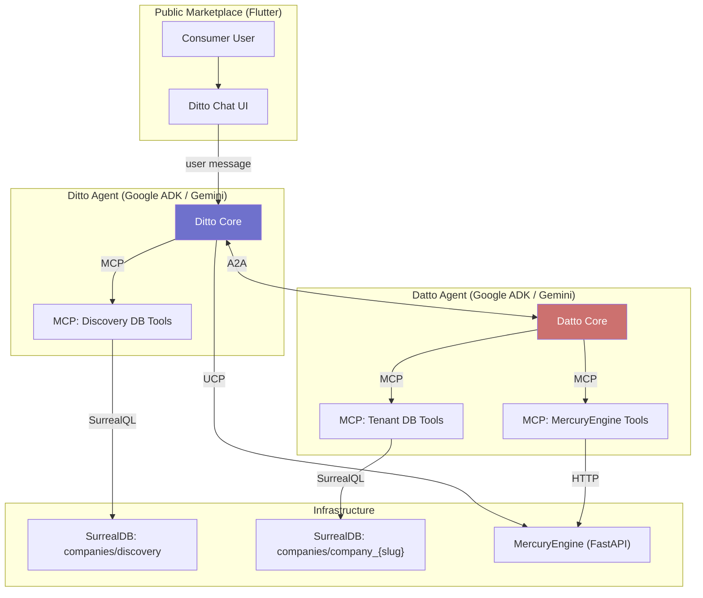

# Research: Agentic Readability — Ditto ↔ Datto via UCP, A2A, and MCP

> **Date:** 2026-06-14
> **Author:** Hermes
> **Domain:** platform / agentic-commerce
> **Related:** [context.md](file:///home/solmundur/Projects/DittoDatto/conductor/context.md#L55-L57), [project-context.md](file:///home/solmundur/Projects/DittoDatto/conductor/project-context.md#L18), [database_flow_design.md](file:///home/solmundur/Projects/DittoDatto/conductor/tracks/business-portal/database_flow_design.md)

---

## TL;DR

UCP is specifically for **shopping/commerce transactions** (cart → checkout → order). What you actually need for Ditto ↔ Datto is a combination of **three protocols** working together:

| Protocol | Role in DittoDatto | Analogy |
|----------|-------------------|---------|
| **A2A** (Agent-to-Agent) | Ditto discovers Datto, they exchange capabilities, delegate tasks | Two people introducing themselves |
| **MCP** (Model Context Protocol) | Datto reads SurrealDB tenant data (services, availability, staff) | An employee checking the company database |
| **UCP** (Universal Commerce Protocol) | The actual booking transaction (hold → confirm → receipt) | The cash register |

UCP alone doesn't make the Business Portal "readable." **A2A makes it discoverable, MCP makes it readable, UCP makes it transactable.**

---

## 1. What UCP Actually Is (And Isn't)

### What UCP Does
UCP is Google's open standard for **agentic commerce** — it standardizes how AI agents perform **transactions** with merchants:

- Product/service catalog browsing
- Cart management
- Checkout (including payment via AP2)
- Order tracking and post-purchase

A merchant publishes a **capability manifest** at `/.well-known/ucp` that tells agents: "Here's what I sell, here are my checkout rules, here's how to pay."

### What UCP Does NOT Do
- ❌ Agent-to-agent discovery ("find me a spa near Drammen")
- ❌ Conversational Q&A ("what are your opening hours?")
- ❌ Database querying ("show me available slots for Thursday")
- ❌ Real-time streaming updates ("a slot just opened up")

### The Misconception
Thinking of UCP as "how agents talk to each other" is conflating three separate concerns. UCP is one layer in a stack:

```
┌─────────────────────────────────────────────┐
│  Ditto (Consumer Agent)                     │
│  "Find me a Thai massage in Drammen"        │
├─────────────────────────────────────────────┤
│  A2A — Agent Discovery & Delegation         │
│  Ditto finds Datto:sawasdee via Agent Card  │
├─────────────────────────────────────────────┤
│  MCP — Data & Tool Access                   │
│  Datto reads SurrealDB: services, slots,    │
│  staff, establishment info                  │
├─────────────────────────────────────────────┤
│  UCP — Commerce Transaction                 │
│  Hold → Confirm → Booking receipt           │
├─────────────────────────────────────────────┤
│  SurrealDB (company_sawasdee)               │
│  + MercuryEngine (Time Tetris)              │
└─────────────────────────────────────────────┘
```

---

## 2. The Three Protocols — DittoDatto Mapping

### 2.1 A2A: How Ditto Finds Datto

The **A2A protocol** (Google, now Linux Foundation) standardizes agent-to-agent discovery. Each agent publishes a JSON **Agent Card** at `/.well-known/agent-card.json`.

**DittoDatto application:** Each company's Datto instance publishes an Agent Card:

```json
// https://api.dittodatto.no/companies/sawasdee/.well-known/agent-card.json
{
  "name": "Datto:sawasdee",
  "description": "AI receptionist for Sawasdee Spa, Drammen",
  "url": "https://api.dittodatto.no/agents/datto/sawasdee",
  "capabilities": [
    "service_catalog",
    "availability_check",
    "booking_hold",
    "establishment_info",
    "staff_info"
  ],
  "authentication": {
    "type": "bearer",
    "schemes": ["dittodatto-platform"]
  },
  "modalities": ["text"]
}
```

**Ditto's workflow:**
1. User says "find me a Thai massage near Drammen"
2. Ditto queries `companies/discovery` (EstablishmentListings) for matching services + geo
3. For each match, Ditto discovers the company's Datto agent via A2A Agent Card
4. Ditto delegates: "Check Thursday availability for Thai massage" → Datto:sawasdee

### 2.2 MCP: How Datto Reads the Business Portal Data

**MCP** is the "USB-C for AI" — it gives Datto structured access to the tenant's SurrealDB data. This is what makes the Business Portal **"agentic readable."**

**DittoDatto application:** Datto connects to SurrealDB via MCP tools:

```
MCP Server: datto-surreal-tools
├── tool: get_services       → SELECT * FROM service WHERE status = 'active'
├── tool: get_availability   → MercuryEngine /availability endpoint  
├── tool: get_establishment  → SELECT * FROM establishment
├── tool: get_staff          → SELECT * FROM staff WHERE status = 'active'
├── tool: get_opening_hours  → SELECT schedules FROM establishment
└── tool: create_hold        → MercuryEngine /holds endpoint
```

> [!IMPORTANT]
> MCP is where the Business Portal's data becomes "readable" by an agent. The MCP server wraps the existing SurrealDB queries and MercuryEngine endpoints that the Flutter Business Portal already uses.

### 2.3 UCP: How the Booking Transaction Happens

Once Ditto and Datto agree on a slot, UCP handles the commerce flow:

```
Ditto                         Datto (via UCP)
  │                              │
  ├── browse_catalog ──────────► │ (UCP: catalog capability)
  │◄── service list ────────────┤
  │                              │
  ├── check_availability ──────► │ (MCP: Datto queries SurrealDB)
  │◄── available slots ─────────┤
  │                              │
  ├── create_hold ─────────────► │ (UCP: checkout capability)
  │◄── hold confirmation ───────┤ (MercuryEngine creates hold)
  │                              │
  ├── confirm_booking ─────────► │ (UCP: order capability)
  │◄── booking receipt ─────────┤ (MercuryEngine converts hold→booking)
```

**Capability manifest (UCP):**

```json
// https://api.dittodatto.no/companies/sawasdee/.well-known/ucp
{
  "business": {
    "name": "Sawasdee Spa",
    "url": "https://dittodatto.no/sawasdee"
  },
  "capabilities": {
    "no.dittodatto.booking.catalog": {
      "version": "1.0",
      "endpoint": "/api/companies/sawasdee/services"
    },
    "no.dittodatto.booking.availability": {
      "version": "1.0", 
      "endpoint": "/api/companies/sawasdee/availability"
    },
    "no.dittodatto.booking.checkout": {
      "version": "1.0",
      "endpoint": "/api/companies/sawasdee/holds"
    }
  }
}
```

---

## 3. Architecture: Where Each Protocol Lives



### Where Things Run

| Component | Runtime | Host |
|-----------|---------|------|
| Ditto agent | Google ADK (Python) container | Saturn → Cloud Run |
| Datto agent (per-company) | Google ADK (Python) container | Saturn → Cloud Run |
| MCP Server (discovery) | Python, wraps SurrealDB queries | Co-located with Ditto |
| MCP Server (tenant) | Python, wraps SurrealDB + MercuryEngine | Co-located with Datto |
| A2A Agent Cards | Static JSON, served by MercuryEngine or CDN | Cloud Run |
| UCP Manifests | Static JSON, served by MercuryEngine or CDN | Cloud Run |

---

## 4. What "Agentic Readable" Means for the Business Portal

The Business Portal (Flutter) doesn't need to change at all. The portal is a **human UI** over SurrealDB. The agents read the **same data** through a different interface:

```
Human (Business Portal)  ──► SurrealDB (company_slug) ◄── Datto (MCP Server)
          │                                                      │
          │  Same data, different interface                       │
          └──────────────────────────────────────────────────────┘
```

### What Needs to Be Built (Layer 2)

| Component | What It Does | Depends On |
|-----------|-------------|------------|
| **MCP Server for tenant data** | Wraps SurrealQL queries as MCP tools (services, staff, schedules, establishment) | SurrealDB schema (exists) |
| **MCP Server for booking** | Wraps MercuryEngine's `/availability`, `/holds`, `/bookings` as MCP tools | MercuryEngine API (exists) |
| **Datto agent (ADK)** | Gemini-powered agent with persona, connected to the two MCP servers above | Google ADK |
| **Ditto agent (ADK)** | Gemini-powered agent that queries discovery DB and delegates to Datto via A2A | Google ADK |
| **A2A Agent Cards** | Per-company JSON at a well-known URL | Trivial static generation |
| **UCP Manifests** | Per-company capability profile for booking transactions | Trivial static generation |

> [!TIP]
> The MCP servers are essentially a **thin Python wrapper** over the SurrealDB queries and MercuryEngine HTTP endpoints that already exist. MercuryEngine's `get_availability`, `create_hold`, `confirm_booking` map almost 1:1 to MCP tools.

---

## 5. Concrete Example: "Book a Thai Massage"

```
User: "I want a Thai massage Thursday afternoon in Drammen"

DITTO:
  1. [MCP → discovery DB]
     SELECT * FROM establishment_listing 
     WHERE services CONTAINS "thai massage"
     AND geo::distance(location, $user_geo) < 10km
     → finds Sawasdee Spa (slug: "sawasdee")

  2. [A2A → discover Datto]
     GET /.well-known/agent-card.json for company "sawasdee"
     → Datto:sawasdee is alive, supports availability_check

  3. [A2A → delegate to Datto]
     "Check Thursday PM availability for Thai massage"

DATTO:sawasdee:
  4. [MCP → tenant DB]
     SELECT * FROM service WHERE name ~ "thai massage"
     → service:thai_60 (60 min, staff: [staff:nok, staff:kai])

  5. [MCP → MercuryEngine]
     GET /availability?company_slug=sawasdee&service_ids=thai_60&date=2026-06-18
     → slots: [14:00, 14:30, 15:00, 15:30, 16:00]

  6. [A2A → respond to Ditto]
     "Available: 14:00, 14:30, 15:00, 15:30, 16:00 with Nok or Kai"

DITTO:
  7. [presents to user]
     "Sawasdee Spa has Thai massage openings Thursday: 2pm, 2:30pm, 3pm, 3:30pm, 4pm"

User: "Book 3pm with Kai"

DITTO:
  8. [UCP/MCP → MercuryEngine]
     POST /holds { company_slug: "sawasdee", services: ["thai_60"], 
                   date: "2026-06-18", time: "15:00", staff: "kai" }
     → hold created (TTL: 5 min)

  9. [UCP → confirm]
     POST /bookings { hold_id: "hold:xyz", company_slug: "sawasdee" }
     → booking confirmed

  10. [presents to user]
      "Booked! Thai massage at 3pm Thursday with Kai at Sawasdee Spa."
```

---

## 6. Business Portal Datto "Tier" — The Opt-In Model

Per the project principles: **"Agentic by design, value without AI."** Datto is an opt-in tier:

| Tier | Datto Capability | What the Business Portal Exposes |
|------|-----------------|----------------------------------|
| **Free** | None — Ditto reads discovery DB only (listings, basic info) | Static listing data projected to `companies/discovery` |
| **Premium** | Datto answers availability queries, basic Q&A about services/hours | MCP tools for: services, schedules, availability |
| **Enterprise** | Datto handles full booking flow, custom persona, conversation memory | Full MCP + UCP + A2A with conversational memory |

This maps cleanly to the existing `Company.tier` field and `enabledFeatures` object in the registry schema.

---

## 7. Key Insight: The Business Portal Doesn't Serve Agents — MercuryEngine Does

The Flutter Business Portal is a **human-operated dashboard**. It doesn't need to "expose" anything to agents. The agentic interface is:

1. **MercuryEngine** (already exists) — provides the REST API that both the Flutter app and the MCP tools call
2. **SurrealDB** (already exists) — stores the data that both the Flutter app and the MCP server query
3. **MCP Server** (to be built) — thin wrapper making those queries available as agent tools
4. **A2A + UCP** (to be built) — discovery and transaction protocols

The Business Portal's role is to let merchants **configure** what Datto knows — manage services, set schedules, define policies. Datto then reads that same data via MCP.

---

## 8. Open Questions

| # | Question | Impact |
|---|----------|--------|
| 1 | **One Datto per company vs. shared Datto with context switching?** Multi-container (one agent per tenant) is cleanest for isolation but heavier. Shared Datto with `company_slug` context switching is cheaper but riskier. | Architecture decision needed |
| 2 | **Where does Datto run?** Saturn's NVIDIA GB10 is ready for inference. Cloud Run for production. Does Datto use Gemini API (remote) or local model? | Infra decision |
| 3 | **UCP namespace:** Google UCP uses `dev.ucp.shopping.*`. DittoDatto would need custom capabilities like `no.dittodatto.booking.*` — is this supported, or should we use UCP's extensibility model? | Spec compliance check |
| 4 | **A2A vs. internal RPC:** For Ditto ↔ Datto within our own platform, is full A2A overkill? Could use internal gRPC/HTTP and reserve A2A for third-party agents. | Complexity vs. future-proofing |
| 5 | **Discovery DB as agent source of truth:** Currently `companies/discovery` is a read-heavy projection. Is it rich enough for Ditto's search, or does Ditto need MCP access to `companies/registry`? | Data model question |

---

## 9. Summary: Protocol Cheat Sheet

```
┌──────────────────────────────────────────────────────────────┐
│                   DittoDatto Protocol Stack                  │
├──────────────┬───────────────────────────────────────────────┤
│   Protocol   │  What it does for DittoDatto                  │
├──────────────┼───────────────────────────────────────────────┤
│   A2A        │  Ditto discovers Datto agents per company     │
│              │  Agent Cards at /.well-known/agent-card.json  │
├──────────────┼───────────────────────────────────────────────┤
│   MCP        │  Datto reads tenant DB + MercuryEngine        │
│              │  Tools: get_services, get_availability, etc.  │
│              │  THIS is "agentic readable"                   │
├──────────────┼───────────────────────────────────────────────┤
│   UCP        │  Booking transaction lifecycle                │
│              │  Manifests at /.well-known/ucp                │
│              │  Catalog → Cart → Checkout → Order            │
├──────────────┼───────────────────────────────────────────────┤
│   Google ADK │  Agent orchestration runtime                  │
│              │  Gemini models power Ditto + Datto personas   │
└──────────────┴───────────────────────────────────────────────┘
```

---

## 10. Source References

| Source | What |
|--------|------|
| [context.md L55-57](file:///home/solmundur/Projects/DittoDatto/conductor/context.md#L55-L57) | Ditto, Datto, UCP glossary definitions |
| [project-context.md L18](file:///home/solmundur/Projects/DittoDatto/conductor/project-context.md#L18) | Layer 1/Layer 2 architecture description |
| [project-context.md L75](file:///home/solmundur/Projects/DittoDatto/conductor/project-context.md#L75) | Google ADK as agent orchestration choice |
| [database_flow_design.md](file:///home/solmundur/Projects/DittoDatto/conductor/tracks/business-portal/database_flow_design.md) | Full auth and data flow design |
| [booking_routes.py](file:///home/solmundur/Projects/DittoDatto/services/mercury-engine/src/mercury_engine/api/booking_routes.py) | MercuryEngine — existing availability/hold/booking API |
| [ucp.dev](https://ucp.dev) | UCP specification |
| [A2A Protocol](https://github.com/google/a2a-spec) | Agent-to-Agent specification |
| [MCP (Anthropic)](https://modelcontextprotocol.io) | Model Context Protocol specification |
