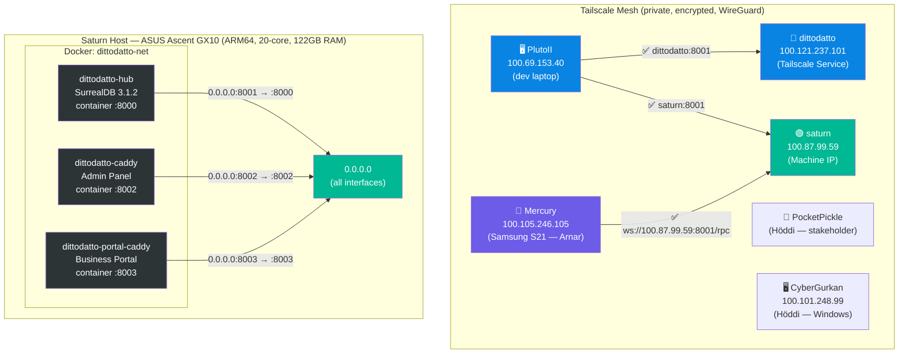

# Saturn Network Topology

> **Updated:** 2026-06-25
> **Config:** `/srv/dittodatto/.env` + `/srv/dittodatto/docker-compose.yml`

---

## Active Topology



## Tailscale Dual-IP Note

> [!IMPORTANT]
> Saturn has **two** Tailscale IPs. Containers must bind to `0.0.0.0` to be reachable from both.

| Name | IP | Type | Resolves via |
|------|----|------|-------------|
| `saturn` | `100.87.99.59` | Machine IP | `getent hosts saturn` |
| `dittodatto` | `100.121.237.101` | Tailscale Service | `getent hosts dittodatto` |

Browsers and CLI tools use the `dittodatto` hostname (Service IP). The Flutter app uses the machine IP directly via `--dart-define`. Both work because `TAILNET_IP=0.0.0.0`.

## Port Map

| Port | Service | Container | Protocol | Used by |
|------|---------|-----------|----------|---------|
| `:8001` | SurrealDB (DittoDatto Hub) | `dittodatto-hub` | WebSocket `/rpc` | All Flutter apps (direct-to-DB) |
| `:8002` | Admin Panel | `dittodatto-caddy` | HTTP | Arnar + Höddi via browser |
| `:8003` | Business Portal | `dittodatto-portal-caddy` | HTTP | Business users via browser |
| `:8004` | Public Marketplace | *(planned)* | HTTP | Consumers via browser |
| `:8005` | APK Downloads | *(planned)* | HTTP | Höddi's phone (static file server) |
| `:8085` | SurrealDB (OpenWebUI) | `owui-surrealdb` | WebSocket | OpenWebUI only (separate stack) |

## Security

> [!NOTE]
> **Zero internet exposure.** Saturn has no public IP. All ports are reachable **only** from Tailscale peers. `0.0.0.0` binding is safe because the only network interfaces are Tailscale (WireGuard) and the local Docker bridge.

Authorized Tailscale peers: PlutoII (Arnar), Mercury (Arnar phone), CyberGurkan (Höddi), PocketPickle (Höddi phone).

## Config Reference

**`.env` (`/srv/dittodatto/.env`):**
```
TAILNET_IP=0.0.0.0
SURREAL_PORT=8001
```

**`docker-compose.yml`** uses `${TAILNET_IP}:${SURREAL_PORT}:8000` for port binding.

**BP portal caddy** runs outside compose (manual `docker run` with `-p 0.0.0.0:8003:8003`).
