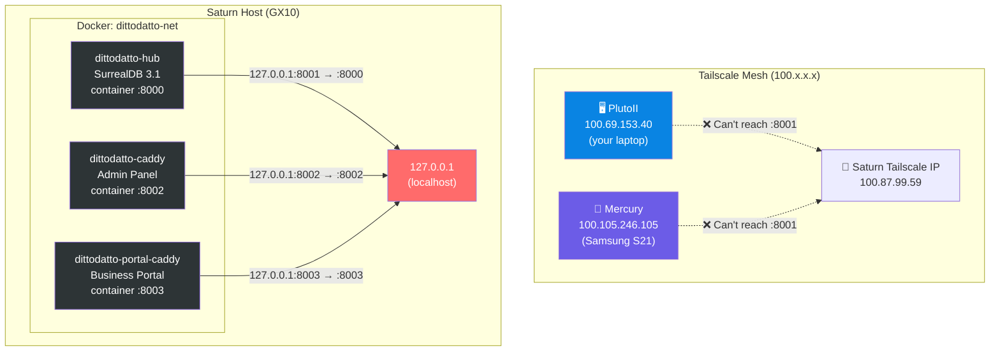
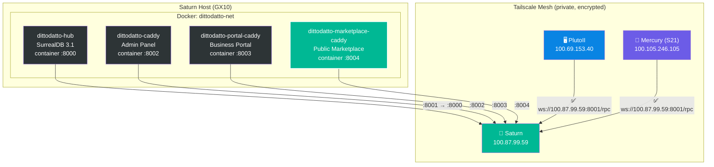

# Saturn Network — Current vs Proposed

## Current State: Everything on localhost

> [!CAUTION]
> All 3 containers bind to `127.0.0.1` — **nothing is reachable** from the Tailscale mesh. The web apps only work because you browse from Saturn itself or SSH tunnel.

---

## Proposed: Bind to Tailscale IP

## The Change

| What | Before | After |
|------|--------|-------|
| `.env` `TAILNET_IP` | `127.0.0.1` | `100.87.99.59` |
| SDB reachable from mesh | ❌ | ✅ `:8001` |
| Admin Panel from mesh | ❌ | ✅ `:8002` |
| BP from mesh | ❌ | ✅ `:8003` |
| Marketplace (new) | — | ✅ `:8004` |
| Public internet | ❌ blocked | ❌ still blocked |

> [!IMPORTANT]
> **Security:** Binding to `100.87.99.59` means only Tailscale peers (PlutoII, Mercury, CyberGurkan, PocketPickle) can reach these ports. Saturn has no public IP — Tailscale IS the firewall. Zero exposure to the internet.

## Port Map (after)

| Port | Service | Protocol | Used by |
|------|---------|----------|---------|
| `:8001` | SurrealDB (DittoDatto Hub) | WebSocket `/rpc` | All apps (Flutter direct-to-DB) |
| `:8002` | Admin Panel | HTTP | Arnar + Höddi via browser |
| `:8003` | Business Portal | HTTP | Business users via browser |
| `:8004` | Public Marketplace | HTTP | Consumers via browser |
| `:8085` | SurrealDB (OpenWebUI) | WebSocket | OpenWebUI only (separate stack) |
