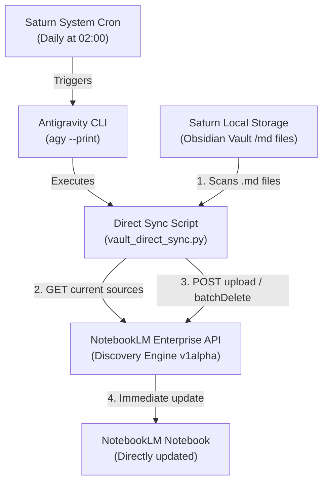

# Specification — DittoDatto Vault to NotebookLM Direct Enterprise API Sync

This document outlines the architecture, data flow, and setup instructions to programmatically synchronize the **DittoDatto Obsidian Vault** from the **Saturn staging server** directly to your **NotebookLM Enterprise Notebook** using the official Google Cloud Discovery Engine API, bypassing Google Drive entirely.

---

## 🎯 High-Level Goal

Automatically sync all local Markdown notes (`.md`) from the Saturn staging server to NotebookLM on a daily basis so that our custom enterprise notebook is always up-to-date with the latest DittoDatto domain knowledge, glossary, decisions (ADRs), and track summaries.

---

## 🏗️ Architecture & Direct API Integration



### Key Technical Details
1. **Native Markdown Support:** The Discovery Engine / NotebookLM Enterprise API `notebooks.sources.uploadFile` method natively supports raw `.md` files with `Content-Type: text/markdown` and `X-Goog-Upload-Protocol: raw`.
2. **Synchronization Mechanics:**
   - **GET Notebook State:** Fetch active sources from the target notebook:
     `GET https://{ENDPOINT}-discoveryengine.googleapis.com/v1alpha/projects/{PROJECT_NUMBER}/locations/{LOC}/notebooks/{NOTEBOOK_ID}`
   - **Upload Delta:** Detect new or modified local files. Call `sources:uploadFile` to add them.
   - **Prune Delta:** Call `sources:batchDelete` to remove files from the notebook that no longer exist in the local vault.
   - **Relative Path Names:** We preserve folder structure by passing relative paths (e.g. `Decisions/ADR-0003.md`) as the display name via the `X-Goog-Upload-File-Name` header.

---

## 🔧 Deployment Configuration on Saturn

### 1. Environment Variables (`/srv/dittodatto/.env`)
Add the following variables to Saturn's staging environment configuration:
```bash
# NotebookLM Enterprise Integration
NOTEBOOK_PROJECT_NUMBER="your-gcp-project-number"
NOTEBOOK_LOCATION="global"
NOTEBOOK_ENDPOINT_LOCATION="us"  # us, eu, or global
NOTEBOOK_ID="your-notebook-uuid"
NOTEBOOK_VAULT_PATH="/home/arnar/Projects/Obsidian"
```

### 2. Authentication Configuration
*   **Service Account JSON (Recommended):** Place a GCP service account JSON key file at `/srv/dittodatto/config/gcp-sa.json`. The service account must have **Discovery Engine Viewer/Editor** permissions.
*   **Alternative OAuth Token:** If no Service Account key is present, the script runs a one-time interactive OAuth 2.0 Web Flow, storing the refreshable token in `/srv/dittodatto/config/token.json`.

---

## 🐍 Synchronization Script Spec (`vault_direct_sync.py`)

A standalone Python script running under `uv` on Saturn:
- **Path:** `/srv/dittodatto/scripts/vault_direct_sync.py`
- **Behavior:**
  - Loads credentials dynamically.
  - Queries Google Cloud to build a map of existing sources (`title` ➔ `resource_name`).
  - Scans local vault `.md` files recursively, skipping hidden folders (like `.git` or `.obsidian`).
  - Compares file size and modification timestamps (or contents) to detect updates.
  - Deletes modified or stale sources in a batch and uploads fresh content recursively.

---

## 🕒 Automated Triggers & Scheduling

We configure a new system cron job running as `arnar` on Saturn to trigger the sync securely and headlessly:
```bash
0 2 * * * /home/arnar/.local/bin/agy --dangerously-skip-permissions --print "Run the direct sync script at /srv/dittodatto/scripts/vault_direct_sync.py"
```
*Resiliency details:* If Saturn restarts, the system cron will survive. Running it through `agy --print` ensures that the Antigravity task runner is invoked, tracking execution and maintaining safety audits.
