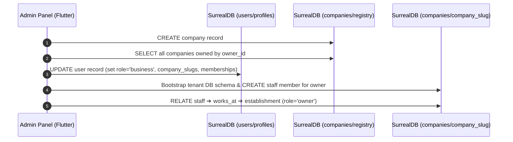
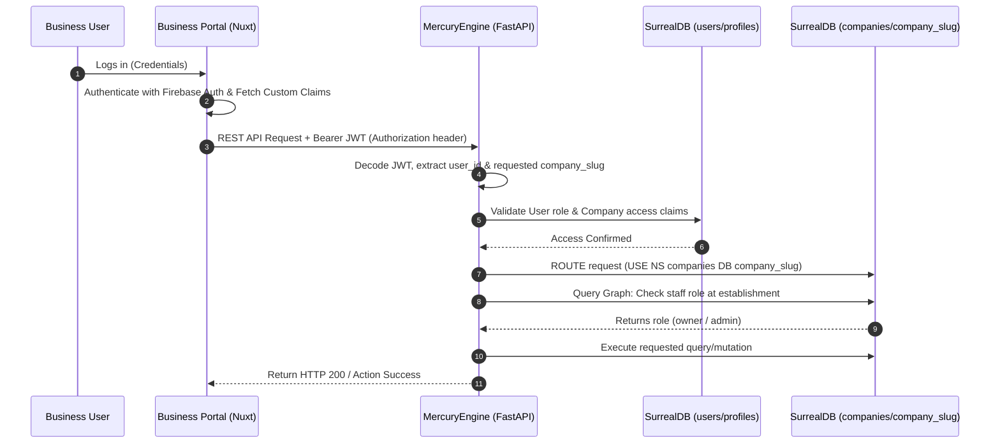

# DittoDatto Authentication, Authorization, and Database Flow Design

This report documents the multi-tenant database structure, authentication workflows, and authorization checks between the **Business Portal**, the **Admin Panel**, and **SurrealDB**, mediated by **MercuryEngine**.

---

## 1. Database Architecture & Tenancy Model

DittoDatto uses a hybrid multi-tenant architecture in SurrealDB 3.0. Security, compliance, and PII management are enforced using strict namespace and database isolation.

```
SurrealDB Instance
├── Namespace: users
│   └── Database: profiles (or users)
│       └── Table: user (GDPR-isolated consumer/business accounts)
└── Namespace: companies
    ├── Database: registry (System-wide list of all registered Dattos)
    │   └── Table: company (Company metadata + database routing tags)
    ├── Database: discovery (Public read-heavy aggregator)
    │   └── Table: establishment_listing (Projected store data)
    └── Databases: company_{slug} (Isolated per-company databases)
        ├── Table: establishment (Stores/Locations)
        ├── Table: staff (Company employees)
        ├── Table: works_at (Edge: staff ➔ establishment)
        └── Table: booking (Transactional appointments)
```

### Namespace Segregation (GDPR Boundaries)
*   **Namespace `users` / Database `profiles`**: Contains the `user` table. All customer and business owner PII remains isolated here. As per [users.surql](file:///home/solmundur/Projects/DittoDatto/schemas/users.surql#L8-L10), this is a hard boundary; company databases never store direct user records or sensitive credentials.
*   **Namespace `companies`**:
    *   **Database `registry`**: Holds the `company` registry. It contains owner mappings and feature flags.
    *   **Database `discovery`**: Houses read-heavy, denormalized projections (`establishment_listing`) for public search.
    *   **Database `company_{slug}`**: Tenant-isolated databases. If a company named "Sawasdee" is created, its database is `company_sawasdee`. It has its own `establishment`, `service`, `staff`, and `booking` tables.

### Cross-Namespace Mappings
Since SurrealDB record links cannot traverse namespace boundaries, references across the `users` and `companies` namespaces are stored as **String references**:
*   `company.owner_id` (in `companies/registry`) points to a user ID string (e.g., `"user:abc123"`).
*   `staff.user_id` (in `companies/company_{slug}`) points to a user ID string.
*   `user.company_membership_ids` (in `users/profiles`) is an array of company ID strings.

---

## 2. Onboarding Flow: User & Company Association

When a new business owner registers and associates with a company, the **Admin Panel** performs an atomic, multi-database sync.



### Detailed Steps

1.  **Company Creation**:
    The Admin Panel connects to the `companies` namespace and inserts the company metadata into `companies/registry`:
    ```surql
    USE NS companies DB registry;
    CREATE company CONTENT {
        name: "Sawasdee Spa",
        slug: "sawasdee",
        db_slug: "sawasdee",
        owner_id: "user:xyz789",
        owner_email: "owner@sawasdee.no",
        tier: "premium",
        onboarding_status: "verified"
    };
    ```
2.  **Aggregation of Owner Companies**:
    The Admin Panel queries all companies owned by this user:
    ```surql
    SELECT * FROM company WHERE owner_id = "user:xyz789";
    ```
3.  **Atomic User Profile Update**:
    The Admin Panel switches to the `users` namespace and updates the user profile record. This promotes the user to the `business` role and stores membership links for fast authentication checks:
    ```surql
    USE NS users DB profiles;
    UPDATE user:xyz789 SET 
        role = "business",
        company_slug = "sawasdee",
        company_membership_ids = ["company:sawasdee_id"],
        company_memberships = [
            {
                company_id: "company:sawasdee_id",
                role: "owner",
                assigned_at: time::now()
            }
        ];
    ```
4.  **Tenant Database Setup**:
    The tenant database (`companies/company_sawasdee`) is created and bootstrapped with the [company-blueprint.surql](file:///home/solmundur/Projects/DittoDatto/schemas/company-blueprint.surql).
5.  **Staff & Graph Assignment (Inside Tenant DB)**:
    An entry is created in the `staff` table of the tenant database, mapping the user ID to a staff entity:
    ```surql
    USE NS companies DB company_sawasdee;
    
    -- Create staff entry matching the owner's user ID string
    LET $staff = (CREATE staff CONTENT {
        user_id: "user:xyz789",
        email: "owner@sawasdee.no",
        display_name: "Owner Name",
        is_bookable: false,
        status: "active"
    });
    
    -- Relate staff to the initial establishment with owner privileges
    RELATE $staff->works_at->establishment:sawasdee_est_id SET
        role = "owner",
        since = time::now();
    ```

---

## 3. Authentication & Authorization Flow

### The Sequence



### Detailed Trace

#### Step 1: User Signs in at the Business Portal
The user signs in using Firebase Auth. The frontend middleware extracts the user's custom claims from the ID token:
```ts
// Located in app/middleware/auth.global.ts
const tokenResult = await user.getIdTokenResult(true);
const role = tokenResult.claims.role; // e.g. 'business'
const companyId = tokenResult.claims.companyId; // e.g. 'company:sawasdee_id'
```

#### Step 2: REST Request with Bearer Token
When making a request to the backend, `useMercuryREST` attaches the token to the header:
```
Authorization: Bearer <firebase_jwt_token>
```

#### Step 3: MercuryEngine Claims Validation (Cross-Namespace Check)
MercuryEngine validates the JWT and verifies that the `user_id` has access to the requested `company_slug`. It connects to the `users/profiles` database to check memberships:
```surql
-- Query run by MercuryEngine on users/profiles database
SELECT company_membership_ids, role FROM user:xyz789;
```
*   **Pass Condition**: If `role == 'super_admin'` OR if the requested company ID exists in the `company_membership_ids` array, the authorization check passes.
*   **Fail Condition**: An HTTP 403 Forbidden is returned.

#### Step 4: Routing to Tenant Database
Once authorized, MercuryEngine utilizes its `SurrealConnectionManager` to fetch a database client scoped to the company's tenant database:
```python
# Resolved via SurrealConnectionManager.get_company_client(company_slug)
await client.use("companies", "company_sawasdee")
```

#### Step 5: Graph-Based Establishment Authorization
To verify that the logged-in user is authorized to perform changes on a specific establishment within that company, the backend traverses the `works_at` graph:
```surql
-- 1. Find the staff record representing the authenticated user ID string
LET $staff_id = (SELECT VALUE id FROM staff WHERE user_id = "user:xyz789" LIMIT 1)[0];

-- 2. Traverse the works_at edge to check their role at the target establishment
SELECT VALUE role FROM works_at WHERE in = $staff_id AND out = establishment:sawasdee_store1;
```

*   **Role Outcomes**:
    *   `'owner'` / `'admin'`: Full management capabilities (updating schedules, changing services, viewing bookings).
    *   `'employee'`: Limited capabilities (viewing personal schedule, booking/modifying own slots).
    *   `NONE` (no relation exists): Request is blocked.

---

## 4. Key Architectural Observations

> [!NOTE]
> **Cross-Namespace Decoupling**: Storing cross-namespace mappings as plain strings (like `user_id` on the `staff` table) instead of native SurrealDB record links prevents cross-database corruption. This guarantees that tenant data can be cleanly migrated, backed up, or deleted without leaving dangling pointers in the core `users` registry.

> [!TIP]
> **Performance Optimization**: Because cross-namespace checks are relatively slow, the user's active memberships (`company_membership_ids`) are stored directly on the `user` table in `users/profiles`. This allows MercuryEngine to validate access with a single, fast point-lookup rather than scanning the entire `companies/registry` database.

---

## 5. Summary Table: Authentication & Roles

| Service / App | Authentication Source | SurrealDB Connection Namespace / DB | Security Boundary |
| :--- | :--- | :--- | :--- |
| **Admin Panel** | Namespace credentials (e.g. `arnarvalur`) | `companies/registry`, `companies/discovery`, `users/profiles` | Namespace owner (access to all system data) |
| **Business Portal (FE)** | Firebase Auth Cookie / ID Token | N/A (Mediated by Nitro/MercuryEngine) | Client-side routes protected by Firebase Claims |
| **MercuryEngine (BE)** | Decoded JWT (Bearer Token) | `companies/company_{slug}`, `users/profiles` | Dual-namespace client; scoped database tenant routing |
| **Public App (Marketplace)** | Scoped user session / Anonymous | `companies/discovery`, `companies/company_{slug}` | Read-only discovery listings; write-only hold creation |
