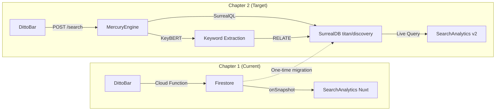

# Search Keywords & SurrealDB v3 — Deep Research

> **Context:** Research sweep across DittoDatto + SearchAnalytics codebases and the web.
> Compiled 2026-05-26 for the DittoDatto search intelligence layer.

---

## Table of Contents

1. [SearchAnalytics — Project Anatomy](#1-searchanalytics--project-anatomy)
2. [DittoDatto — Existing Search Infrastructure](#2-dittodatto--existing-search-infrastructure)
3. [Keyword Extraction Algorithms](#3-keyword-extraction-algorithms)
4. [SurrealDB v3 — Search & Storage Best Practices](#4-surrealdb-v3--search--storage-best-practices)
5. [Noise Reduction & Relevance Filtering](#5-noise-reduction--relevance-filtering)
6. [Search Analytics Database Design](#6-search-analytics-database-design)
7. [Architectural Recommendations](#7-architectural-recommendations)

---

## 1. SearchAnalytics — Project Anatomy

**What it is:** A standalone, read-only Nuxt 4 analytics dashboard deployed at `sa.dittodatto.no`. It visualizes search events from DittoDatto's DittoBar — the "intelligence layer behind DittoBar."

**Core mission:** Keyword intelligence — understanding what users search for, and critically, what they search for and **don't find** (zero-result queries = "data gold" for unmet market demand).

### Tech Stack

| Layer | Technology |
|-------|-----------|
| Framework | Nuxt 4 (^4.3.1), SSR disabled (SPA) |
| UI | @nuxt/ui ^4.4.0 + Tailwind CSS 4 |
| Language | TypeScript ^5.9.3 |
| Validation | Zod ^4.3.6 |
| Database | Cloud Firestore (read-only) |
| Auth | Firebase Auth (super_admin role) |
| Deployment | Docker (Node 20 Alpine) → Firebase Hosting |

### Data Flow

```
DittoDatto App                       SearchAnalytics
─────────────                        ───────────────
User types in DittoBar
       │
       ▼
useDittoSearch (300ms debounce)
       │
       ▼
Cloud Function: analytics_logSearchEvent
       │
       ▼
Firestore: searchEvents/{autoId}  ──────▶  useSearchAnalytics.ts
       (write)                              (real-time onSnapshot listener)
                                                   │
                                                   ▼
                                            Computed KPIs:
                                            - Total Searches (30d)
                                            - Zero-Result count
                                            - Click-Through Rate
                                            - Unique Sessions
                                            - Top Queries (normalized, ranked)
                                            - Zero-Result Queries (ranked)
```

### Firestore `searchEvents` Schema

```typescript
{
  id: string,
  query: string,              // What the user typed
  resultCount: number,        // 0 = zero-result query
  selectedResult?: {          // Only if user clicked a result
    type: "store" | "category",
    id: string,
    name: string,
  },
  userId?: string,            // null if anonymous
  sessionId: string,          // Anonymous session tracking
  source: "dittobar" | "discover" | "dattobar",
  createdAt: Timestamp,
}
```

### Current Dashboard Views

| Page | Content | Status |
|------|---------|--------|
| `/dashboard` | 4 KPI cards + Top 10 queries + Top 10 zero-results | ✅ Built |
| `/dashboard/keywords` | Full keyword analysis table | ✅ Built |
| `/dashboard/zero-results` | Full zero-result queries ranked by frequency | ✅ Built |
| `/settings` | Placeholder | ⬜ Stub only |

### What's NOT Built Yet

- Time-window selector (7d/30d/custom) — hardcoded to 30d
- Trend calculations (`trend` field always returns `0`)
- Charts / data visualization (chart library TBD)
- Recent Activity Feed (real-time stream)
- Export (CSV/BigQuery)
- Automated alerts

### Key Intelligence Practices (from [search-analytics-lecture.md](file:///home/solmundur/Projects/SearchAnalytics/.docs/dittobar_search_20260216/search-analytics-lecture.md))

- **Debounce at 300ms** — don't capture every keystroke
- **Minimum 2 chars** — ignore single-letter queries
- **Lowercase & normalize** — but keep raw strings (typos are valuable intelligence)
- **Fire-and-forget logging** — never degrade search UX for analytics
- **Click-through as separate event** — enables conversion tracking
- **AI summarization over manual tokenization** — future plan to pass raw queries to AI for demand analysis

> [!IMPORTANT]
> **SearchAnalytics is a Chapter 1 Firebase system.** It has zero SurrealDB integration. The migration path to SurrealDB is a key architectural decision ahead.

---

## 2. DittoDatto — Existing Search Infrastructure

### SurrealDB Namespace Architecture (ADR-0009)

```
titan (namespace)
├── company_{slug}    ← Per-company DB (19-table blueprint)
├── discovery         ← Public aggregator (DittoBar, search events)
└── platform          ← Company registry, system alerts, audit log

enceladus (namespace)
└── users             ← GDPR-isolated consumer PII
```

### Schema Files (in [DittoDatto-old/schemas/](file:///home/solmundur/Projects/DittoDatto/DittoDatto-old/schemas/))

| File | Target DB | Purpose |
|------|-----------|---------|
| [init.surql](file:///home/solmundur/Projects/DittoDatto/DittoDatto-old/schemas/init.surql) | Root | Namespace/DB creation + service accounts |
| [company-blueprint.surql](file:///home/solmundur/Projects/DittoDatto/DittoDatto-old/schemas/company-blueprint.surql) | `titan/company_{slug}` | 19-table per-company template |
| [discovery.surql](file:///home/solmundur/Projects/DittoDatto/DittoDatto-old/schemas/discovery.surql) | `titan/discovery` | DittoBar search, categories, areas, demand signals |
| [platform.surql](file:///home/solmundur/Projects/DittoDatto/DittoDatto-old/schemas/platform.surql) | `titan/platform` | Company registry, system alerts, audit log |
| [users.surql](file:///home/solmundur/Projects/DittoDatto/DittoDatto-old/schemas/users.surql) | `enceladus/users` | Consumer profiles, favorites, booking refs |

### DittoBar — The Search Interface

> The unified search interface in the Public Marketplace. An **A2UI (Agent-to-User Interface) visor** — Ditto's eyes into the knowledge graph.

**Dual purpose:**
1. **User-facing search** across establishments, services, and categories via graph traversal
2. **Demand intelligence harvester** that logs every query as a geo-enriched SearchEvent

**v1.0 behavior:**
- Text input with 300ms debounce
- Client-side autocomplete from cached categories
- Cleaned query → MercuryEngine `/search` → SurrealDB graph traversal
- Results rendered as map pins + list
- Sources tracked: `'dittobar'`, `'discover'`, `'dattobar'`

**v1.5 vision:** Ditto as NLU layer — interprets user intent, constructs semantic graph queries. "something relaxing near bragernes" → spa/massage/sauna categories → geo filter. The agent IS the search intelligence.

### Discovery Schema — Full-Text Search Setup

```sql
-- Analyzer with Norwegian snowball stemmer
DEFINE ANALYZER search_analyzer
  TOKENIZERS blank, class
  FILTERS ascii, lowercase, snowball(norwegian);

-- BM25 full-text indexes
DEFINE INDEX idx_listing_name ON establishment_listing
  COLUMNS name FULLTEXT ANALYZER search_analyzer BM25;
DEFINE INDEX idx_listing_about ON establishment_listing
  COLUMNS about FULLTEXT ANALYZER search_analyzer BM25;
```

### Keywords on Services

Keywords exist at multiple levels:

| Location | Definition |
|----------|-----------|
| [company-blueprint.surql L154](file:///home/solmundur/Projects/DittoDatto/DittoDatto-old/schemas/company-blueprint.surql#L154) | `DEFINE FIELD keywords ON service TYPE array<string>;` |
| [discovery.surql L93](file:///home/solmundur/Projects/DittoDatto/DittoDatto-old/schemas/discovery.surql#L93) | `DEFINE FIELD keywords ON establishment_listing TYPE array<string> DEFAULT [];` |
| [service.py L51](file:///home/solmundur/Projects/DittoDatto/DittoDatto-old/services/mercury-engine/src/mercury_core/models/service.py#L51) | `keywords: list[str] = Field(default_factory=list)` |

> Keywords should **always be populated** — they feed DittoBar search and future AI matching. Also on Service: `ai_description` (AI-generated text) and `embedding` (vector for HNSW semantic search — commented out, awaiting population).

### search_event Table ([discovery.surql L126-159](file:///home/solmundur/Projects/DittoDatto/DittoDatto-old/schemas/discovery.surql#L126-L159))

| Field | Type | Purpose |
|-------|------|---------|
| `query` | string | Cleaned/normalized query |
| `raw_query` | string | Original user input |
| `result_count` | int | Number of results returned |
| `selected_result` | optional object | What the user clicked (type, id, name) |
| `user_id` | optional string | Authenticated user (null for anonymous) |
| `session_id` | string | Session tracking |
| `source` | string | `'dittobar'` / `'discover'` / `'dattobar'` |
| `user_location` | optional geometry(point) | GeoJSON user position |
| `filters` | optional object | Active filters (category, radius, city) |
| `nearest_result_distance_m` | optional number | Distance to nearest result |
| `created_at` | datetime | Auto-timestamped |

**Zero-Result Signal** = SearchEvent where `result_count === 0` → unmet market demand for B2B sales targeting.

**Proposed materialized view:**
```sql
DEFINE TABLE search_demand TYPE NORMAL SCHEMAFULL AS
    SELECT count() AS query_count, query AS search_term,
           math::mean(result_count) AS avg_results
    FROM search_event GROUP BY search_term;
```

### Key Gaps in Current State

| Gap | Status |
|-----|--------|
| DittoBar search routes (`/search`, `/categories`, `/areas`) | Not yet built (Phase 4) |
| Vector search HNSW index on `service.embedding` | Commented out — awaiting embedding population |
| Geo index on `establishment_listing.location` | Commented out |
| SearchAnalytics consuming from SurrealDB | Still on Firebase — not migrated |
| SearchEvent schema for v1.5 agentic queries | Open question for foundation grill |

---

## 3. Keyword Extraction Algorithms

### Algorithm Comparison

| Algorithm | Type | Speed | Quality | Multi-word | Unsupervised | Best For |
|-----------|------|-------|---------|------------|-------------|----------|
| **TF-IDF** | Statistical | ⚡⚡⚡ | ⭐⭐ | ❌ | ✅ | Fast baseline, large corpora |
| **RAKE** | Statistical | ⚡⚡⚡ | ⭐⭐ | ✅ | ✅ | Fast multi-word extraction |
| **TextRank** | Graph-based | ⚡⚡ | ⭐⭐⭐ | ✅ | ✅ | Single-doc, no training data |
| **YAKE** | Statistical | ⚡⚡⚡ | ⭐⭐⭐ | ✅ | ✅ | Versatile, multi-language |
| **KeyBERT** | Transformer | ⚡ | ⭐⭐⭐⭐⭐ | ✅ | ✅ | Best quality, semantic understanding |
| **KeyLLM** | LLM-augmented | ⚡ | ⭐⭐⭐⭐⭐ | ✅ | ✅ | SOTA — KeyBERT + LLM refinement |

### Recommended: KeyBERT for Service Keyword Generation

```python
from keybert import KeyBERT

kw_model = KeyBERT("all-MiniLM-L6-v2")  # Fast model

# Extract keywords from service description
keywords = kw_model.extract_keywords(
    service_description,
    keyphrase_ngram_range=(1, 3),  # 1-3 word phrases
    stop_words="norwegian",
    use_mmr=True,                  # Maximal Marginal Relevance
    diversity=0.7,                 # Balance relevance vs diversity
    top_n=10
)
```

**Why KeyBERT for DittoDatto:**
- **Semantic understanding** — captures meaning, not just word frequency
- **Multi-language ready** — Norwegian + English with multilingual models
- **Diversity via MMR** — avoids redundant keywords ("hair cut", "hair styling", "hair coloring" → diversified set)
- **No training data required** — unsupervised, works out of the box
- **Batch-ready** — pre-calculate embeddings for performance

### Stop Word Strategy

> [!TIP]
> For **transformer-based models** (KeyBERT), do NOT remove stop words — they carry semantic context. For **TF-IDF/traditional** approaches used in indexing, standard stop word removal applies.

### Stemming vs Lemmatization

- **Stemming (Snowball)** → speed, indexing, search matching. Already configured in SurrealDB's `search_analyzer`.
- **Lemmatization** → accuracy, meaning preservation. Better for keyword display and analytics.
- **Recommendation:** Stem for search indexes (already done), lemmatize for keyword storage/display.

---

## 4. SurrealDB v3 — Search & Storage Best Practices

### v3 Release Context

SurrealDB v3.0 released **Feb 17, 2026** with a complete architectural overhaul:
- In-memory MVCC storage engine (replaces RocksDB for primary)
- Computed fields, custom API endpoints, Record References
- File support, Surrealism extensions
- v3.1 added **DiskANN** for large-scale disk-based vector search

### Full-Text Search Architecture

```sql
-- 1. Define analyzer with Norwegian support
DEFINE ANALYZER search_no
  TOKENIZERS blank, class
  FILTERS ascii, lowercase, snowball(norwegian);

-- 2. Autocomplete analyzer (prefix matching)
DEFINE ANALYZER autocomplete_no
  TOKENIZERS blank, class
  FILTERS ascii, lowercase, edgengram(2, 10);

-- 3. BM25 full-text indexes
DEFINE INDEX idx_name ON establishment_listing
  FIELDS name SEARCH ANALYZER search_no BM25;
DEFINE INDEX idx_about ON establishment_listing
  FIELDS about SEARCH ANALYZER search_no BM25;

-- 4. Autocomplete index
DEFINE INDEX idx_name_auto ON establishment_listing
  FIELDS name SEARCH ANALYZER autocomplete_no BM25;
```

> [!NOTE]
> SurrealDB v3 syntax uses `FIELDS ... SEARCH ANALYZER ... BM25` instead of the older `COLUMNS ... FULLTEXT ANALYZER ... BM25`. The existing [discovery.surql](file:///home/solmundur/Projects/DittoDatto/DittoDatto-old/schemas/discovery.surql) uses older syntax — needs updating for v3.

### Vector Search (HNSW)

```sql
-- Define HNSW index for semantic search
DEFINE INDEX idx_service_embedding ON service
  FIELDS embedding HNSW DIMENSION 768 DIST COSINE TYPE F32
  CAPACITY 50000 -- expected max records
  EFC 150        -- construction ef (quality vs build speed)
  M 12;          -- connections per layer

-- KNN query with ef parameter
SELECT *, vector::distance::cosine(embedding, $query_vec) AS score
FROM service
WHERE embedding <|10, 200|> $query_vec  -- K=10, ef=200
ORDER BY score ASC;
```

**v3.1 DiskANN** — for when vectors exceed RAM:
```sql
DEFINE INDEX idx_embedding ON service
  FIELDS embedding DISKANN DIMENSION 768 DIST COSINE TYPE F32;
```

### Hybrid Search with Reciprocal Rank Fusion (RRF)

```sql
-- Combine BM25 text search + vector similarity
SELECT *,
  search::rrf(
    search::score(1),  -- BM25 score
    search::score(2)   -- vector score (via HNSW)
  ) AS hybrid_score
FROM establishment_listing
WHERE name @1@ $query OR about @1@ $query
  OR embedding <|10, 200|>2 $query_vec
ORDER BY hybrid_score DESC
LIMIT 20;
```

> [!IMPORTANT]
> **`search::rrf()` is the key function** — it implements Reciprocal Rank Fusion, combining BM25 lexical scores with semantic vector scores into a single ranking. This is the SOTA approach for search quality.

### Graph Relationships for Search Intelligence

```sql
-- Track what users searched → what they clicked
RELATE search_event:abc -> clicked -> establishment_listing:xyz
  SET rank_position = 3, dwell_time_ms = 45000;

-- Track keyword → category associations learned from search behavior
RELATE keyword:massage -> maps_to -> category:spa
  SET confidence = 0.92, source = 'ai_classification';

-- Query: "What do users search before booking spa services?"
SELECT <-clicked<-search_event.query
FROM establishment_listing
WHERE ->categorized_as->category.slug = 'spa';
```

### Computed Fields (v3 feature)

```sql
-- Auto-compute search popularity on categories
DEFINE FIELD search_volume ON category
  VALUE (SELECT count() FROM search_event WHERE category = $parent.id).count
  PERMISSIONS FULL;

-- Auto-compute trending score
DEFINE FIELD trending_score ON keyword
  VALUE fn::calculate_trending($this.id)
  PERMISSIONS FULL;
```

### Recommended Index Strategy

| Field | Index Type | Purpose |
|-------|-----------|---------|
| `establishment_listing.name` | BM25 (search_no) | Full-text search |
| `establishment_listing.about` | BM25 (search_no) | Full-text search |
| `establishment_listing.name` | BM25 (autocomplete_no) | Prefix autocomplete |
| `service.keywords[]` | BM25 (search_no) | Keyword search |
| `service.embedding` | HNSW (768d, COSINE) | Semantic similarity |
| `establishment_listing.location` | MTREE (2d) | Geo proximity |
| `search_event.query` | Standard | Query analytics lookup |
| `search_event.created_at` | Standard | Time-range filtering |
| `keyword.term` | Unique | Keyword deduplication |

---

## 5. Noise Reduction & Relevance Filtering

### Query Normalization Pipeline

```
Raw Input → Lowercase → Trim → Remove Extra Whitespace
         → Handle Diacritics (æ/ø/å preserved for Norwegian)
         → Expand Abbreviations ("massasje" → "massage" if cross-lang)
         → Map Synonyms (configurable synonym table)
         → Classify Intent
         → Store Both raw_query AND normalized query
```

> [!TIP]
> **Always store the raw query alongside the normalized version.** Typos, misspellings, and raw input are valuable intelligence — they reveal user behavior patterns and common confusions.

### Intent Classification

| Intent | Example | Action |
|--------|---------|--------|
| **Navigational** | "drammen frisør" | Direct establishment/category match |
| **Commercial** | "beste spa i drammen" | Ranked results with reviews |
| **Transactional** | "book klipp" | Route to booking flow |
| **Informational** | "åpningstider" | FAQ/info panel |

For DittoDatto v1.0, simple heuristic rules suffice. For v1.5 (Ditto NLU), the AI agent handles intent classification natively.

### Deduplication Strategy (3-tier)

```
Tier 1: Exact Hash
  "massage drammen" == "massage drammen" ✓

Tier 2: Fuzzy Matching (Levenshtein / Jaro-Winkler)
  "massasje" ≈ "massage" (distance < threshold) ✓
  Good for typo grouping in analytics

Tier 3: Semantic Clustering (BERT embeddings + DBSCAN)
  "spa behandling" ≈ "velvære" ≈ "avslapning"
  Groups semantically similar queries for demand analysis
```

### Relevance Scoring — Hybrid Approach

```
Final Score = α × BM25(query, document)
            + β × cosine_similarity(query_embedding, doc_embedding)
            + γ × geo_proximity_score(user_location, doc_location)
            + δ × popularity_boost(click_through_rate)

Where α + β + γ + δ = 1.0
Default: α=0.35, β=0.35, γ=0.20, δ=0.10
```

### Noise Filtering Checklist

| Filter | Implementation | When |
|--------|---------------|------|
| Min query length ≥ 2 chars | Client-side | Before logging |
| Debounce 300ms | Client-side | Before logging |
| Bot/spam detection | Server-side | Before storage |
| Stop-word-only queries | Server-side | Flag, don't discard |
| Duplicate session queries | Analytics | Aggregate in analysis |
| Profanity/abuse | Server-side | Filter + alert |
| Encoding artifacts | Normalization | Before storage |

---

## 6. Search Analytics Database Design

### Proposed SurrealDB Schema for Search Intelligence

#### Core Tables

```sql
-- ═══════════════════════════════════════════
-- SEARCH EVENT (fact table — every search)
-- ═══════════════════════════════════════════
DEFINE TABLE search_event TYPE NORMAL SCHEMAFULL;
DEFINE FIELD query           ON search_event TYPE string;
DEFINE FIELD raw_query       ON search_event TYPE string;
DEFINE FIELD normalized_query ON search_event TYPE string;       -- NEW: post-pipeline normalized
DEFINE FIELD result_count    ON search_event TYPE int;
DEFINE FIELD selected_result ON search_event TYPE option<object>;
DEFINE FIELD user_id         ON search_event TYPE option<string>;
DEFINE FIELD session_id      ON search_event TYPE string;
DEFINE FIELD source          ON search_event TYPE string
  ASSERT $value IN ['dittobar', 'discover', 'dattobar', 'api'];
DEFINE FIELD user_location   ON search_event TYPE option<geometry<point>>;
DEFINE FIELD filters         ON search_event TYPE option<object>;
DEFINE FIELD intent          ON search_event TYPE option<string>  -- NEW
  ASSERT $value IN [NONE, 'navigational', 'commercial', 'transactional', 'informational'];
DEFINE FIELD is_zero_result  ON search_event TYPE bool            -- NEW: computed
  VALUE $this.result_count = 0;
DEFINE FIELD response_time_ms ON search_event TYPE option<int>;   -- NEW: perf tracking
DEFINE FIELD nearest_result_distance_m ON search_event TYPE option<number>;
DEFINE FIELD created_at      ON search_event TYPE datetime
  DEFAULT time::now() READONLY;

-- Indexes
DEFINE INDEX idx_se_query    ON search_event FIELDS normalized_query;
DEFINE INDEX idx_se_source   ON search_event FIELDS source;
DEFINE INDEX idx_se_created  ON search_event FIELDS created_at;
DEFINE INDEX idx_se_session  ON search_event FIELDS session_id;
DEFINE INDEX idx_se_zero     ON search_event FIELDS is_zero_result;
DEFINE INDEX idx_se_user_loc ON search_event FIELDS user_location MTREE DIMENSION 2;

-- ═══════════════════════════════════════════
-- KEYWORD (dimension table — canonical terms)
-- ═══════════════════════════════════════════
DEFINE TABLE keyword TYPE NORMAL SCHEMAFULL;
DEFINE FIELD term            ON keyword TYPE string;
DEFINE FIELD stem            ON keyword TYPE string;            -- Snowball-stemmed form
DEFINE FIELD language        ON keyword TYPE string DEFAULT 'no';
DEFINE FIELD embedding       ON keyword TYPE option<array<float>>;
DEFINE FIELD is_stop_word    ON keyword TYPE bool DEFAULT false;
DEFINE FIELD category_affinity ON keyword TYPE option<array<record<category>>>;
DEFINE FIELD search_volume_30d ON keyword TYPE int DEFAULT 0;   -- Computed/refreshed
DEFINE FIELD trending_score  ON keyword TYPE float DEFAULT 0.0;
DEFINE FIELD created_at      ON keyword TYPE datetime DEFAULT time::now();
DEFINE FIELD updated_at      ON keyword TYPE datetime VALUE time::now();

DEFINE INDEX idx_kw_term     ON keyword FIELDS term UNIQUE;
DEFINE INDEX idx_kw_stem     ON keyword FIELDS stem;
DEFINE INDEX idx_kw_embed    ON keyword FIELDS embedding HNSW DIMENSION 384 DIST COSINE TYPE F32;

-- ═══════════════════════════════════════════
-- SEARCH SESSION (aggregated user journey)
-- ═══════════════════════════════════════════
DEFINE TABLE search_session TYPE NORMAL SCHEMAFULL;
DEFINE FIELD session_id      ON search_session TYPE string;
DEFINE FIELD user_id         ON search_session TYPE option<string>;
DEFINE FIELD queries         ON search_session TYPE array<record<search_event>>;
DEFINE FIELD query_count     ON search_session TYPE int;
DEFINE FIELD had_click       ON search_session TYPE bool;
DEFINE FIELD first_query_at  ON search_session TYPE datetime;
DEFINE FIELD last_query_at   ON search_session TYPE datetime;
DEFINE FIELD duration_s      ON search_session TYPE option<int>;
DEFINE FIELD source          ON search_session TYPE string;

DEFINE INDEX idx_ss_session  ON search_session FIELDS session_id UNIQUE;
DEFINE INDEX idx_ss_created  ON search_session FIELDS first_query_at;
```

#### Graph Relationships

```sql
-- Search event → clicked result
DEFINE TABLE clicked TYPE RELATION SCHEMAFULL
  FROM search_event TO establishment_listing ENFORCED;
DEFINE FIELD rank_position   ON clicked TYPE option<int>;
DEFINE FIELD dwell_time_ms   ON clicked TYPE option<int>;

-- Keyword → category mapping (AI-derived)
DEFINE TABLE maps_to_category TYPE RELATION SCHEMAFULL
  FROM keyword TO category ENFORCED;
DEFINE FIELD confidence       ON maps_to_category TYPE float;
DEFINE FIELD source           ON maps_to_category TYPE string
  ASSERT $value IN ['ai', 'manual', 'search_behavior'];

-- Search event → extracted keywords
DEFINE TABLE extracted_from TYPE RELATION SCHEMAFULL
  FROM keyword TO search_event ENFORCED;
DEFINE FIELD position        ON extracted_from TYPE int;      -- keyword position in query
DEFINE FIELD relevance_score ON extracted_from TYPE float;

-- Keyword → keyword (synonym/related)
DEFINE TABLE related_to TYPE RELATION SCHEMAFULL
  FROM keyword TO keyword ENFORCED;
DEFINE FIELD relationship    ON related_to TYPE string
  ASSERT $value IN ['synonym', 'broader', 'narrower', 'related'];
DEFINE FIELD confidence      ON related_to TYPE float;
```

#### Materialized Aggregations

```sql
-- Real-time demand signals
DEFINE TABLE search_demand TYPE NORMAL SCHEMAFULL AS
  SELECT
    count()                    AS query_count,
    normalized_query           AS search_term,
    math::mean(result_count)   AS avg_results,
    count(is_zero_result = true) AS zero_result_count,
    array::distinct(source)    AS sources
  FROM search_event
  GROUP BY normalized_query;

-- Trending queries (requires periodic refresh)
DEFINE TABLE trending_queries TYPE NORMAL SCHEMAFULL AS
  SELECT
    normalized_query AS search_term,
    count()          AS volume_7d
  FROM search_event
  WHERE created_at > time::now() - 7d
  GROUP BY normalized_query
  ORDER BY volume_7d DESC
  LIMIT 100;
```

### Privacy Considerations

> [!WARNING]
> **GDPR compliance is non-negotiable.** All search data involving user identity lives in the `enceladus` namespace (GDPR-isolated). The `titan/discovery` search_event table uses pseudonymized `user_id` (optional) and anonymized `session_id`.

| Principle | Implementation |
|-----------|---------------|
| Data minimization | Only store query + behavioral signals, no PII in search events |
| Pseudonymization | `user_id` is a hash, resolved only in `enceladus` |
| Right to deletion | Cascade delete from `enceladus` nullifies `user_id` in search events |
| Retention limits | Auto-purge raw search events after 90 days, keep aggregates indefinitely |
| Differential privacy | Add noise to aggregates with < 5 unique users |
| Anonymous by default | Unauthenticated searches have `user_id = NONE` |

---

## 7. Architectural Recommendations

### Migration Path: SearchAnalytics → SurrealDB



### Recommended Implementation Phases

#### Phase 1: Schema Foundation
- Update [discovery.surql](file:///home/solmundur/Projects/DittoDatto/DittoDatto-old/schemas/discovery.surql) to v3 syntax
- Add `keyword` table, `search_session` table
- Add graph relations (`clicked`, `maps_to_category`, `extracted_from`, `related_to`)
- Enable geo index on `establishment_listing.location`
- Add autocomplete analyzer with `edgengram(2, 10)`

#### Phase 2: Search Pipeline
- Build MercuryEngine `/search` route with hybrid BM25 + vector scoring
- Implement query normalization pipeline (normalize, classify intent, extract keywords)
- Implement `search::rrf()` hybrid ranking
- Implement search event logging with enriched fields

#### Phase 3: Keyword Intelligence
- Deploy KeyBERT for service keyword generation (batch + on-create)
- Build keyword → category mapping via AI classification
- Implement semantic deduplication (Tier 3: BERT + DBSCAN clustering)
- Populate `service.embedding` and enable HNSW index

#### Phase 4: Analytics Migration
- Migrate SearchAnalytics from Firestore to SurrealDB Live Queries
- Build materialized views (`search_demand`, `trending_queries`)
- Implement time-window selectors, trend calculations, charts
- One-time migration of historical Firestore `searchEvents` → SurrealDB

### Key Design Decisions Ahead

| Decision | Options | Recommendation |
|----------|---------|----------------|
| Embedding model | `all-MiniLM-L6-v2` (384d) vs `multilingual-e5-base` (768d) | `multilingual-e5-base` — Norwegian support crucial |
| Keyword extraction trigger | On service create/update vs batch job | Both — on-write for freshness, nightly batch for consistency |
| Autocomplete source | Categories only vs categories + keywords + popular queries | All three — federated autocomplete |
| Vector index type | HNSW (in-memory) vs DiskANN (disk) | HNSW for now (< 50k services), DiskANN when scaling |
| Search event retention | Raw 30d/90d/indefinite | 90d raw → aggregate forever |
| SearchAnalytics hosting | Keep Nuxt separate vs embed in admin-panel | Keep separate — different auth scope, different deployment cadence |
